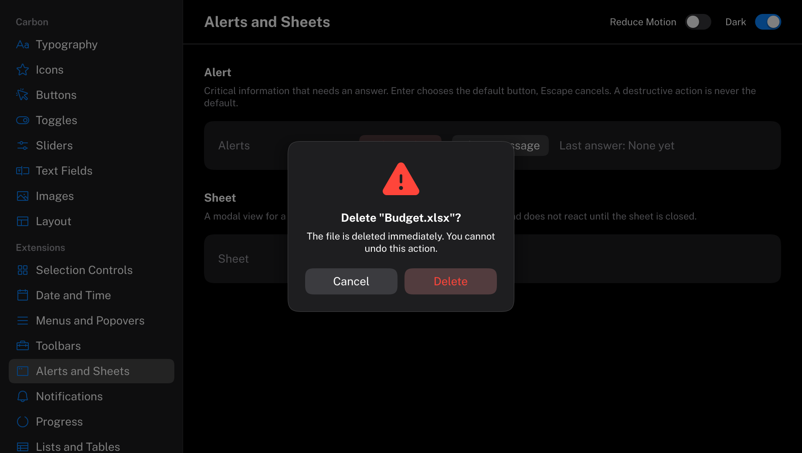

# Alert

Interrupts with critical information and waits for an answer.
HIG: [Alerts](https://developer.apple.com/design/human-interface-guidelines/alerts)
Library: CarbonExtensions, `#include <Carbon/Extensions/Alert.h>`



```cpp
if (Carbon::Button("Delete File..."))
    Carbon::OpenAlert("delete");

const Carbon::AlertResult answer = Carbon::Alert("delete", "Delete \"Budget.xlsx\"?",
    { .Message = "The file is deleted immediately. You cannot undo this action.",
      .Icon = Carbon::Icons::Warning,
      .PrimaryLabel = "Delete",
      .SecondaryLabel = "Cancel",
      .IsDestructive = true });
if (answer == Carbon::AlertResult::Primary)
    DeleteFile();
```

Call `Alert` every frame. It draws nothing and returns `AlertResult::None` while the alert is closed or still
waiting; on the frame a button is chosen it returns `Primary` or `Secondary` once, and the alert closes.
`OpenAlert` must be called at the same ID scope as `Alert`.

## Options

| Field | Type | Default | Meaning |
| --- | --- | --- | --- |
| `Message` | `std::string_view` | none | Informative text below the title |
| `Icon` | `std::string_view` | none | A large icon above the title |
| `PrimaryLabel` | `std::string_view` | `"OK"` | The button that carries out the alert's action |
| `SecondaryLabel` | `std::string_view` | none | The button that backs out, usually "Cancel". Empty leaves it out. |
| `IsDestructive` | `bool` | `false` | The primary action destroys data |
| `Width` | `float` | 260 | |

## Behaviour

- The alert is modal: it sits in the middle of the display above a scrim, and nothing beneath reacts until it
  is answered. A click outside does nothing.
- The primary button is on the trailing side and is the default button, drawn prominently.
- With `IsDestructive`, the primary button is drawn in the destructive color and is **not** the default: the
  secondary button is, so that Enter cannot destroy data by accident.
- Title and message are centered and wrap.

## Keyboard

| Key | Effect |
| --- | --- |
| Enter | Choose the default button |
| Escape | Choose the secondary button; with only one button, that one |
| Tab / Shift+Tab | Move between the buttons |
| Space | Press the focused button |

## Guidance from the HIG

- Use alerts sparingly, for problems and for actions that cannot be undone. An alert that appears often is
  dismissed without being read.
- Make the title a short, complete sentence or question that says what happened or what will happen; add a
  message only if it adds something.
- Label buttons with what they do ("Delete", "Save"), not "Yes" and "No", and always offer "Cancel" when the
  alert asks for a decision.
