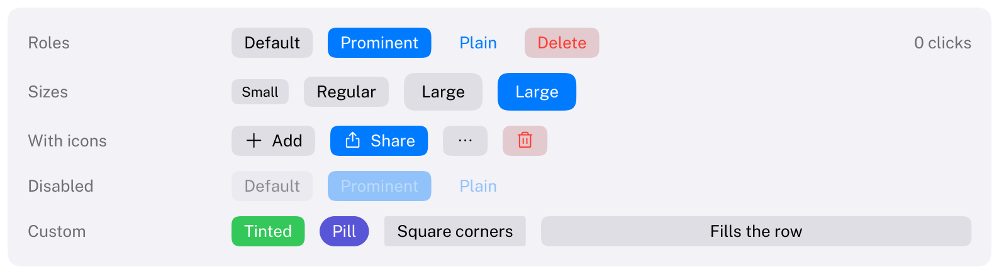

# Button

Starts an action when clicked.
HIG: [Buttons](https://developer.apple.com/design/human-interface-guidelines/buttons)



```cpp
if (Carbon::Button("Cancel"))
    Close();
if (Carbon::Button("Save", { .Role = Carbon::ButtonRole::Prominent, .IsDefault = true }))
    Save();
if (Carbon::Button("Delete", { .Role = Carbon::ButtonRole::Destructive, .Icon = Carbon::Icons::Trash }))
    Delete();
```

`Button` returns `true` on the frame it is activated.

## Roles

| Role | Look | Use |
| --- | --- | --- |
| `Default` | Gray fill, label color text | Most buttons |
| `Prominent` | Accent fill, white text | The most likely action of a view. The HIG recommends one or two per view. |
| `Plain` | No fill until hovered, accent text | Toolbars, inline actions |
| `Destructive` | Red text on a red-tinted fill | Actions that destroy data. Never make it the default button. |

## Options

| Field | Type | Default | Meaning |
| --- | --- | --- | --- |
| `Role` | `ButtonRole` | `Default` | See above |
| `ControlSize` | `ControlSize` | `Regular` | `Small`, `Regular` or `Large` |
| `Icon` | `std::string_view` | none | An icon from `Carbon::Icons` before the label. With a label of only an ID (`"##add"`), the button shows just the icon. |
| `Width` | `Size` | `Fit` | `Fit` hugs the label; fixed and `Fill` stretch the button and center the label |
| `Disabled` | `bool` | `false` | Dimmed, ignores input |
| `IsDefault` | `bool` | `false` | Also activates with Enter when no focused control uses the key |
| `CornerRadius` | `float` | from theme and size | |
| `CornerSmoothing` | `float` | theme's `CornerSmoothing` | |
| `Tint` | `Color` | theme's `Accent` | Fill of a `Prominent` button, text of a `Plain` one |

## States

Hover, pressed and focus changes are animated. A default button's fill shifts towards the label color on hover
and further when pressed; a prominent button brightens on hover and darkens when pressed. Pressing and dragging
off the button cancels the click, as on macOS.

## Keyboard

| Key | Effect |
| --- | --- |
| Tab / Shift+Tab | Focus the button |
| Space, Enter | Activate the focused button |
| Enter (nothing focused that uses it) | Activate the `IsDefault` button |

## Guidance from the HIG

- Start labels with a verb and use title-style capitalization: "Add to Cart", "Save Document".
- Append an ellipsis when the button opens another view for more input: "Export…".
- Distinguish the preferred choice by style (`Prominent`), not by size.
