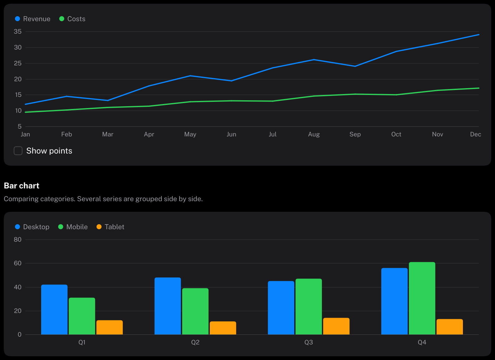

# Charts

Line and bar charts.
HIG: [Charting data](https://developer.apple.com/design/human-interface-guidelines/charting-data)
Library: CarbonExtensions, `#include <Carbon/Extensions/Chart.h>`



```cpp
const float revenue[] = { 12.0f, 14.5f, 13.2f, 17.8f, 21.0f, 19.4f };
const float costs[]   = {  9.5f, 10.2f, 11.0f, 11.4f, 12.8f, 13.1f };
const std::string_view months[] = { "Jan", "Feb", "Mar", "Apr", "May", "Jun" };

const Carbon::ChartSeries series[] = {
    { .Label = "Revenue", .Values = revenue },
    { .Label = "Costs", .Values = costs },
};
Carbon::LineChart("revenue", series, { .Height = 200.0f, .Labels = months });
Carbon::BarChart("revenue bars", series, { .Labels = months });

Carbon::LineChart("load", cpuLoad);        // a single unnamed series: any std::span<const float>
```

| Function | Use |
| --- | --- |
| `LineChart` | Change over time or along an ordered axis |
| `BarChart` | Comparing categories; several series are grouped side by side |

The data is not copied: the spans must stay valid during the call, nothing longer.

## Series

| Field | Type | Default | Meaning |
| --- | --- | --- | --- |
| `Label` | `std::string_view` | none | Shown in the legend and in the callout |
| `Values` | `std::span<const float>` | empty | One value per position along the horizontal axis |
| `Color` | `Color` | by position | Defaults to the theme's accent, green, orange, purple, red, teal, pink, yellow, in that order |

## Options

| Field | Type | Default | Meaning |
| --- | --- | --- | --- |
| `Width` | `Size` | `Fill` | |
| `Height` | `float` | 180 | |
| `Labels` | `std::span<const std::string_view>` | empty | Labels along the horizontal axis, one per value. When they do not all fit, every second, third, ... is shown. |
| `Min`, `Max` | `float` | from the data | Range of the vertical axis |
| `ShowsGrid` | `bool` | `true` | Horizontal lines at the axis values |
| `ShowsLegend` | `bool` | `true` | A dot and the label of each series above the chart, when any series has a label |
| `ShowsPoints` | `bool` | `false` | Marks every value of a line chart with a dot |

## Behaviour

- **Axis.** By default the vertical axis fits the data, rounded outwards to steps of 1, 2 or 5 times a power of
  ten, with about four intervals. A bar chart always includes zero; bars for negative values hang below the
  zero line.
- **Callout.** While the pointer is over the plot, the nearest position is marked (a guide and ringed dots in a
  line chart, a tinted column in a bar chart) and a small box next to the pointer names the values.
- **Appearing.** A chart draws itself in when it appears: lines are revealed from the leading edge, bars grow
  out of the zero line. With Reduce Motion it is simply there.
- Charts are not interactive beyond the callout and are not a stop for Tab.

## Accessibility note

The chart is drawn, not described: Carbon has no accessibility tree. Put the key numbers in text next to a
chart that carries information people must not miss.

## Guidance from the HIG

- Keep a chart simple: a few series, a clear axis, no decoration that carries no data.
- Use color to tell series apart, never as the only carrier of meaning, and name every series in the legend.
- Add a title and, where it helps, a sentence that states the main point of the chart.
