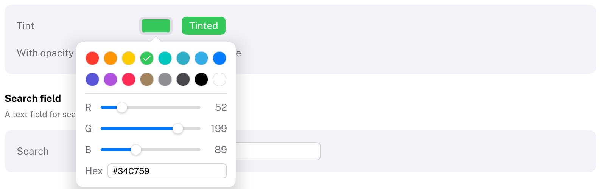

# ColorWell

Shows a color and lets the user change it.
HIG: [Color wells](https://developer.apple.com/design/human-interface-guidelines/color-wells)
Library: CarbonExtensions, `#include <Carbon/Extensions/ColorWell.h>`



```cpp
Carbon::Color tint = Carbon::Color::FromHex(0x34C759);
if (Carbon::ColorWell("Tint", &tint))
    ApplyTint(tint);
```

The well is a swatch of the current color. A click opens a popover with

- a palette of the theme's colors plus a dark gray, black and white,
- sliders for red, green and blue (0 to 255), and optionally opacity (0 to 100),
- a field for the hex value (`#RRGGBB`; the `#` is optional when typing).

`ColorWell` returns `true` on every frame the color changed. The label identifies the well and is not drawn.

## Options

| Field | Type | Default | Meaning |
| --- | --- | --- | --- |
| `ShowsOpacity` | `bool` | `false` | Adds a slider for the alpha value |
| `ControlSize` | `ControlSize` | `Regular` | Height of the well |
| `Disabled` | `bool` | `false` | |

## Behaviour

- Choosing a palette color keeps the current opacity and leaves the popover open, so that several colors can be
  tried.
- The popover closes with a click outside or Escape.
- Colors are straight-alpha sRGB values, like everywhere in Carbon.

## Keyboard

| Key | Effect |
| --- | --- |
| Tab / Shift+Tab | Focus the well; inside the popover, cycle through its controls |
| Space, Enter | Open the popover; choose the focused palette color |
| Arrow keys | Move the focused slider |
| Escape | Close the popover |

## Note

Carbon has no system color picker to hand off to, so the popover is the whole picker. For a different one,
build it from `BeginOverlay`; `ColorWell.cpp` is a short example of a component with a popover.
