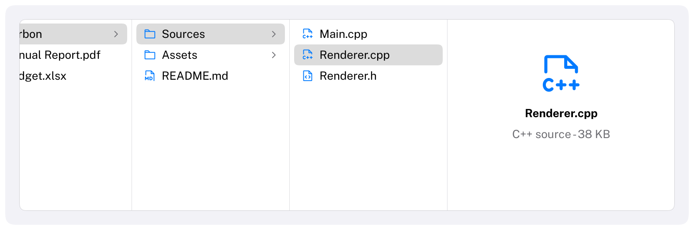

# ColumnView

A hierarchy shown as columns, one per level, like the column view of a file browser.
HIG: [Column views](https://developer.apple.com/design/human-interface-guidelines/column-views)
Library: CarbonExtensions, `#include <Carbon/Extensions/ColumnView.h>`



```cpp
std::vector<int> path = { 0 };          // the selected index in each column

Carbon::BeginColumnView("browser", { .Height = 260.0f });
std::span<const FileNode> level = root;
const FileNode* selected = nullptr;
for (size_t depth = 0; !level.empty(); depth++)
{
    Carbon::BeginColumnViewColumn();
    std::span<const FileNode> next;
    for (int i = 0; i < int(level.size()); i++)
    {
        const bool isSelected = depth < path.size() && path[depth] == i;
        if (Carbon::ColumnViewItem(level[i].Name, isSelected, { .Icon = level[i].Icon,
                                                                 .HasChildren = level[i].IsFolder() }))
        {
            path.resize(depth);              // picking an item makes it the end of the path
            path.push_back(i);
        }
        if (isSelected)
        {
            selected = &level[i];
            next = level[i].Children;        // the next column shows its children
        }
    }
    Carbon::EndColumnViewColumn();
    level = next;
}
if (selected != nullptr && !selected->IsFolder())
{
    Carbon::BeginColumnViewPreview();       // details of a selected leaf
    Carbon::Text(selected->Name);
    Carbon::EndColumnViewPreview();
}
Carbon::EndColumnView();
```

The application owns the path and decides which columns exist; the column view lays them out side by side,
scrolls, and handles the keyboard.

| Function | Purpose |
| --- | --- |
| `BeginColumnView(id, options)` / `EndColumnView()` | The column view |
| `BeginColumnViewColumn()` / `EndColumnViewColumn()` | One column; at most 32 |
| `ColumnViewItem(label, isSelected, options)` | An item of the current column. Returns `true` when the user picks it. |
| `BeginColumnViewPreview()` / `EndColumnViewPreview()` | A column after the last one, for information about a selected leaf, laid out like a `VStack` |

## Options

| Field | Type | Default | Meaning |
| --- | --- | --- | --- |
| `Width`, `Height` | `Size` | `Fill` | Inside a stack that fits its content, give it a fixed height |
| `ColumnWidth` | `float` | 200 | Width of a column until the user resizes it |
| `MinColumnWidth` | `float` | 120 | |
| `PreviewWidth` | `float` | 260 | |
| `RowHeight` | `float` | 24 | |
| `HasBorder` | `bool` | `true` | Bordered control background |

## Item options

| Field | Type | Default | Meaning |
| --- | --- | --- | --- |
| `Icon` | `std::string_view` | none | Before the title |
| `IconTint` | `Color` | theme's `Accent` | |
| `HasChildren` | `bool` | `false` | Shows a chevron; the right arrow key moves into the next column only from such an item |
| `Disabled` | `bool` | `false` | |

## Behaviour

- The first column always shows the root, so people can start over from the top.
- When a column appears, the view scrolls horizontally to show it.
- The line after each column can be dragged to resize the column. Widths are remembered per column position.
- Selected items are highlighted in every column: in the selection color in the column with keyboard focus, gray
  in the others.

## Long columns

An item that is scrolled out of view costs little: it takes its space, but it is not hit-tested or drawn. For a
column of tens of thousands of items, submit only the ones that are needed: call
`ClipColumnViewItems(count, selectedItem, selectedHasChildren)` right after `BeginColumnViewColumn` and add the
items of the `RowRange` it returns, in order. It works like [`ClipListItems`](List.md#long-lists);
`selectedHasChildren` tells the column whether the right arrow may move on from a selected item that is not among
the submitted ones.

## Keyboard

| Key | Effect |
| --- | --- |
| Tab / Shift+Tab | Move between the columns; each is a stop |
| Up / Down arrow, Home / End | Select within the focused column |
| Right arrow | Move into the next column, selecting its first item if nothing is selected there |
| Left arrow | Move back into the previous column and select its item again, which closes the columns after it |

## Guidance from the HIG

- Use a column view for deep hierarchies that people navigate back and forth in, when sorting is not needed.
- Show information about the selected item when it has no children, such as a preview and its attributes.
- Let people resize columns, so that long names can be read.
