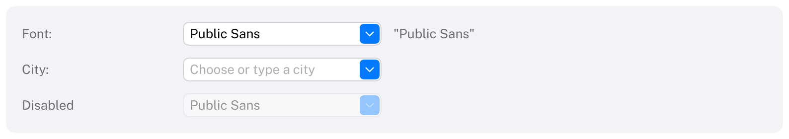
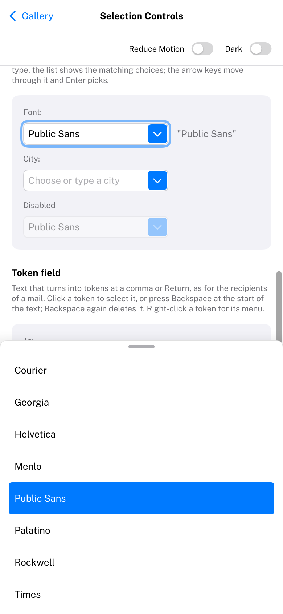

# ComboBox

A text field combined with a list of choices.
HIG: [Combo boxes](https://developer.apple.com/design/human-interface-guidelines/combo-boxes)
Library: CarbonExtensions, `#include <Carbon/Extensions/ComboBox.h>`



```cpp
std::string font = "Helvetica";
Carbon::BeginHStack();
Carbon::Text("Font:");
if (Carbon::ComboBox("Font", &font, { "Courier", "Helvetica", "Menlo", "Times" }))
    ApplyFont(font);
Carbon::EndHStack();
```

People type any value, or click the button at the trailing edge and pick one of the items. A typed value is not
added to the items. `ComboBox` returns `true` on frames the text changed, by typing or picking;
`IsItemSubmitted()` is `true` on the frame Enter was pressed. Items can also be passed as a
`std::span<const std::string_view>`. The label identifies the control and is not drawn.

## Options

| Field | Type | Default | Meaning |
| --- | --- | --- | --- |
| `Placeholder` | `std::string_view` | none | Shown while the field is empty |
| `Width` | `Size` | 180 | Width of the whole control; the list is as wide |
| `ControlSize` | `ControlSize` | `Regular` | |
| `FiltersWhileTyping` | `bool` | `true` | While typing, the list opens by itself and shows only the items that contain the text (ignoring the case of ASCII letters) |
| `MaxLength` | `size_t` | 0 | Longest text in characters; 0 is unlimited |
| `Disabled` | `bool` | `false` | |

## Behaviour

- The list appears below the field (above when there is no room), at most eight rows high, and scrolls.
- It does not take the keyboard: typing goes on in the field while it is open.
- It closes when an item is picked, when the field loses focus and with Escape.
- Picking an item replaces the text and puts the caret at its end.
- The list can be long: only the rows in view are built, and the items are filtered when the text changes, not
  every frame. Keep the items where they are while the list is open; they are told apart by their address and
  their number.

## Keyboard

Everything a [TextField](TextField.md#keyboard) does, plus:

| Key | Effect |
| --- | --- |
| Down arrow | Open the list; then move the highlight down |
| Up arrow | Move the highlight up |
| Enter | Pick the highlighted item (with the list open); the field also reports it as submitted |
| Escape | Close the list and keep editing |

## Compact width

On a phone (compact width, see [Phones and tablets](../Mobile.md)) the list of choices slides up from the bottom of
the display across its width, with 44-point rows, while the field keeps the keyboard; a choice still closes it.



## Guidance from the HIG

- Put a label ending in a colon before the combo box, saying what kind of value is expected.
- Fill it with a meaningful default where there is one.
- Offer choices that are likely, and make the control wide enough that they are not cut off.
- If people must choose from the list and may not type their own value, use a [PopUpButton](PopUpButton.md)
  instead.
