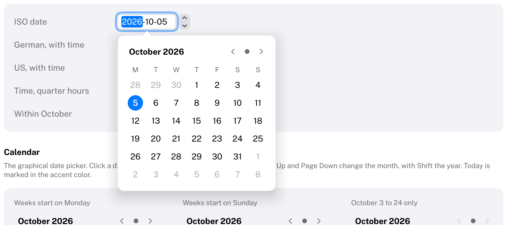
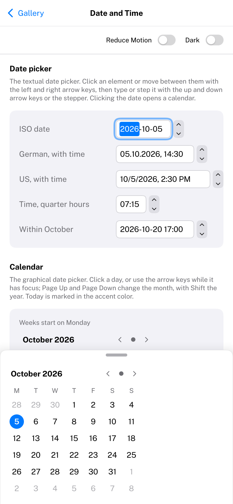

# DatePicker

The textual date picker: a compact field that shows a date, a time or both, edited one element at a time, with a
calendar a click away.
HIG: [Pickers](https://developer.apple.com/design/human-interface-guidelines/pickers) (date pickers, macOS)
Library: CarbonExtensions, `#include <Carbon/Extensions/DatePicker.h>`



```cpp
Carbon::DateTime meeting = { .Year = 2026, .Month = 10, .Day = 5, .Hour = 14, .Minute = 30 };

Carbon::DatePicker("Date", &meeting);                                           // 2026-10-05
Carbon::DatePicker("Start", &meeting, { .Elements = Carbon::DatePickerElements::DateAndTime,
                                        .Format = Carbon::DateFormat::German() });  // 05.10.2026, 14:30
Carbon::DatePicker("Alarm", &alarm, { .Elements = Carbon::DatePickerElements::Time,
                                      .Format = Carbon::DateFormat::US(),
                                      .MinuteInterval = 15 });                   // 2:30 PM
```

The value is a [`DateTime`](DatePickerCalendar.md#dates): local wall time owned by the application. The function
returns `true` on the frame it changed. The label identifies the picker and is not drawn. `IsItemSubmitted()` is
true after Enter.

## Formats

`DateFormat` describes how dates and times are written. Start from a preset and change what differs:

| Preset | Date | Time | Date and time |
| --- | --- | --- | --- |
| `DateFormat::ISO()` (default) | 2026-10-05 | 14:30 | 2026-10-05 14:30 |
| `DateFormat::German()` | 05.10.2026 | 14:30 | 05.10.2026, 14:30 |
| `DateFormat::US()` | 10/5/2026 | 2:30 PM | 10/5/2026, 2:30 PM |

| Field | Type | Meaning |
| --- | --- | --- |
| `Order` | `DateOrder` | `YearMonthDay`, `DayMonthYear` or `MonthDayYear` |
| `DateSeparator` | `char` | Between year, month and day |
| `PadsDay`, `PadsMonth` | `bool` | Two digits below 10 |
| `DateTimeSeparator` | `std::string_view` | Between the date and the time |
| `Uses24HourClock` | `bool` | Otherwise 12-hour time with AM and PM |
| `PadsHour` | `bool` | Two digits for hours below 10 |
| `TimeSeparator` | `char` | Between hour and minute |

`FormatDateTime(value, elements, format, buffer)` writes a value the way a picker shows it, for labels elsewhere
in the interface; it does not allocate.

## Options

| Field | Type | Default | Meaning |
| --- | --- | --- | --- |
| `Elements` | `DatePickerElements` | `Date` | `Date`, `Time` or `DateAndTime` |
| `Format` | `DateFormat` | `ISO()` | See above |
| `MinDate`, `MaxDate` | `DateTime` | none | The range of values that can be entered |
| `MinuteInterval` | `int` | 1 | Steps of the minute; must divide 60 (5, 10, 15, 30) |
| `ShowsStepper` | `bool` | `true` | A stepper next to the field, as in macOS's "textual with stepper" style |
| `FirstWeekday` | `Weekday` | `Monday` | The first column of the calendar |
| `Today` | `DateTime` | the computer's date | The day the calendar marks as today |
| `ControlSize` | `ControlSize` | `Regular` | `Small`, `Regular` or `Large` |
| `Disabled` | `bool` | `false` | Dimmed, ignores input |

## Behaviour

- The field has the look of a text field and is as wide as the longest text its format can produce, so it does not
  change width as the value changes.
- **Elements.** Year, month, day, hour, minute and AM/PM are edited separately. The selected element is
  highlighted while the field has focus.
- **Typing.** Digits replace the selected element. When the element is complete it is applied and the next one is
  selected: after four digits of a year, two of the others, or one that cannot begin a longer number (a 5 for the
  month is May). A separator (`-`, `.`, `/`, `:` or `,`) applies what was typed and moves on, unless the selection
  just moved on by itself. Two-digit years are in this century. A day that the month does not have becomes its
  last day, and a typed minute is rounded down to the interval. A and P choose AM and PM.
- **Stepping.** The up and down arrow keys and the stepper change the selected element by one (the minute by the
  interval). Elements wrap within their range without carrying over, as on macOS: the day after the 31st is the
  1st of the same month.
- **Calendar.** Clicking the date opens a [DatePickerCalendar](DatePickerCalendar.md) in a popover below the
  field. Picking a day there changes the date, keeps the time and closes the popover. While the popover is open
  the keyboard stays in the field, and the calendar follows what is typed. The popover closes on Escape, on
  Enter, on a click outside, and when the field loses focus. A time-only picker has no calendar.
- Every change is clamped to `MinDate` and `MaxDate`. A value from the application that is invalid or out of range
  is corrected without reporting a change.
- Formatting writes into fixed buffers; editing does not allocate.

## Keyboard

| Key | Effect |
| --- | --- |
| Tab / Shift+Tab | Focus the field (it starts at the first element), then the stepper |
| Left / Right arrow | Select the previous / next element |
| Up / Down arrow | Step the selected element |
| 0–9 | Type into the selected element |
| `-` `.` `/` `:` `,` | Apply what was typed and select the next element |
| A, P | AM, PM (12-hour time) |
| Backspace | Discard what was typed into the element |
| Space | Open or close the calendar |
| Enter | Apply what was typed and close the calendar; `IsItemSubmitted()` is true |
| Escape | Discard what was typed and close the calendar |

## Compact width

On a phone (compact width, see [Phones and tablets](../Mobile.md)) the calendar slides up from the bottom of the display as a
sheet across its width, while the field keeps the keyboard. A tap above it or dragging it down by its grabber dismisses it. Nothing changes in
the code.



## Guidance from the HIG

- macOS has two styles: textual, for limited space and people who know the date they want, and graphical, for
  browsing days. This picker is the textual style with the graphical one in its popover; use
  [DatePickerCalendar](DatePickerCalendar.md) on its own when browsing matters more.
- Consider a coarser minute interval when exact minutes do not matter, such as quarter hours for appointments; it
  must divide 60.
- Show the picker in context, near what it edits, and let the calendar appear in a popover rather than switching
  views.
- Month and weekday names are English in Carbon; formats are chosen by the application, not by a locale.
