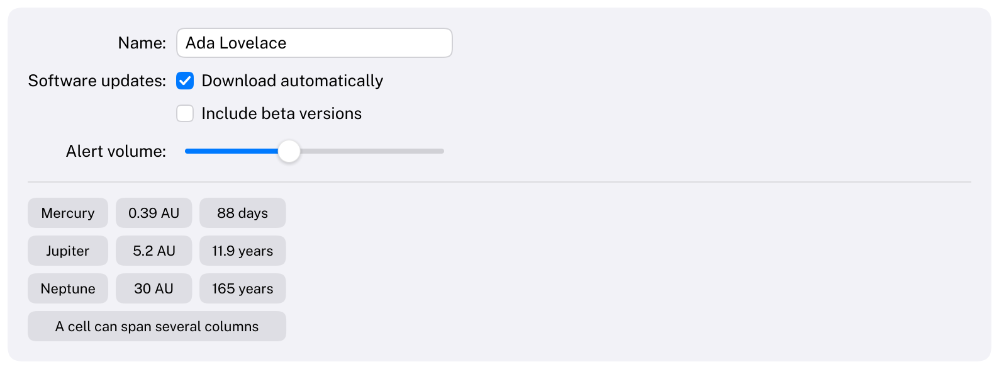

# Grid

Rows of cells whose columns line up, like SwiftUI's `Grid` and `GridRow`. Use it for forms (labels in one column,
controls in the next) and for small tables of values.
HIG: [Layout](https://developer.apple.com/design/human-interface-guidelines/layout)



```cpp
static constexpr Carbon::Alignment FormColumns[] = { Carbon::Alignment::Trailing, Carbon::Alignment::Leading };

Carbon::BeginGrid({ .HorizontalSpacing = 8.0f, .VerticalSpacing = 10.0f, .ColumnAlignments = FormColumns });
    Carbon::BeginGridRow();
        Carbon::Text("Name:");
        Carbon::TextField("Name", &name);
    Carbon::EndGridRow();
    Carbon::BeginGridRow();
        Carbon::Text("Software updates:");
        Carbon::Toggle("Download automatically", &updates, { .Kind = Carbon::ToggleKind::Checkbox });
    Carbon::EndGridRow();
    Carbon::BeginGridRow();
        Carbon::SetNextGridCell({ .ColumnSpan = 2 });
        Carbon::Text("Changes apply at once.", { .Secondary = true });
    Carbon::EndGridRow();
Carbon::EndGrid();
```

Each item placed in a row is one cell: a widget, a stack, a scroll view or another grid. The first cell goes into
the first column, the next into the second, and so on. A column is as wide as its widest cell, in every row, so
the columns line up however different the rows are. Rows can have fewer cells than there are columns.
`Spacer({ .Length = 0.0f })` leaves a cell empty.

Anything placed directly in the grid rather than in a row takes the grid's full width, which is how a divider
between groups of rows is made: `Carbon::Separator()`.

Every `Begin` needs its `End`. `BeginGridRow` must be called directly inside `BeginGrid`.

## GridOptions

| Field | Type | Default | Meaning |
| --- | --- | --- | --- |
| `HorizontalSpacing` | `float` | theme's `Spacing` (8) | Distance between columns |
| `VerticalSpacing` | `float` | theme's `Spacing` (8) | Distance between rows |
| `Alignment` | `Alignment` | `Leading` | Where cells sit horizontally inside their column |
| `VerticalAlignment` | `VerticalAlignment` | `Center` | Where cells sit vertically inside their row |
| `ColumnAlignments` | `std::span<const Alignment>` | empty | Alignment per column, from the first column on; overrides `Alignment` |
| `Padding` | `EdgeInsets` | 0 | Space between the grid's edges and its rows |
| `Width`, `Height` | `Size` | `Fit` | |
| `Background` | `Color` | none | A squircle behind the grid |
| `CornerRadius` | `float` | theme's `GroupCornerRadius` (10) | Corner radius of the background |
| `ID` | `std::string_view` | call site | A stable identity; see [Layout](../Layout.md#identity) |

`ColumnAlignments` points to the caller's array, which must live until `BeginGrid` returns; a `static constexpr`
array is the usual choice.

## GridRowOptions and GridCellOptions

| Field | Type | Default | Meaning |
| --- | --- | --- | --- |
| `GridRowOptions::Alignment` | `VerticalAlignment` | the grid's | Where the cells of this row sit vertically |
| `GridRowOptions::ID` | `std::string_view` | call site | A stable identity for a row begun in a loop; see [Layout](../Layout.md#identity) |
| `GridCellOptions::ColumnSpan` | `int` | 1 | How many columns the cell covers |
| `GridCellOptions::Alignment` | `Alignment` | the column's | Where the cell's content sits horizontally |
| `GridCellOptions::VerticalAlignment` | `VerticalAlignment` | the row's | Where the cell's content sits vertically |

`SetNextGridCell(options)` applies to the next cell only. Call it directly before the cell.

## Behaviour

- **Sizes in cells.** A cell with `Width = Size::Fill()` takes the full width of its column (or of the columns it
  spans). Its column is still sized by content: a column of `Fill` cells is as wide as the widest of their
  contents. `Height = Size::Fill()` takes the row's height.
- **Spans.** A cell that spans several columns does not narrow them. When it is wider than they are together,
  they grow by the same amount each.
- **One frame of latency.** Column widths are measured while the rows are submitted and used from the next frame
  on, like the size of a fitting stack. A new grid is hidden for its first frame and fades in, and
  `IsAnimating()` is true until the columns have settled. See [Layout](../Layout.md#one-frame-of-latency).
- **Identity.** A grid and its rows are identified by their call sites, like stacks. They do not push onto the ID
  stack, so wrapping existing widgets in a grid does not change their IDs or lose their focus or animation state.
  Rows begun in a loop need an identity each, `PushID(key)` or `.ID = key`; otherwise the line is reported once
  through the log, as for [stacks](Stack.md#identity).
- A grid has at most 32 columns.

## Keyboard

Grids are not interactive. Tab moves through the controls inside them in the order they are submitted: row by
row, leading to trailing.

## Guidance from the HIG

- "Align elements to make them easier to scan." In a form, align the labels on their trailing edge and the
  controls on their leading edge, as macOS settings windows do.
- "Use consistent spacing": give the grid one horizontal and one vertical spacing rather than padding individual
  cells.
- The HIG's Layout page has no grid metrics for macOS; Carbon's defaults come from the theme's spacing.
