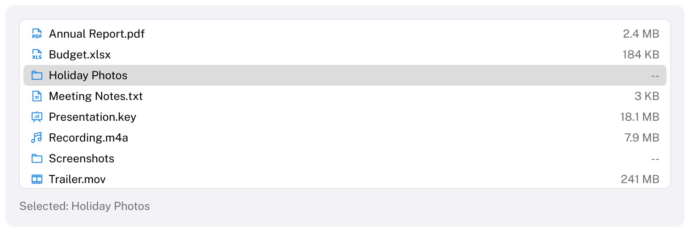

# List

A scrolling column of rows with a selection.
HIG: [Lists and tables](https://developer.apple.com/design/human-interface-guidelines/lists-and-tables)
Library: CarbonExtensions, `#include <Carbon/Extensions/List.h>`



```cpp
Carbon::BeginList("files", { .Height = 200.0f });
for (int i = 0; i < int(files.size()); i++)
{
    Carbon::PushID(i);
    if (Carbon::ListItem(files[i].Name, i == selected, { .Icon = Carbon::Icons::FileText, .Detail = files[i].Size }))
        selected = i;
    Carbon::PopID();
}
Carbon::EndList();
```

The application owns the selection: pass each row whether it is selected, and react when `ListItem` returns
`true`. That makes single selection (`selected = i`), multiple selection (`isSelected[i] = !isSelected[i]`) and
no selection at all the application's choice. For rows with several columns see [Table](Table.md).

## List options

| Field | Type | Default | Meaning |
| --- | --- | --- | --- |
| `Width` | `Size` | `Fill` | |
| `Height` | `Size` | `Fill` | A list scrolls, so inside a stack that fits its content give it a fixed height |
| `RowHeight` | `float` | 24 | |
| `HasBorder` | `bool` | `true` | Draws the list on a bordered control background. Turn it off for a list that fills a pane. |

## Item options

| Field | Type | Default | Meaning |
| --- | --- | --- | --- |
| `Icon` | `std::string_view` | none | Before the title |
| `Detail` | `std::string_view` | none | Secondary text at the trailing edge |
| `Disabled` | `bool` | `false` | Dimmed; cannot be picked and is skipped by the keyboard |

## Behaviour

- Rows span the list. The selected row has a rounded highlight: gray, or the selection color with on-accent
  text while the list has keyboard focus.
- A row under the pointer is tinted. Clicking a row gives the list focus.
- Titles that do not fit are cut off with an ellipsis.
- All rows are submitted every frame; rows outside the visible area are not drawn. For very long lists, submit
  only the rows near the visible range and reserve the rest of the height with a `Spacer`.

## Long lists

An item that is scrolled out of view costs little: it takes its space, but it is not hit-tested, its label is not
hashed or shaped and nothing is drawn. For tens of thousands of items and more, submit only the ones that are
needed. `ClipListItems(count, selectedItem)` declares how many items the list has and returns the range to submit:
the items in view and, after the arrow keys, Home or End moved the selection, the item they moved to.

```cpp
Carbon::BeginList("files", { .Height = 200.0f });
const Carbon::RowRange items = Carbon::ClipListItems(int(names.size()), selected);
for (int i = items.First; i < items.End; i++)
{
    if (Carbon::ListItem(names[i], i == selected))
        selected = i;
}
Carbon::EndList();
```

The list reserves the space of the other items, so it scrolls and reacts to the keyboard as if all of them were
submitted. Call it once, right after `BeginList`, and submit exactly the items of the range, in order. The items
that are left out count as enabled. [Table](Table.md#long-tables) has the same for its rows.

## Keyboard

| Key | Effect |
| --- | --- |
| Tab / Shift+Tab | Focus the list; it is one stop, and shows the focus ring |
| Up / Down arrow | Select the previous / next row |
| Home / End | Select the first / last row |

A selection made by keyboard is scrolled into view. A key press takes effect on the following frame, through
the return value of the row it moves to.

## Guidance from the HIG

- Keep row text short so that it is not cut off, and sort rows in an order people expect.
- Use a list for one column of similar items; when items have attributes worth comparing, use a table.
