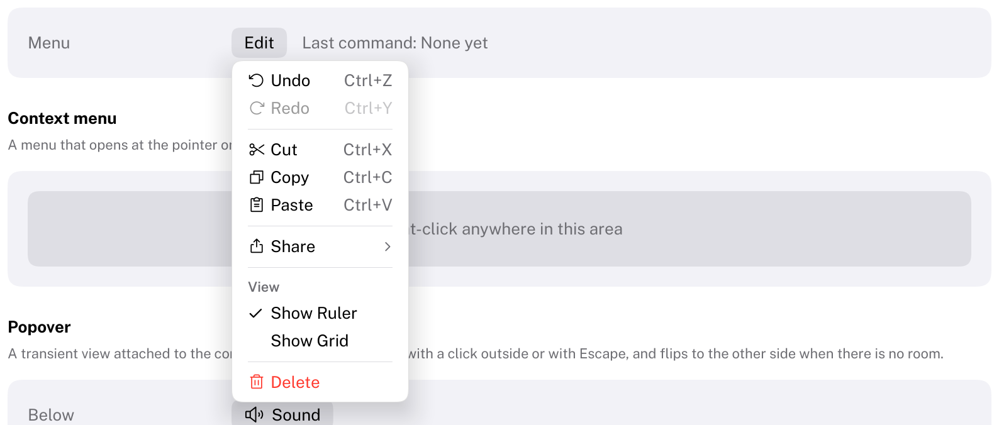
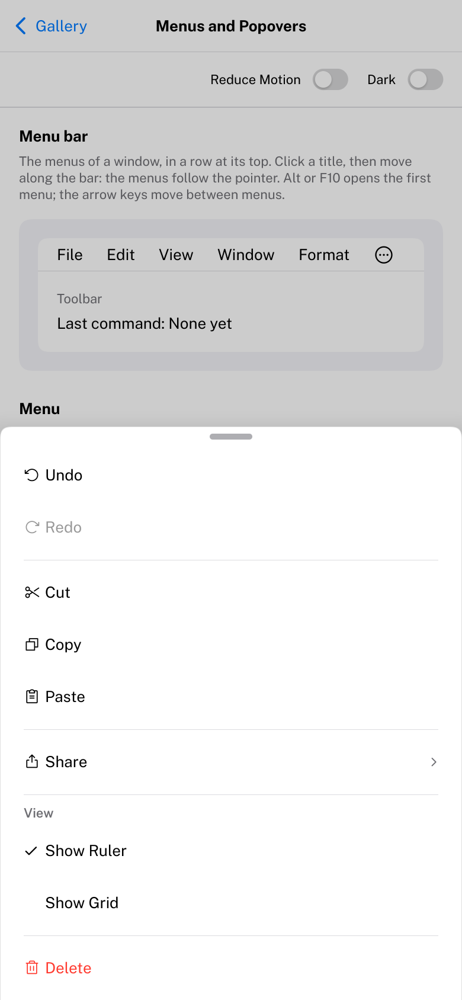

# Menu

A list of commands that appears on demand.
HIG: [Menus](https://developer.apple.com/design/human-interface-guidelines/menus)
Library: CarbonExtensions, `#include <Carbon/Extensions/Menu.h>`



```cpp
if (Carbon::Button("Edit"))
    Carbon::OpenMenu("edit");
if (Carbon::BeginMenu("edit"))
{
    if (Carbon::MenuItem("Copy", { .Icon = Carbon::Icons::Copy, .Shortcut = "Ctrl+C" }))
        Copy();
    Carbon::MenuItem("Paste", { .Shortcut = "Ctrl+V", .Disabled = !CanPaste() });
    Carbon::MenuSeparator();
    if (Carbon::BeginSubmenu("Share"))
    {
        if (Carbon::MenuItem("Mail"))
            ShareByMail();
        Carbon::EndSubmenu();
    }
    Carbon::MenuHeader("View");
    if (Carbon::MenuItem("Show Ruler", { .IsChecked = showRuler }))
        showRuler = !showRuler;
    Carbon::EndMenu();
}
```

| Function | Purpose |
| --- | --- |
| `OpenMenu(id)` / `IsMenuOpen(id)` | Open the menu; ask whether it is open. Same ID scope as `BeginMenu`. |
| `BeginMenu(id, options)` / `EndMenu()` | The menu's items go in between. `BeginMenu` returns `false` while the menu is closed; then do not call `EndMenu`. An overload takes an `ID`, for a menu opened with `OpenOverlay(id)`; components that own a menu use it. |
| `MenuItem(label, options)` | A command. Returns `true` when it is chosen, which closes the menu and its parents. |
| `MenuSeparator()` | A line between groups |
| `MenuHeader(title)` | A small title above a group |
| `BeginSubmenu(label, options)` / `EndSubmenu()` | An item that opens another menu beside this one |

Buttons that own a menu are ready-made: [PullDownButton](PullDownButton.md) for commands,
[PopUpButton](PopUpButton.md) for a choice. For menus on a right click see [ContextMenu](ContextMenu.md).

## Menu options

| Field | Type | Default | Meaning |
| --- | --- | --- | --- |
| `Anchor` | `Rect` | the last item | The rectangle the menu belongs to |
| `Placement` | `OverlayPlacement` | `Below` | Flips when there is no room |
| `Alignment` | `Alignment` | `Leading` | Which edge of the anchor the menu lines up with |
| `Gap` | `float` | 2 | Distance to the anchor |
| `MinWidth` | `float` | 0 | For example the width of the button |

## Item options

`MenuItemOptions`, for `MenuItem` and `BeginSubmenu`.

| Field | Type | Default | Meaning |
| --- | --- | --- | --- |
| `Icon` | `std::string_view` | none | In the leading column |
| `Shortcut` | `std::string_view` | none | Shown at the trailing edge. A hint only: check the keys with `IsShortcutPressed` where the command lives. |
| `IsChecked` | `bool` | `false` | A checkmark in the leading column |
| `Disabled` | `bool` | `false` | Dimmed; cannot be highlighted or chosen |
| `IsDestructive` | `bool` | `false` | Title in the destructive color |

The leading column for checkmarks and icons exists only in menus that have any.

## Behaviour

- The highlight is a rounded accent-colored row. It follows the pointer and the arrow keys alike.
- A submenu opens when its item is chosen, with the right arrow key, or when the pointer rests on it for 0.2
  seconds. It closes when the pointer rests on another part of the parent menu.
- A click outside closes the menu and is used up. With submenus open, a click on a parent menu closes the
  submenus above it.
- Menus can be nested eight deep.

## Keyboard

| Key | Effect |
| --- | --- |
| Up / Down arrow | Move the highlight; it wraps around and skips disabled items |
| Enter, Space | Choose the highlighted item |
| Right arrow | Open the highlighted submenu and highlight its first item |
| Left arrow | Close the submenu |
| Escape | Close the innermost menu |

## Compact width

On a phone (compact width, see [Phones and tablets](../Mobile.md)) the menu slides up from the bottom of the display as a
sheet across its width, with its rows 44 points tall and without the keyboard shortcuts, as an iPhone has no keyboard to press them on. A submenu opens as a sheet of its own. A tap above it or dragging it down by its grabber dismisses it. Nothing changes in
the code.



## Guidance from the HIG

- Name items with verbs or verb phrases in title-style capitalization; append an ellipsis when the command needs
  more input before it acts ("Export...").
- Disable unavailable items instead of removing them, so the menu keeps its shape.
- Group related items between separators, most used first, and keep submenus to one level where possible.
- Show the keyboard shortcut of a command that has one.
