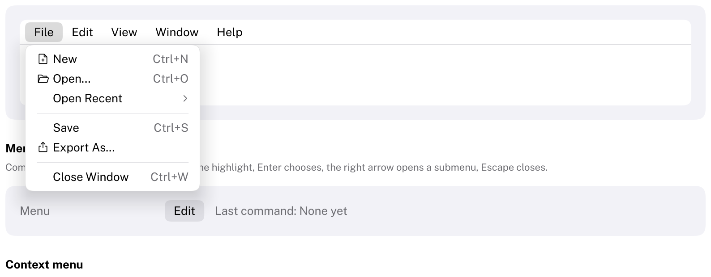

# MenuBar

The menus of a window, in a row at its top.
HIG: [The menu bar](https://developer.apple.com/design/human-interface-guidelines/the-menu-bar)
Library: CarbonExtensions, `#include <Carbon/Extensions/MenuBar.h>`



macOS has one menu bar for the whole screen; Windows and Linux applications put it in their windows. Carbon's
menu bar is the in-window kind, drawn in Carbon's style.

```cpp
Carbon::BeginMenuBar();
if (Carbon::BeginMenuBarMenu("File"))
{
    if (Carbon::MenuItem("New", { .Shortcut = "Ctrl+N" }))
        NewDocument();
    if (Carbon::BeginSubmenu("Open Recent"))
    {
        // ...
        Carbon::EndSubmenu();
    }
    Carbon::EndMenuBarMenu();
}
if (Carbon::BeginMenuBarMenu("Edit"))
{
    // ...
    Carbon::EndMenuBarMenu();
}
Carbon::EndMenuBar();
```

`BeginMenuBarMenu` draws a title and returns `true` while its menu is open; then add items exactly as in a
[Menu](Menu.md) and call `EndMenuBarMenu`.

Shortcuts shown in menu items are hints only. Handle them where the command lives, with `IsShortcutPressed`, so
that they work while the menu is closed.

## Options

| Field | Type | Default | Meaning |
| --- | --- | --- | --- |
| `Width` | `Size` | `Fill` | `Fill` spans the window. `Fit` makes the bar as wide as its titles, for a menu bar inside a [custom title bar](../Integration.md#drawing-your-own-title-bar). |
| `Height` | `float` | 28 | |
| `Background` | `Color` | theme's `SecondaryBackground` | `Color::Transparent()` for a bar on top of something else |
| `HasSeparator` | `bool` | `true` | A hairline along the bottom |

`BeginMenuBarMenu` takes `{ .Disabled = true }` for a menu that cannot be opened.

## Behaviour

- A press on a title opens its menu below it; a press on the open title closes it.
- While a menu is open, moving the pointer to another title opens that menu instead, without clicking.
- The title of the open menu is highlighted; titles are tinted under the pointer.

## Keyboard

| Key | Effect |
| --- | --- |
| Alt (pressed and released on its own), F10 | Open the first menu with its first item highlighted |
| Left / Right arrow | Open the previous / next menu, wrapping around. Inside a submenu, they close and open submenus first. |
| Up / Down arrow, Enter, Escape | As in any [Menu](Menu.md) |

## Guidance from the HIG

- Keep the familiar order: File, Edit, Format, View, your own menus, Window, Help.
- Use short, one-word menu titles.
- Never hide menu items that are unavailable; disable them, so that the menu keeps its shape.
- Name toggling items after what they do now: "Show Toolbar" while the toolbar is hidden, "Hide Toolbar" while
  it is shown.
- Support the keyboard shortcuts people know.
