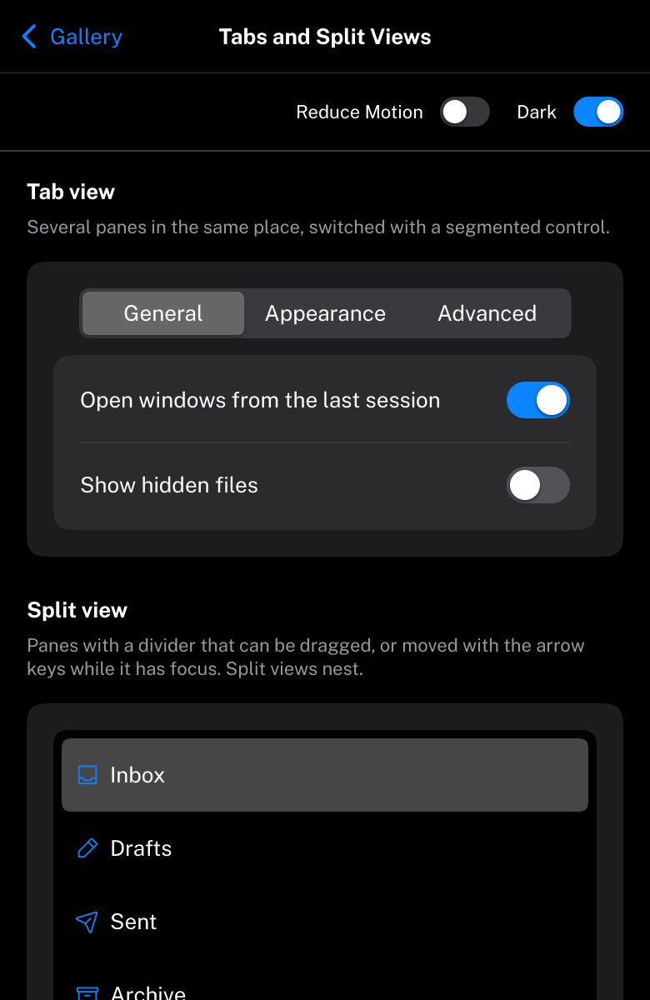

# NavigationSplitView

A sidebar and the content it navigates, which becomes a navigation stack on a phone.
HIG: [Split views](https://developer.apple.com/design/human-interface-guidelines/split-views),
[Sidebars](https://developer.apple.com/design/human-interface-guidelines/sidebars)



```cpp
Carbon::BeginNavigationSplitView("main", { .Title = "Mail", .DetailTitle = mailbox.Name });
Carbon::BeginSidebar("mailboxes");
for (Mailbox& entry : mailboxes)
{
    if (Carbon::SidebarItem(entry.Name, &entry == &mailbox, { .Icon = entry.Icon }))
        mailbox = entry;
}
Carbon::EndSidebar();
Carbon::NavigationSplitViewDetail();
ShowMessages(mailbox);                   // laid out like in a VStack that fills the rest
Carbon::EndNavigationSplitView();
```

In regular width, a Mac or PC window or an iPad in full screen, this is exactly a sidebar followed by a vertical
stack in an `HStack` that fills the display: nothing moves. In compact width (an iPhone in portrait, a narrow
window; see [Phones and tablets](../Mobile.md)) the two become a navigation stack:

- The sidebar fills the area as a list, with a chevron at the end of each row, under a navigation bar with `Title`.
- Choosing an item slides the content in from the trailing edge, on a spring, while the list moves aside and darkens
  a little, as in UIKit.
- The content has a navigation bar with `DetailTitle` in the middle and a back button labeled with `Title` (or
  "Back"). The back button, or a swipe from the leading edge that follows the finger, slides back to the list.
- While the panes slide, nothing in them takes the pointer.

Both panes are built every frame; the one that is off screen is clipped away and costs no drawing. Choosing an item
means picking a row of a [Sidebar](Sidebar.md), [List](List.md), [Table](Table.md), [OutlineView](OutlineView.md) or
[ColumnView](ColumnView.md) in the sidebar pane. A horizontal [SplitView](SplitView.md) collapses the same way.

## Options

| Field | Type | Default | Meaning |
| --- | --- | --- | --- |
| `Title` | `string_view` | empty | Compact width: the title above the sidebar and of the back button; empty for no bar and "Back" |
| `DetailTitle` | `string_view` | empty | Compact width: the title of the content's navigation bar |
| `Width`, `Height` | `Size` | `Fill` | The area of the whole view |

## From code

```cpp
Carbon::ShowNavigationDetail("main", true, false);   // show the content, without sliding (an address, a link)
if (!Carbon::IsNavigationDetailShown("main"))         // the user went back to the list
    UpdateAddress("#mail");
```

`ShowNavigationDetail` and `IsNavigationDetailShown` take the ID of a navigation split view or of a split view. The
choice is kept in regular width, where both panes show, for when the width becomes compact again.

## Keyboard

The back button is a stop for Tab and Space or Enter presses it. Escape does not go back: on iPhone that is the back
button's and the swipe's job.

## Guidance from the HIG

- In compact width, show the sidebar's content as a list that leads to the detail; in regular width keep them side
  by side.
- Let people go back with the back button and with a swipe from the leading edge.
