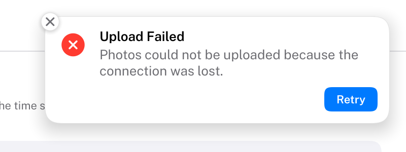

# Notifications

Banners at an edge of the window that tell about something that happened, and go away by themselves.
HIG: [Notifications](https://developer.apple.com/design/human-interface-guidelines/notifications)
Library: CarbonExtensions, `#include <Carbon/Extensions/Notification.h>`



```cpp
// Anywhere, also outside a frame (a background job finishing):
Carbon::PostNotification("Export Finished", {
    .Body = "Quarterly Report.pdf was saved to Documents.",
    .Style = Carbon::NotificationStyle::Success,
    .PrimaryAction = "Show",
    .Tag = jobID });

// Once per frame, at the end of the interface:
const std::span<const Carbon::NotificationEvent> events =
    Carbon::ShowNotifications({ .Position = Carbon::NotificationPosition::TopRight });
for (const Carbon::NotificationEvent& event : events)
{
    if (event.Kind == Carbon::NotificationEventKind::PrimaryAction || event.Kind == Carbon::NotificationEventKind::Clicked)
        RevealExport(event.Tag);
}
```

| Function | Purpose |
| --- | --- |
| `PostNotification(title, options)` | Shows a notification. The text is copied. Returns its `ID`. |
| `ShowNotifications(options)` | Draws the notifications above everything else; call once per frame. Returns this frame's events. |
| `DismissNotification(id)`, `DismissAllNotifications()` | Removes notifications, with their closing animation |
| `GetNotificationCount()` | How many are shown or waiting |

## Notification options

| Field | Type | Default | Meaning |
| --- | --- | --- | --- |
| `Body` | `std::string_view` | none | The message below the title; it wraps |
| `Style` | `NotificationStyle` | `Plain` | `Plain` (no icon), `Info`, `Success`, `Warning` or `Error`: the icon and its color |
| `Icon` | `std::string_view` | from `Style` | An icon of your own at the leading edge |
| `IconTint` | `Color` | from `Style` | |
| `Image` | `TextureID` | none | An image instead of the icon, such as a picture of the sender. Get the ID with `Carbon::GetTextureID(view)`; keep the texture alive while the notification is shown. |
| `ImageIsRound` | `bool` | `false` | A circle, as for a person; otherwise rounded corners |
| `PrimaryAction`, `SecondaryAction` | `std::string_view` | none | Up to two buttons below the message |
| `Duration` | `float` | 5 | Seconds before it goes away by itself; 0 keeps it until dismissed |
| `Position` | `NotificationPosition` | the center's | Replaces the position given to `ShowNotifications`, for this notification |
| `Tag` | `uint64_t` | 0 | A value of your own, handed back with its events |

## Center options

| Field | Type | Default | Meaning |
| --- | --- | --- | --- |
| `Position` | `NotificationPosition` | `TopRight` | `TopLeft`, `TopCenter`, `TopRight`, `BottomLeft`, `BottomCenter` or `BottomRight` |
| `Width` | `float` | 340 | |
| `Margin` | `float` | 16 | Distance from the window's edges |
| `Spacing` | `float` | 8 | Distance between stacked notifications |
| `MaxVisible` | `int` | 4 | How many a stack shows at once; further ones wait |

## Events

`NotificationEvent` has the notification's `ID`, its `Tag` and a `Kind`:

| Kind | When |
| --- | --- |
| `Clicked` | The notification itself was clicked: show what it is about |
| `PrimaryAction`, `SecondaryAction` | One of its buttons was clicked |
| `Dismissed` | Its close button was clicked |
| `Expired` | It went away after its duration |

Each of them ends the notification. Removing one from code reports nothing.

## Behaviour

- Notifications stack at their position, the newest nearest the edge. They slide in from the edge (corners) or
  from above or below (center), fade out when they go, and the others move up into the free place.
- The time stops while the pointer rests on a notification, so it can be read. A close button appears at its
  top-left corner then.
- Notifications draw above everything, popovers and sheets included, and take clicks there. They are not Tab
  stops and never take the keyboard, so they cannot interrupt typing.
- At most 32 exist at a time; posting more replaces the oldest. Text is cut at 128 bytes for the title and 512
  for the body, at a character boundary.
- `ShowNotifications` requests frames while notifications are shown, so that hosts rendering on demand keep the
  timers running.

## Guidance from the HIG

- Keep notifications short and worth the interruption: a title readable at a glance in title case, and a body of
  complete sentences.
- Don't post several notifications about the same thing, and don't use them for instructions; offer an action
  instead.
- Use short verbs for actions ("Reply", "Show"), and avoid actions that only open the app: clicking the
  notification does that.
- Don't put sensitive information in a notification.
