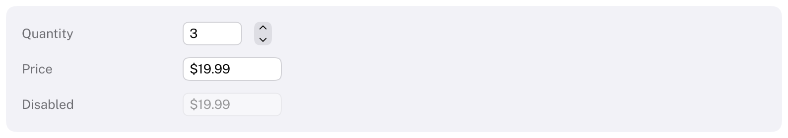

# NumberField

A text field for a number: it shows the value formatted, and applies what is typed when editing ends.
HIG: [Text fields](https://developer.apple.com/design/human-interface-guidelines/text-fields)
Library: CarbonExtensions, `#include <Carbon/Extensions/NumberField.h>`



```cpp
int quantity = 3;
Carbon::NumberField("Quantity", &quantity, { .Min = 0.0, .Max = 999.0, .Width = 60.0f });
Carbon::Stepper("Quantity stepper", &quantity, { .Min = 0.0, .Max = 999.0 });

double price = 19.99;
Carbon::NumberField("Price", &price, { .Step = 0.5, .Format = { .Decimals = 2, .Prefix = "$" } });
```

`NumberField` binds to an `int`, a `float` or a `double` and returns `true` on the frame the value changed. The
label identifies the field and is its placeholder while it is empty; put a `Text` next to it for a visible title.

## Options

| Field | Type | Default | Meaning |
| --- | --- | --- | --- |
| `Min`, `Max` | `double` | −∞, ∞ | The value stays within this range; unlimited by default |
| `Step` | `double` | 1 | Change per press of an arrow key |
| `Format` | `NumberFormat` | automatic | How the value is shown (below) |
| `Width` | `Size` | 80 points | A field cannot fit its content, so the default is a fixed width |
| `ControlSize` | `ControlSize` | `Regular` | |
| `Disabled` | `bool` | `false` | |

### NumberFormat

| Field | Type | Default | Meaning |
| --- | --- | --- | --- |
| `Decimals` | `int` | −1 | Digits after the point. −1 writes up to three and drops trailing zeros, so whole numbers have none |
| `Prefix`, `Suffix` | `std::string_view` | empty | Written around the number, e.g. `"$"` or `" px"` |

`FormatNumber(value, format, buffer)` writes a number the same way into a `std::span<char>` without allocating,
and `ParseNumber(text, format, &value)` reads one the way the field does. Both are public, so a label next to a
slider can show its value like a number field would.

## Behaviour

- **When the value changes.** Typing does not change the value. It is applied when the user presses Return or
  leaves the field (Tab, or a click elsewhere), and on every arrow key. The field then shows the value formatted
  again.
- **What is accepted.** Spaces around the number, the format's prefix and suffix (they may also be left out), a
  sign, digits with `.` as the decimal point, or a single `,` when there is no `.`, and an exponent (`1e3`).
  Anything else is not a number: the value stays as it was and the field shows it again.
- **Clamping and rounding.** The typed value is clamped to `[Min, Max]`; an `int` is rounded to the nearest
  whole number and clamped to what an `int` holds; a `float` is rounded to the nearest `float`.
- **The application may change the value** at any time. The field shows the new value unless the user has
  typed since the value was last shown; then the typing is kept and wins when it is applied.
- `IsItemSubmitted()` is true in the frame Return was pressed, as for a text field.
- An empty range (`Min > Max`) or a negative `Step` is reported through the assert callback and the field is
  not drawn.

## Keyboard

| Key | Effect |
| --- | --- |
| Tab / Shift+Tab | Focus the field and select its text; leaving applies the typed value |
| Up / Down arrow | Add / subtract one `Step`, from the typed number if it is one; held keys repeat |
| Shift+Up / Shift+Down | A tenth of a step |
| Ctrl+Up / Ctrl+Down | Ten steps |
| Return | Apply the typed value; the field keeps the focus |
| Escape | Discard the typing and leave the field |

All other keys edit the text as in a [TextField](TextField.md).

## Guidance from the HIG

- Use a number formatter to show and check numbers, and say what unit the value is in; a suffix such as
  `" pt"` does both.
- Pair a number field with a [Stepper](Stepper.md) when small changes are common, as macOS does for page counts
  and sizes. For changes by dragging, use a [ScrubField](ScrubField.md).
