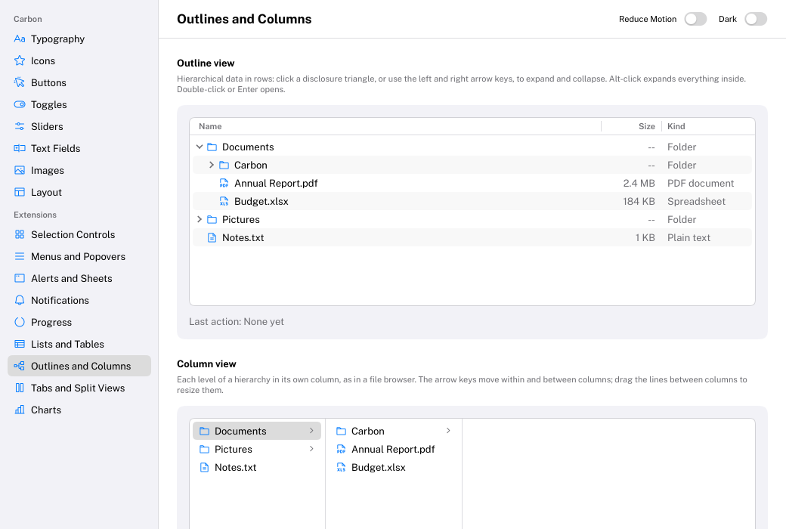

# OutlineView

Hierarchical data in rows, with disclosure triangles: a file browser, the outline of a document.
HIG: [Outline views](https://developer.apple.com/design/human-interface-guidelines/outline-views)
Library: CarbonExtensions, `#include <Carbon/Extensions/OutlineView.h>`



```cpp
void BuildNode(const FileNode& node)
{
    const Carbon::OutlineItem item = Carbon::BeginOutlineItem(node.Name, selected == &node,
        { .Icon = node.IsFolder() ? Carbon::Icons::Folder : Carbon::Icons::FileText,
          .HasChildren = node.IsFolder() });
    Carbon::OutlineCell(node.Size, { .Secondary = true });   // further columns, right after Begin
    if (item.Picked)
        selected = &node;
    if (item.Activated)
        Open(node);
    if (item.IsExpanded)
        for (const FileNode& child : node.Children)
            BuildNode(child);
    Carbon::EndOutlineItem();                              // always, after the children
}

const Carbon::TableColumn columns[] = { { .Title = "Name" }, { .Title = "Size", .Width = 80.0f } };
Carbon::BeginOutlineView("files", { .Height = 300.0f, .Columns = columns });
for (const FileNode& node : root)
    BuildNode(node);
Carbon::EndOutlineView();
```

| Function | Purpose |
| --- | --- |
| `BeginOutlineView(id, options)` / `EndOutlineView()` | The outline view |
| `BeginOutlineItem(label, isSelected, options)` | An item. Returns an `OutlineItem`: `IsExpanded` (add the children now), `Picked` (make it the selection), `Activated` (double-click or Enter: open it). |
| `EndOutlineItem()` | Ends the item, after its children. Needed for every item, leaves too. |
| `OutlineCell(text, options)` | The next column of the item, right after `BeginOutlineItem` |

Each item pushes its ID for its children, so labels only need to be unique among siblings. The application owns
the selection; Carbon remembers which items are expanded, also while they are not shown.

## Options

| Field | Type | Default | Meaning |
| --- | --- | --- | --- |
| `Width`, `Height` | `Size` | `Fill` | An outline view scrolls: inside a stack that fits its content, give it a fixed height |
| `RowHeight` | `float` | 24 | |
| `Columns` | `std::span<const TableColumn>` | none | Columns as in a [Table](Table.md). The first holds the hierarchy; the others are filled with `OutlineCell`. Without columns there is no header. |
| `ShowsAlternatingRows` | `bool` | `false` | Tints every other row |
| `HasBorder` | `bool` | `true` | Bordered control background. Turn it off for an outline view that fills a pane. |

## Item options

| Field | Type | Default | Meaning |
| --- | --- | --- | --- |
| `Icon` | `std::string_view` | none | Before the title |
| `IconTint` | `Color` | theme's `Accent` | |
| `HasChildren` | `bool` | `true` | Shows a disclosure triangle. Leaves set it to `false`. |
| `IsInitiallyExpanded` | `bool` | `false` | Expansion the first time the item appears; afterwards the user's choice is remembered |
| `Disabled` | `bool` | `false` | Cannot be picked; skipped by the keyboard |

## Behaviour

- Each level is indented by 16 points. The disclosure triangle turns as the item expands.
- A click on the triangle expands or collapses without selecting; Alt-click does it for everything inside.
- Titles that do not fit their column end with an ellipsis.
- Rows, selection highlight, hover tint and scrolling behave as in a [List](List.md).

## Keyboard

| Key | Effect |
| --- | --- |
| Tab / Shift+Tab | Focus the outline view; it is one stop |
| Up / Down arrow, Home / End | Select the previous / next / first / last visible item |
| Right arrow | Expand the selected item; when it is expanded, select its first child |
| Left arrow | Collapse the selected item; when it is collapsed or a leaf, select its parent |
| Alt + Right / Left | Expand / collapse the item and everything inside it |
| Enter | Activate the selected item |

## Not supported

Sorting by column, resizing columns and editing cells in place. Sort your data before submitting it.

## Guidance from the HIG

- Use an outline view for hierarchical data only; for flat data use a [List](List.md) or [Table](Table.md).
- Show the hierarchy in the first column and attributes in the others, with short noun titles.
- Let people search a long outline: put a [SearchField](SearchField.md) nearby.
