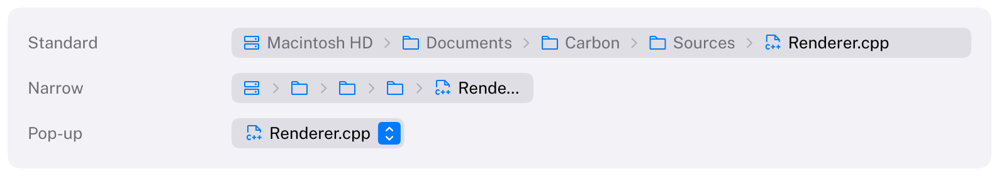

# PathControl

Shows where an item lives: the path from a root (a disk, a project) to the selected item, and lets people go
back to any part of it.
HIG: [Path controls](https://developer.apple.com/design/human-interface-guidelines/path-controls)
Library: CarbonExtensions, `#include <Carbon/Extensions/PathControl.h>`



```cpp
const Carbon::PathControlItem path[] = {
    { .Label = "Macintosh HD", .Icon = Carbon::Icons::HardDrives },
    { .Label = "Documents", .Icon = Carbon::Icons::Folder },
    { .Label = "Report.pdf", .Icon = Carbon::Icons::FilePdf },
};
const int clicked = Carbon::PathControl("Location", path, { .Width = Carbon::Size::Fill() });
if (clicked >= 0)
    GoTo(clicked);   // the application owns the path and decides what a click means
```

The application owns the path, as with [ColumnView](ColumnView.md): the control draws it and reports which
component the user activated. The return value is that component's index on the frame it was clicked or chosen
with the keyboard, and -1 otherwise. The label identifies the control and is not drawn.

## Options

| Field | Type | Default | Meaning |
| --- | --- | --- | --- |
| `Style` | `PathControlStyle` | `Standard` | `Standard`: every component in a row. `PopUp`: a button showing the last component, with the path in a menu |
| `Width` | `Size` | `Fit` | `Fit` shows every name; a fixed width or `Fill` can make the path too long for the control |
| `ControlSize` | `ControlSize` | `Regular` | `Small`, `Regular` or `Large` |
| `Disabled` | `bool` | `false` | Dimmed, ignores input |

Each `PathControlItem` has a `Label` and an optional `Icon` (for example `Icons::Folder`).

## Behaviour

- **Standard style.** The components sit in a field, separated by chevrons, each with its icon and name. The last
  one, the selected item, is drawn in the label color, its parents in the secondary label color. A component
  under the pointer is highlighted; clicking it activates it.
- **When the path is too long.** As the HIG describes, the names between the first and the last component are
  hidden first, starting next to the root, so the components show only their icons. If that is not enough, the
  root's name is truncated, then the selected item's. A component under the pointer or the keyboard highlight
  always shows its name; the others make room, and the change is animated.
- **Pop-up style.** A button like a [PopUpButton](PopUpButton.md) that shows the selected item's icon and name.
  Clicking it opens a menu with the whole path, from the selected item (over the button) down to the root.
  Choosing an entry activates that component.
- Components without an icon show an ellipsis when their name is hidden.
- At most 64 components.

## Keyboard

| Key | Effect |
| --- | --- |
| Tab / Shift+Tab | Focus the control; it is one stop |
| Left / Right arrow | Move the highlight to the previous / next component (standard style) |
| Home / End | Highlight the first / last component |
| Space, Enter | Activate the highlighted component (standard style); open the menu (pop-up style) |
| Up / Down arrow | Open the menu (pop-up style) |

The highlight starts at the selected item and carries the focus ring.

## Guidance from the HIG

- Use a path control in the window body, not in a toolbar or status bar.
- The standard style suits views with room for the path; the pop-up style suits tight spaces and shows the
  selected item, with the rest of the path a click away.
- Dragging an item onto an editable path control to select it, and the "Choose" command of an editable pop-up
  path control, are not part of Carbon's control: the application owns the path and can add a button for that.
