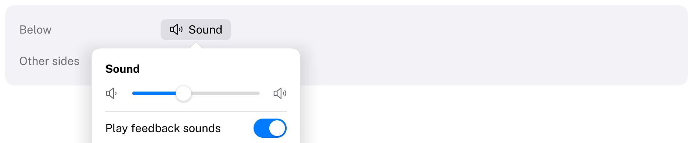
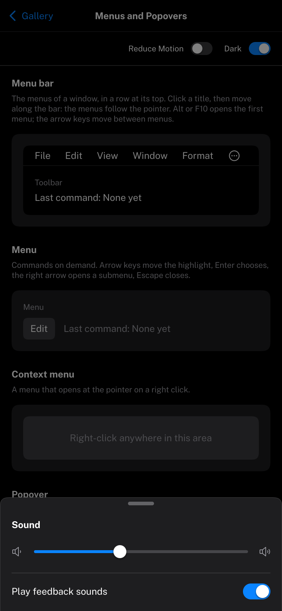

# Popover

A transient view that appears next to the control it belongs to.
HIG: [Popovers](https://developer.apple.com/design/human-interface-guidelines/popovers)
Library: CarbonExtensions, `#include <Carbon/Extensions/Popover.h>`



```cpp
if (Carbon::Button("Sound"))
    Carbon::OpenPopover("sound");
if (Carbon::BeginPopover("sound", { .Width = 240.0f }))
{
    Carbon::Text("Sound", { .Style = Carbon::TextStyle::Headline });
    Carbon::Slider("Volume", &volume, 0.0f, 1.0f, { .Width = Carbon::Size::Fill() });
    Carbon::EndPopover();
}
```

`BeginPopover` returns `true` while the popover is open; then add its content, laid out like in a `VStack`, and
call `EndPopover`. Call it right after the control that opens it: by default the popover points at the item
submitted last.

`OpenPopover`, `ClosePopover` and `IsPopoverOpen` take the same name and must be called at the same ID scope as
`BeginPopover` (not inside a different `PushID`, and not from inside the popover). From inside, close it with
`Carbon::CloseCurrentOverlay()`.

## Options

| Field | Type | Default | Meaning |
| --- | --- | --- | --- |
| `Anchor` | `Rect` | the last item | The rectangle the arrow points at |
| `Placement` | `OverlayPlacement` | `Below` | `Below`, `Above`, `Trailing` or `Leading`; flips when there is no room |
| `Width`, `Height` | `Size` | `Fit` | |
| `Padding` | `EdgeInsets` | 16 | |
| `Spacing` | `float` | theme's `Spacing` | |
| `ShowsArrow` | `bool` | `true` | |
| `DismissOnOutsideClick` | `bool` | `true` | Off: the popover stays while the user works elsewhere |

## Behaviour

- The popover is centered on its anchor and stays on the display.
- It fades in; it closes at once.
- While open it holds the pointer and the keyboard (see [Overlays](../Overlays.md)): a click outside closes it
  and is used up. With `DismissOnOutsideClick` off it holds neither: it covers only its own surface, and its
  controls are part of the normal Tab order.
- It closes by itself when `BeginPopover` is no longer called, for example because the page that contains it
  went away.

## Keyboard

| Key | Effect |
| --- | --- |
| Tab / Shift+Tab | Cycle through the controls inside the popover (with `DismissOnOutsideClick` off, the normal Tab order) |
| Escape | Close; focus returns to where it was (with `DismissOnOutsideClick` off the popover never took the focus, and it is not moved) |

## Compact width

On a phone (compact width, see [Phones and tablets](../Mobile.md)) the popover slides up from the bottom of the display as a
sheet across its width, without its arrow, over the dimmed interface. A tap above it or dragging it down by its grabber dismisses it. Nothing changes in
the code.



## Guidance from the HIG

- Use a popover for a small amount of content or controls related to what is on screen; for a task of its own,
  use a [Sheet](Sheet.md).
- Point the popover at the element that revealed it, and let it close when people click elsewhere.
- Avoid showing a popover from a popover.
