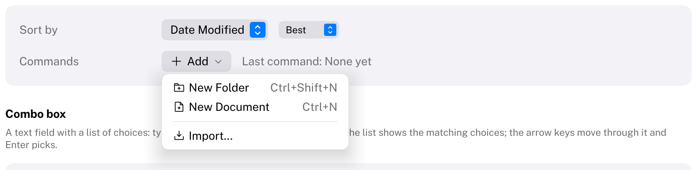
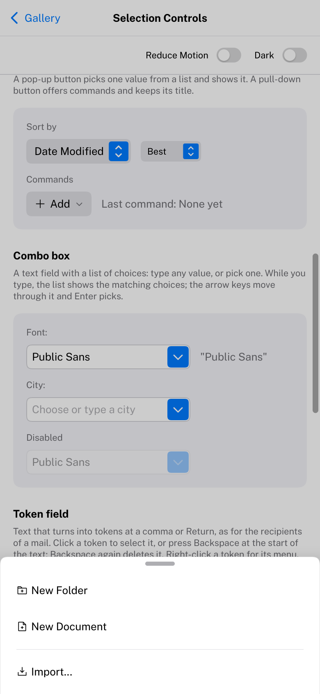

# PullDownButton

A button that opens a menu of commands.
HIG: [Pull-down buttons](https://developer.apple.com/design/human-interface-guidelines/pull-down-buttons)
Library: CarbonExtensions, `#include <Carbon/Extensions/PullDownButton.h>`



```cpp
if (Carbon::BeginPullDownButton("Add", { .Icon = Carbon::Icons::Plus }))
{
    if (Carbon::MenuItem("New Folder", { .Shortcut = "Ctrl+Shift+N" }))
        NewFolder();
    if (Carbon::MenuItem("New Document"))
        NewDocument();
    Carbon::MenuSeparator();
    if (Carbon::MenuItem("Import..."))
        Import();
    Carbon::EndPullDownButton();
}
```

`BeginPullDownButton` draws the button and returns `true` while its menu is open; then add items exactly as in
a [Menu](Menu.md) (`MenuItem`, `MenuSeparator`, `MenuHeader`, `BeginSubmenu`) and call `EndPullDownButton`.
Unlike a [PopUpButton](PopUpButton.md) it keeps its title: the items are things to do, not a value.

## Options

| Field | Type | Default | Meaning |
| --- | --- | --- | --- |
| `Icon` | `std::string_view` | none | Before the title. With a label of only an ID (`"##more"`), the button shows just the icon and the chevron. |
| `ControlSize` | `ControlSize` | `Regular` | |
| `Width` | `Size` | `Fit` | |
| `Disabled` | `bool` | `false` | |

## Behaviour

- The button looks like a default [Button](Button.md) with a chevron pointing down.
- The menu opens below the button when the mouse button goes down, aligned with its leading edge and at least
  as wide as the button.

## Keyboard

| Key | Effect |
| --- | --- |
| Tab / Shift+Tab | Focus the button |
| Space, Enter, Down arrow | Open the menu with its first item highlighted |
| Menu keys | See [Menu](Menu.md#keyboard) |
| Escape | Close; focus returns to the button |

## Compact width

On a phone (compact width, see [Phones and tablets](../Mobile.md)) the pull-down button's menu slides up from the bottom of the display as a
sheet across its width, A tap above it or dragging it down by its grabber dismisses it. Nothing changes in
the code.



## Guidance from the HIG

- Use a pull-down button for commands that relate to the button's purpose ("Add", "Share", "More"), and name
  the button so that the contents of the menu are predictable.
- Do not put the button's main action only in its menu: if there is one obvious action, give it a button of its
  own next to it.
- For an icon-only button with further actions, the ellipsis icon is the convention.
