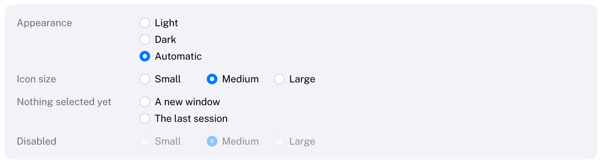

# RadioGroup

A set of radio buttons for a few mutually exclusive choices.
HIG: [Toggles](https://developer.apple.com/design/human-interface-guidelines/toggles) (radio buttons)
Library: CarbonExtensions, `#include <Carbon/Extensions/RadioGroup.h>`



```cpp
int appearance = 2;
if (Carbon::RadioGroup("Appearance", &appearance, { "Light", "Dark", "Automatic" }))
    ApplyAppearance(appearance);

Carbon::RadioGroup("Icon size", &iconSize, { "Small", "Medium", "Large" },
                   { .Orientation = Carbon::Axis::Horizontal });
```

`selected` is the index of the selected button, or -1 when none is selected yet. The function returns `true` on
the frame the selection changed. The label identifies the group and is not drawn: put a title in front of the
group, in a [Grid](Grid.md) row with `VerticalAlignment::Top` so that it sits on the line of the first button.
Items can also be passed as a `std::span<const std::string_view>`.

## Options

| Field | Type | Default | Meaning |
| --- | --- | --- | --- |
| `Orientation` | `Axis` | `Vertical` | `Vertical` stacks the buttons; `Horizontal` puts them in a row |
| `Spacing` | `float` | 6 vertical, 20 horizontal | Distance between buttons |
| `ControlSize` | `ControlSize` | `Regular` | `Small`, `Regular` or `Large`: buttons of 12, 14 or 16 points |
| `Disabled` | `bool` | `false` | Dimmed, ignores input |

## Behaviour

- Each button is a circle followed by its label, and the whole row is its hit target. The selected circle is
  filled with the accent color around a white dot; the dot fades and grows in.
- Hover and pressed feedback as on every Carbon control.
- In a horizontal group every button is as wide as the widest, so the spacing between them is consistent.
- An index outside the range is treated as the nearest button and written back without reporting a change.
  -1 is kept: no button is selected.
- At most 64 items; more is reported, and more than five belong in a [PopUpButton](PopUpButton.md) anyway.

## Keyboard

| Key | Effect |
| --- | --- |
| Tab / Shift+Tab | Focus the group; it is one stop. The ring is drawn around the selected button |
| Down / Right arrow | Select the next button |
| Up / Left arrow | Select the previous button |
| Space, or any arrow key | With nothing selected, select the first button |

The arrow keys stop at the first and last button. As in AppKit with Full Keyboard Access, they change the
selection directly; there is no separate focus inside the group.

## Guidance from the HIG

- Use radio buttons for mutually exclusive choices; for choices that combine, use checkboxes
  ([Toggle](Toggle.md) with `ToggleKind::Checkbox`).
- Two to five buttons are typical. For more, use a [PopUpButton](PopUpButton.md).
- For a single setting that is on or off, prefer a checkbox. A pair of radio buttons is right only when each
  state needs its own label.
- Use consistent spacing in a horizontal group, measured from the longest label: Carbon does this.
- Radio buttons have no useful mixed state; Carbon has none.
- Keep radio buttons in the window body, not in a toolbar or status bar.
