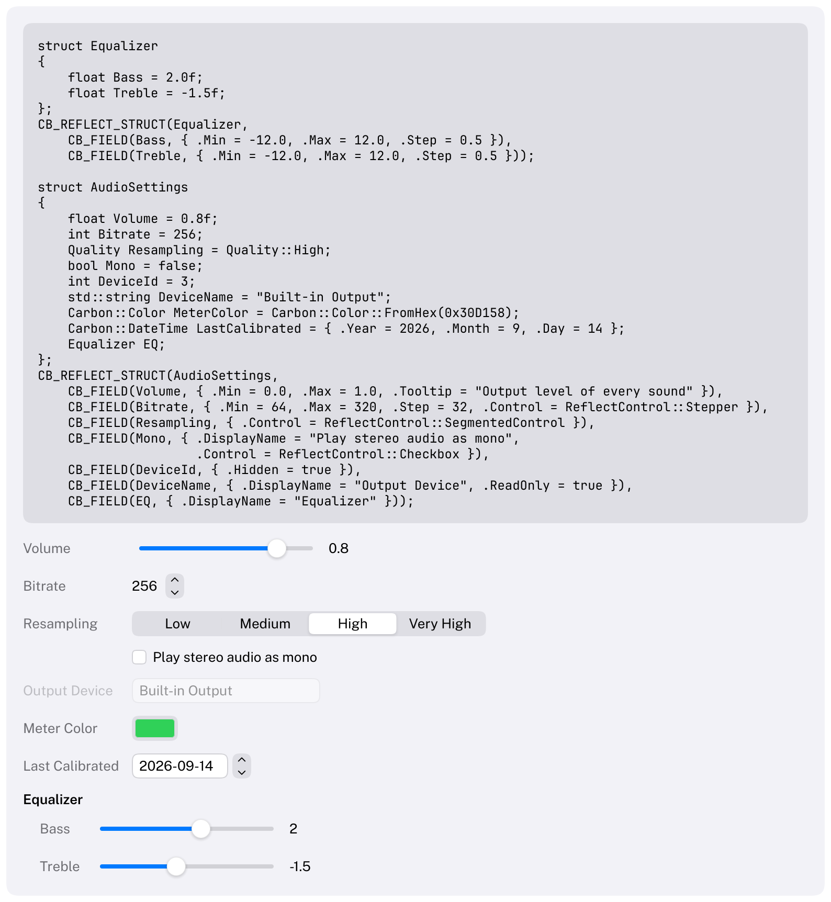

# Reflect

Builds the controls for an enum or a struct from its type: a pop-up button for an enum, a labeled control per
field for a struct.
HIG: [Layout](https://developer.apple.com/design/human-interface-guidelines/layout),
[Pop-up buttons](https://developer.apple.com/design/human-interface-guidelines/pop-up-buttons)
Library: CarbonReflection, `#include <Carbon/Reflection/Reflection.h>`



```cpp
enum class Quality { Low, Medium, High, VeryHigh };

struct GraphicsSettings
{
    Quality TextureQuality = Quality::High;
    bool VSync = true;
    float Gamma = 2.2f;
};
CB_REFLECT_STRUCT(GraphicsSettings, CB_FIELD(Gamma, { .Min = 1.0, .Max = 3.0, .Tooltip = "Display gamma" }));

Carbon::Reflect("quality", &quality);      // a pop-up button: Low, Medium, High, Very High
if (Carbon::Reflect("graphics", &graphics)) // Texture Quality, V Sync and Gamma, each with its control
    ApplyGraphics(graphics);
```

`Reflect` returns `true` on frames the value changed; for a struct, when any field changed. The label identifies
the control and is not drawn. It works for any enum and for every type `ReflectedStruct` accepts: aggregates
without extra code, other types through `CB_REFLECT_STRUCT`. Any other type fails to compile with a message that
lists what is supported. [Reflection](../Reflection.md) explains automatic reflection, the macros and the limits.

## Options

| Field | Type | Default | Meaning |
| --- | --- | --- | --- |
| `EnumStyle` | `ReflectEnumStyle` | `PopUpButton` | `PopUpButton`, `SegmentedControl` or `RadioGroup`, for a reflected enum and every enum field |
| `Layout` | `ReflectLayout` | `LabelLeading` | `LabelLeading`: labels in a column as wide as the widest label of the struct, controls after them. `LabelAbove`: each label above its control |
| `ControlSize` | `ControlSize` | `Regular` | The size of every control |
| `Disabled` | `bool` | `false` | Shows everything without letting it be changed |

## Fields and their controls

| Field type | Control |
| --- | --- |
| `bool` | Switch; `ReflectControl::Checkbox` makes it a checkbox that carries the label |
| integer, `float`, `double` with `Min` and `Max` | Slider, with the value after it |
| integer, `float`, `double` without a range | The value, then a stepper over the type's limits (step 1, or 0.1 for floating point) |
| `std::string` | Text field |
| enum | Pop-up button, segmented control or radio group |
| `Carbon::Color` | Color well |
| `Carbon::DateTime` | Date picker (date only) |
| reflected struct | A group: the field's label as an emphasized title, then its fields indented by 16 points |

A field's `Control` from `CB_FIELD` wins over the call's `EnumStyle`, which wins over the default. A control that
does not suit the field's type (a slider for a `std::string`, a slider without `Min` and `Max`) is a compile
error. Numbers show at most two decimals. `ReadOnly` fields are drawn disabled, `Hidden` fields are skipped, and a
`Tooltip` appears over the field's whole row.

## Keyboard

Tab moves through the fields in their order; each control then behaves as on its own page (Space flips a switch,
arrows move a slider, stepper, segmented control or radio group, Space opens a pop-up button). Every field pushes
its name onto the ID stack, so focus and other state stay with the field when the layout changes. Read-only and
disabled fields are not Tab stops.

## Guidance from the HIG

- Group related settings and give each group a clear title; nested structs do this for you.
- Prefer a pop-up button for many options, and a segmented control or radio buttons for two to five options
  that should all be visible.
- Use a switch for settings that take effect at once, and a checkbox for options in a list or a form that is
  applied later.
