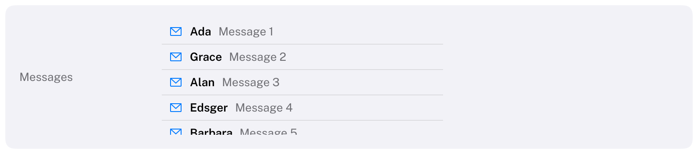

# ScrollView

A clipped area whose content can be larger than it.
HIG: [Scroll views](https://developer.apple.com/design/human-interface-guidelines/scroll-views)



```cpp
Carbon::BeginScrollView("log", { .Height = 200.0f, .Spacing = 4.0f });
    for (const std::string& line : lines)
        Carbon::Text(line);
Carbon::EndScrollView();

Carbon::BeginScrollView("page", { .Padding = 24.0f });     // fills the rest of its parent
    // ...
Carbon::EndScrollView();
```

Items inside are laid out like in a stack along the scrolling axis. The ID is required, identifies the scroll
offset and is pushed on the ID stack.

## Options

| Field | Type | Default | Meaning |
| --- | --- | --- | --- |
| `Axis` | `Axis` | `Vertical` | The direction the content scrolls and is laid out in |
| `Width`, `Height` | `Size` | `Fill` | Size of the visible area. Inside a stack that fits its content, give the scrolling axis a fixed size. |
| `Spacing` | `float` | theme's `Spacing` (8) | Distance between items |
| `Padding` | `EdgeInsets` | 0 | Space around the content; scrolls with it |
| `Alignment` | `Alignment` | `Leading` | Where items sit across the scrolling axis |
| `ShowsIndicator` | `bool` | `true` | The overlay scroll indicator |

## Behaviour

- The mouse wheel scrolls the innermost scroll view under the pointer, three lines (48 points) per notch. In a
  horizontal scroll view a plain wheel scrolls sideways.
- The view glides to its new offset with a spring; with reduced motion it jumps.
- The overlay indicator appears while scrolling, when the view first appears and while the pointer is over its
  lane at the trailing edge, then fades out after about a second, as on macOS. It takes no space, grows slightly
  under the pointer and can be dragged.
- The offset is clamped to the content, survives while the view is not shown, and can be read and set with
  `GetScrollOffset(id)` and `SetScrollOffset(id, offset, animated = false)`, in points and by the ID the view
  was begun with. A set offset is clamped on the next frame; without `animated` the view jumps there.
- Content outside the visible area is not drawn and does not react to the pointer.
- While something is dragged (see [Drag and drop](../DragAndDrop.md#while-something-is-dragged)), the pointer
  within 32 points of an edge of the view under it scrolls the view towards that edge, faster the closer it gets.

## Keyboard

| Key | Effect |
| --- | --- |
| Page Down / Page Up | Scroll by nine tenths of the visible area |
| Home / End | Scroll to the start / end, when no control has focus (a focused slider or text field uses these keys itself) |
| Tab | When focus moves to a control that is scrolled out of view, the view scrolls just far enough to reveal it |

The page keys act on the scroll view under the pointer, or on the outermost one when the pointer is elsewhere,
and are left alone while a text field is being edited.

## Guidance from the HIG

Avoid nesting scroll views that scroll in the same direction. A horizontal scroll view inside a vertical one is
fine.
