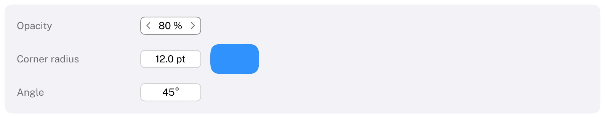

# ScrubField

A number that changes as the pointer drags across it, and becomes a number field for typing on a click.
HIG: no macOS control of its own; it follows the value fields of Apple's pro apps (Motion, Final Cut Pro) and
the [text field](https://developer.apple.com/design/human-interface-guidelines/text-fields) guidance for typing.
Library: CarbonExtensions, `#include <Carbon/Extensions/ScrubField.h>`



```cpp
float opacity = 80.0f;
Carbon::ScrubField("Opacity", &opacity, { .Min = 0.0, .Max = 100.0, .Format = { .Suffix = " %" } });

double radius = 12.0;
Carbon::ScrubField("Corner radius", &radius,
                   { .Min = 0.0, .Max = 30.0, .Step = 0.5, .Format = { .Decimals = 1, .Suffix = " pt" } });
```

`ScrubField` binds to an `int`, a `float` or a `double` and returns `true` on frames the value changed. The label
identifies the control and is not drawn.

## Options

| Field | Type | Default | Meaning |
| --- | --- | --- | --- |
| `Min`, `Max` | `double` | −∞, ∞ | The value stays within this range; unlimited by default |
| `Step` | `double` | 1 | Change per point dragged, and per press of an arrow key while typing |
| `Format` | `NumberFormat` | automatic | How the value is shown; see [NumberField](NumberField.md#numberformat) |
| `Width` | `Size` | 80 points | |
| `ControlSize` | `ControlSize` | `Regular` | |
| `Disabled` | `bool` | `false` | |

## Mouse

| Action | Effect |
| --- | --- |
| Hover | Chevrons appear at both ends and the pointer becomes a horizontal resize cursor |
| Drag sideways | Change the value by `Step` per point; the first 3 points only tell a drag from a click |
| Shift while dragging | A tenth of a step per point |
| Ctrl while dragging | Ten steps per point |
| Click without dragging | Turn into a number field with the whole value selected, ready for typing |

The value follows the pointer while it drags, also beyond the control's edges, and is clamped to `[Min, Max]`.
Values reached by dragging are multiples of the step in use, and slow drags add up: dragging a tenth of a step
per frame still moves the value. The modifiers can change during a drag.

## Keyboard

| Key | Effect |
| --- | --- |
| Tab / Shift+Tab | Focus the control as a number field with its value selected |
| Up / Down arrow (while typing) | One step; with Shift a tenth, with Ctrl ten steps |
| Return | Apply the typed value |
| Escape | Discard the typing and go back to dragging |

While it is being typed into, a scrub field is a [NumberField](NumberField.md) and accepts what a number field
accepts; leaving it applies the value and shows the control for dragging again.

## Guidance

- Use a scrub field where values are adjusted by feel and watched elsewhere: sizes, angles, opacity in an
  inspector. For values that are usually typed exactly, a [NumberField](NumberField.md) is clearer.
- Choose `Step` so that a comfortable drag covers the useful range: about one step per point for whole numbers,
  a hundredth of the range for a value between 0 and 1.
- Show the unit with a suffix, and put a `Text` with a title next to the control.
