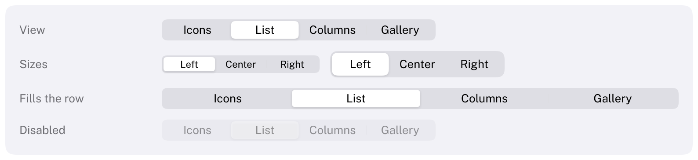

# SegmentedControl

A row of closely related choices of which exactly one is selected.
HIG: [Segmented controls](https://developer.apple.com/design/human-interface-guidelines/segmented-controls)
Library: CarbonExtensions, `#include <Carbon/Extensions/SegmentedControl.h>`



```cpp
int view = 0;
if (Carbon::SegmentedControl("View", &view, { "Icons", "List", "Columns" }))
    ApplyView(view);
```

`selected` is the index of the selected segment. The function returns `true` on the frame the selection changed.
The label identifies the control and is not drawn. Segments can also be passed as a
`std::span<const std::string_view>`.

## Options

| Field | Type | Default | Meaning |
| --- | --- | --- | --- |
| `ControlSize` | `ControlSize` | `Regular` | `Small`, `Regular` or `Large` |
| `Width` | `Size` | `Fit` | `Fit` makes every segment as wide as the widest label; a fixed width or `Fill` is divided equally |
| `Disabled` | `bool` | `false` | Dimmed, ignores input |

## Behaviour

- All segments have the same width.
- The selected segment is a raised plate that slides to its new place with a spring (it jumps with Reduce
  Motion).
- An unselected segment under the pointer is tinted. A segment is selected when the mouse button goes down on
  it.
- An index outside the range is treated as the nearest segment and written back, without returning `true`.

## Keyboard

| Key | Effect |
| --- | --- |
| Tab / Shift+Tab | Focus the control; it is one stop |
| Left / Right arrow | Select the previous / next segment |

## Guidance from the HIG

- Use it for five to seven choices at most; for more, use a [PopUpButton](PopUpButton.md).
- Keep the labels short and of similar length, as nouns or noun phrases, and do not mix text and icons.
- Do not use a segmented control for actions; that is what buttons are for.
