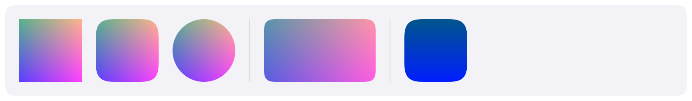

# Separator

A thin line between items.
HIG: [Layout](https://developer.apple.com/design/human-interface-guidelines/layout) (grouping related items)



```cpp
Carbon::BeginVStack({ .Width = Carbon::Size::Fill() });
    Carbon::Toggle("Wi-Fi", &wifi, { .Width = Carbon::Size::Fill() });
    Carbon::Separator();
    Carbon::Toggle("Bluetooth", &bluetooth, { .Width = Carbon::Size::Fill() });
Carbon::EndVStack();
```

A separator follows the direction of its stack: a horizontal line in a vertical stack, a vertical line in a
horizontal stack. It spans the stack across its axis and never makes the stack larger.

## Options

| Field | Type | Default | Meaning |
| --- | --- | --- | --- |
| `Color` | `Color` | theme's `Separator` | |
| `Thickness` | `float` | theme's `BorderWidth` (1 point) | Rounded to whole pixels, at least one |

## Keyboard

Separators are not interactive.

## Guidance from the HIG

Group related items with space first, then with a background shape, and use separator lines sparingly. Carbon's
design follows that: few borders, generous spacing.
