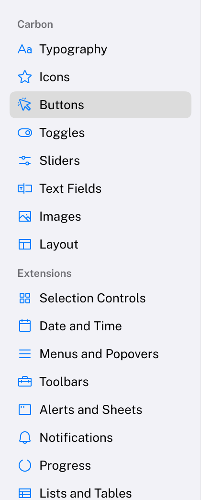

# Sidebar

The column at the leading edge of a window that navigates between the areas of an app.
HIG: [Sidebars](https://developer.apple.com/design/human-interface-guidelines/sidebars)
Library: CarbonExtensions, `#include <Carbon/Extensions/Sidebar.h>`



```cpp
Carbon::BeginHStack({ .Spacing = 0.0f, .Alignment = Carbon::VerticalAlignment::Top,
                      .Width = Carbon::Size::Fill(), .Height = Carbon::Size::Fill() });

Carbon::BeginSidebar("sidebar");
Carbon::SidebarHeader("Library");
if (Carbon::SidebarItem("Songs", page == Page::Songs, { .Icon = Carbon::Icons::MusicNotes }))
    page = Page::Songs;
if (Carbon::SidebarItem("Albums", page == Page::Albums, { .Icon = Carbon::Icons::VinylRecord, .Badge = "12" }))
    page = Page::Albums;
Carbon::EndSidebar();

BuildPage(page);          // the content, next to the sidebar
Carbon::EndHStack();
```

The application owns the selection: pass each item whether it is the selected one, and make it the selection
when `SidebarItem` returns `true`.

| Function | Purpose |
| --- | --- |
| `BeginSidebar(id, options)` / `EndSidebar()` | The sidebar; items and headers go in between |
| `SidebarHeader(title)` | The title of a group of items |
| `SidebarItem(label, isSelected, options)` | One destination. Returns `true` when the user picks it. |

## Sidebar options

| Field | Type | Default | Meaning |
| --- | --- | --- | --- |
| `Width` | `float` | 220 | Width of the column in points |
| `Padding` | `EdgeInsets` | 10 | Space between the sidebar's edge and its items |

## Item options

| Field | Type | Default | Meaning |
| --- | --- | --- | --- |
| `Icon` | `std::string_view` | none | Before the title, in the accent color |
| `Badge` | `std::string_view` | none | Short secondary text at the trailing edge, typically a count |
| `IconTint` | `Color` | theme's `Accent` | Color of the icon; a selected item draws it in the on-accent color while the sidebar has focus |
| `Disabled` | `bool` | `false` | Dimmed; cannot be picked and is skipped by the keyboard |

## Behaviour

- The sidebar fills the height of its container, has an opaque secondary background with a hairline at its
  trailing edge, and scrolls when its items do not fit.
- The selection is a rounded highlight that **slides** from the old item to the new one with a spring; it jumps
  with Reduce Motion.
- The highlight is gray, and takes the selection color with on-accent text while the sidebar has keyboard
  focus.
- An item is picked when the mouse button goes down, as in macOS source lists, not when it is released.
- An item under the pointer is tinted.
- Titles that do not fit are cut off with an ellipsis.

## Keyboard

| Key | Effect |
| --- | --- |
| Tab / Shift+Tab | Focus the sidebar; it is one stop |
| Up / Down arrow | Select the previous / next item |
| Home / End | Select the first / last item |

A selection made by keyboard is scrolled into view. Because the application owns the selection, a key press
takes effect on the following frame, through the return value of the item it moves to.

## Guidance from the HIG

- Use a sidebar for the top level of navigation, with at most two levels of hierarchy.
- Give every item an icon and a short title; group items under headers when there are many.
- Keep the selected item visible and do not put critical actions at the bottom of a sidebar.
