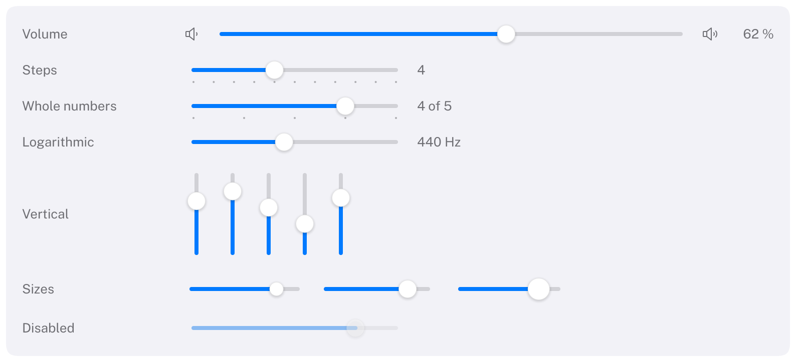

# Slider

Picks a value from a continuous or stepped range.
HIG: [Sliders](https://developer.apple.com/design/human-interface-guidelines/sliders)



```cpp
Carbon::BeginHStack({ .Spacing = 10.0f, .Width = Carbon::Size::Fill() });
    Carbon::Text("Volume");
    Carbon::Slider("Volume", &volume, 0.0f, 1.0f, { .Width = Carbon::Size::Fill() });
Carbon::EndHStack();

int rating = 4;
Carbon::Slider("Rating", &rating, 1, 5, { .ShowsTicks = true });

double frequency = 440.0;
Carbon::Slider("Frequency", &frequency, 20.0, 20000.0, { .Scale = Carbon::SliderScale::Logarithmic });

Carbon::Slider("Bass", &bass, -12.0f, 12.0f, { .Axis = Carbon::Axis::Vertical, .Height = 96.0f });
```

`Slider` binds to a `float`, a `double` or an `int`, with a range of the same type, returns `true` on frames the
value changed and keeps the value inside `[min, max]`. The label identifies the slider and is not drawn; put a
`Text` next to it for a visible title.

- **`float` and `double`** are continuous unless `Step` is set. A `double` slider keeps a `double`'s precision:
  with `Step = 0.001`, values are exact thousandths.
- **`int`** moves in whole steps: `Step` is rounded to a whole number of at least 1, so an `int` slider without a
  step moves by 1.

## Options

| Field | Type | Default | Meaning |
| --- | --- | --- | --- |
| `Step` | `double` | 0 | Distance between allowed values, counted from `min`; 0 is continuous. Also the arrow-key increment. |
| `ShowsTicks` | `bool` | `false` | A tick mark at every step: below a horizontal slider, at the trailing side of a vertical one. Needs a step; a range of more than 100 steps draws none |
| `ControlSize` | `ControlSize` | `Regular` | Knob of 14, 18 or 22 points |
| `Width` | `Size` | 180 points | Length of a horizontal slider. A slider cannot fit its content, so the default is a fixed length; use `Fill` to take the rest of a row |
| `Disabled` | `bool` | `false` | |
| `Tint` | `Color` | theme's `Accent` | Color of the filled part of the track |
| `Axis` | `Axis` | `Horizontal` | `Vertical` runs from the minimum at the bottom to the maximum at the top |
| `Height` | `Size` | 180 points | Length of a vertical slider |
| `Scale` | `SliderScale` | `Linear` | `Logarithmic` spaces equal ratios evenly, for ranges over several orders of magnitude |

Across its axis a slider is as thick as a control of its size (24 points for `Regular`), so a horizontal slider
ignores `Height` and a vertical one `Width`.

## Logarithmic scale

On a logarithmic slider, equal distances are equal ratios: on `[20, 20000]` each third of the track is a factor
of ten, as on the frequency axis of an equalizer. The range must be positive. `Step`, when set, still divides the
*value* (a `Step` of 10 gives multiples of 10), and without a step (only a `float` or `double` slider has none)
the arrow keys move the knob by a twentieth of the track. Tick marks are drawn where the steps fall, so on a
logarithmic slider they crowd towards the maximum; most logarithmic sliders leave them off.

## Behaviour

- Dragging the knob keeps the grab point under the pointer. The drag continues when the pointer leaves the
  slider.
- Clicking the track moves the knob to the click.
- The value updates while dragging, so results can be shown live, as the HIG recommends.
- The knob grows slightly under the pointer and darkens while it is held.
- A null `value`, a range that is empty (`max <= min`), a logarithmic scale whose `min` is not above 0 and a
  negative `Step` are reported through the assert callback; the slider is then not drawn and returns `false`.

## Keyboard

| Key | Effect |
| --- | --- |
| Tab / Shift+Tab | Focus the slider (the ring is drawn around the knob) |
| Right, Up | Increase by `Step`, or when continuous move the knob by 5 % of the track |
| Left, Down | Decrease |
| Home / End | Minimum / maximum |

Held arrow keys repeat. Up and Right increase a vertical slider too.

## Guidance from the HIG

- Show the value or its effect next to the slider when the exact value matters, and use tick marks when
  people should pick one of a few values.
- A vertical slider suits values that people think of as a level, such as the bands of an equalizer.
