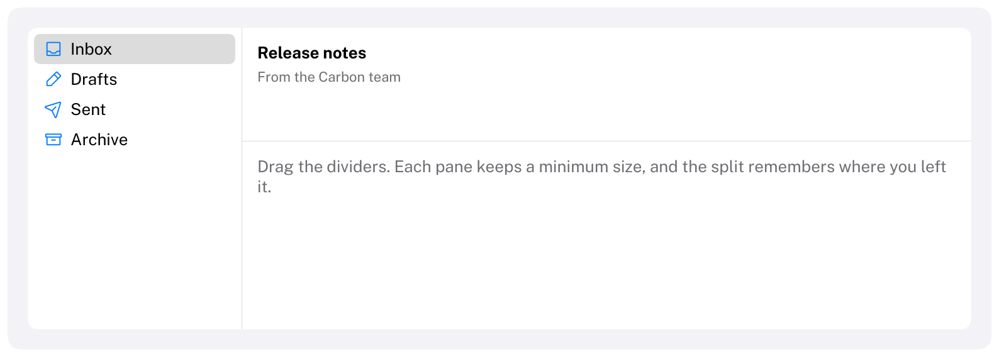

# SplitView

Two panes separated by a divider that the user can move.
HIG: [Split views](https://developer.apple.com/design/human-interface-guidelines/split-views)
Library: CarbonExtensions, `#include <Carbon/Extensions/SplitView.h>`



```cpp
Carbon::BeginSplitView("main", { .InitialSize = 240.0f });
    BuildMessageList();                 // first pane
Carbon::SplitViewDivider();
    BuildMessage();                     // second pane
Carbon::EndSplitView();
```

Each pane lays its content out like a `VStack` that fills the pane. Split views nest; a three-pane layout is a
split view inside the second pane of another:

```cpp
Carbon::BeginSplitView("outer");
    BuildFolders();
Carbon::SplitViewDivider();
    Carbon::BeginSplitView("inner", { .Axis = Carbon::Axis::Vertical, .InitialSize = 160.0f });
        BuildList();
    Carbon::SplitViewDivider();
        BuildDetail();
    Carbon::EndSplitView();
Carbon::EndSplitView();
```

## Options

| Field | Type | Default | Meaning |
| --- | --- | --- | --- |
| `Axis` | `Axis` | `Horizontal` | `Horizontal` puts the panes side by side, `Vertical` one above the other |
| `InitialSize` | `float` | 240 | Length of the first pane before the user moves the divider |
| `MinSize` | `float` | 120 | Shortest length of the first pane |
| `MinSecondSize` | `float` | 120 | Shortest length of the second pane |
| `Width`, `Height` | `Size` | `Fill` | Size of the whole split view |

## Behaviour

- The divider is a hairline that can be grabbed four points to either side of it. Under the pointer and while
  it is dragged it shows as a wider bar, and the cursor becomes a resize cursor (through the host's `SetCursor`
  callback).
- The position is the length of the first pane. It is remembered for as long as the context exists, also while
  the split view is not shown, and kept within the two minimums when the split view changes size.
- Panes do not clip their content. Put a `ScrollView`, `List` or `Table` in a pane whose content can outgrow it.
- Split views can be nested eight deep.

## Keyboard

| Key | Effect |
| --- | --- |
| Tab / Shift+Tab | Focus the divider |
| Left / Right arrow (Up / Down for a vertical split) | Move the divider by 12 points; held keys repeat |

## Guidance from the HIG

- Give each pane a minimum size at which its content still works.
- Use a thin divider, as here, unless the panes need a visible handle.
- Prefer a [Sidebar](Sidebar.md) for the navigation column of a window; use a split view where the user should
  control how space is shared.
