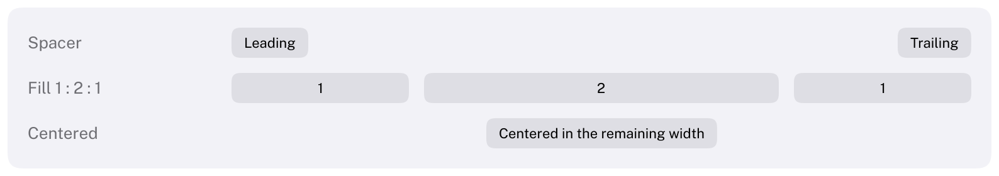

# VStack, HStack and Spacer

Lay items out in a column or a row.
HIG: [Layout](https://developer.apple.com/design/human-interface-guidelines/layout)



```cpp
Carbon::BeginVStack({ .Spacing = 12.0f, .Padding = 20.0f });
    Carbon::Text("Settings", { .Style = Carbon::TextStyle::LargeTitle });
    Carbon::Toggle("Dark Mode", &darkMode);
    Carbon::BeginHStack({ .Spacing = 8.0f, .Width = Carbon::Size::Fill() });
        Carbon::Spacer();
        Carbon::Button("Cancel");
        Carbon::Button("Save", { .Role = Carbon::ButtonRole::Prominent });
    Carbon::EndHStack();
Carbon::EndVStack();
```

Every `Begin` needs its `End`; forgetting one is reported at the end of the frame. The full model (sizes, free
space, the one frame of latency, identity) is explained in [Layout](../Layout.md).

A stack that appears is drawn in its first frame at its final size when its layout did not depend on its own
measurements, as with leading alignment or a row of equally tall controls; otherwise it is hidden for that one
frame and fades in. [The first frame of a new stack](../Layout.md#the-first-frame-of-a-new-stack) lists the
cases.

## VStackOptions and HStackOptions

| Field | Type | Default | Meaning |
| --- | --- | --- | --- |
| `Spacing` | `float` | theme's `Spacing` (8) | Distance between items |
| `Padding` | `EdgeInsets` | 0 | `20.0f`, `{horizontal, vertical}` or `{left, top, right, bottom}` |
| `Alignment` | `Alignment` (VStack), `VerticalAlignment` (HStack) | `Leading`, `Center` | Where items sit across the axis |
| `Justify` | `VerticalAlignment` (VStack), `Alignment` (HStack) | `Top`, `Leading` | Where the content sits along the axis when there is room and no spacer |
| `Width`, `Height` | `Size` | `Fit` | |
| `Background` | `Color` | none | A squircle behind the stack: a grouped box |
| `CornerRadius` | `float` | theme's `GroupCornerRadius` (10) | Corner radius of the background |
| `ID` | `std::string_view` | call site | A stable identity; see [Identity](#identity) |

A grouped box, as in System Settings:

```cpp
Carbon::BeginVStack({ .Padding = 16.0f,
                      .Width = Carbon::Size::Fill(),
                      .Background = Carbon::GetStyleColor(Carbon::StyleColor::SecondaryBackground) });
// rows ...
Carbon::EndVStack();
```

## Spacer

```cpp
Carbon::Spacer();                          // takes the free space of the stack
Carbon::Spacer({ .Length = 24.0f });       // a fixed gap
```

| Field | Type | Default | Meaning |
| --- | --- | --- | --- |
| `Length` | `float` | none | A fixed length; the spacer then does not stretch |
| `MinLength` | `float` | 0 | The least a flexible spacer takes |
| `Weight` | `float` | 1 | Share of the free space relative to other spacers and `Fill` items |

A spacer only has free space to take when its stack's size along the axis is fixed or `Fill`.

## Identity

A stack is identified by the line that begins it, so **one line may begin only one stack per container and ID
scope** in a frame. A loop, or a helper function called several times, breaks that rule; Carbon then tells the
stacks apart by their order and logs a warning from `Layout` once, naming the file, the line and the fix. Give
each stack its own identity with `PushID(key)` / `PopID()` around the call, or with `.ID`. In a helper, pushing
the ID around the `Begin` call alone keeps the IDs of the widgets inside unchanged:

```cpp
void BeginRow(std::string_view label)
{
    Carbon::PushID(label);
    Carbon::BeginHStack();
    Carbon::PopID();
    // ...
}
```

[Layout](../Layout.md#identity) explains why.

## Keyboard

Stacks are not interactive. Tab moves through the controls inside them in the order they are submitted, which is
reading order.
