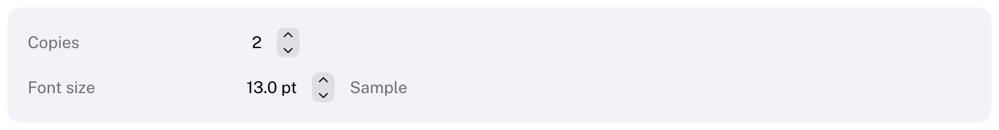

# Stepper

Two small buttons that increase and decrease a value in fixed steps.
HIG: [Steppers](https://developer.apple.com/design/human-interface-guidelines/steppers)
Library: CarbonExtensions, `#include <Carbon/Extensions/Stepper.h>`



```cpp
int copies = 1;
Carbon::BeginHStack();
Carbon::Text(std::format("{}", copies));
Carbon::Stepper("Copies", &copies, { .Min = 1.0, .Max = 99.0 });
Carbon::EndHStack();
```

`Stepper` binds to a `double` or an `int` and returns `true` on the frame the value changed. A stepper does not
show its value: put a `Text` or a `TextField` next to it. The label identifies the stepper and is not drawn.

## Options

| Field | Type | Default | Meaning |
| --- | --- | --- | --- |
| `Min`, `Max` | `double` | 0, 100 | The value stays within this range |
| `Step` | `double` | 1 | Change per click or key press |
| `Wraps` | `bool` | `false` | Stepping past one end continues at the other |
| `ControlSize` | `ControlSize` | `Regular` | |
| `Disabled` | `bool` | `false` | |

## Behaviour

- A press on the upper half adds one step, on the lower half subtracts one.
- Holding a half repeats: after 0.4 seconds, then every 50 milliseconds.

## Keyboard

| Key | Effect |
| --- | --- |
| Tab / Shift+Tab | Focus the stepper; it is one stop |
| Up / Down arrow | Increase / decrease by one step; held keys repeat |

## Guidance from the HIG

- Make the value that the stepper changes obvious: place the stepper directly next to it.
- For large changes, pair the stepper with a text field so the value can be typed.
