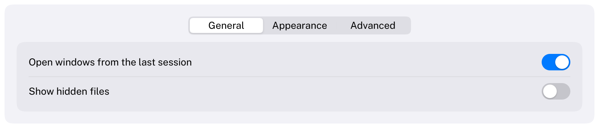

# TabView

Several panes of content in the same area, one visible at a time.
HIG: [Tab views](https://developer.apple.com/design/human-interface-guidelines/tab-views)
Library: CarbonExtensions, `#include <Carbon/Extensions/TabView.h>`



```cpp
int tab = 0;
Carbon::BeginTabView("settings", &tab, { "General", "Appearance", "Advanced" });
switch (tab)
{
    case 0: BuildGeneral(); break;
    case 1: BuildAppearance(); break;
    case 2: BuildAdvanced(); break;
}
Carbon::EndTabView();
```

`selected` is the index of the visible pane. Build only the content of that pane between `BeginTabView` and
`EndTabView`; it is laid out like in a `VStack`. Tabs can also be passed as a
`std::span<const std::string_view>`.

## Options

| Field | Type | Default | Meaning |
| --- | --- | --- | --- |
| `Width` | `Size` | `Fill` | |
| `Height` | `Size` | `Fit` | `Fit` makes the tab view as tall as the visible pane; give it a fixed height or `Fill` to keep the size when switching |
| `Padding` | `EdgeInsets` | 16 | Space around the content |
| `Spacing` | `float` | theme's `Spacing` | Distance between items of the content |

## Behaviour

- The tabs are a centered [SegmentedControl](SegmentedControl.md) above a grouped content area.
- The content of a pane keeps its state while it is not shown only if that state lives in your application, as
  all values do in an immediate-mode interface. Scroll offsets survive as well.

## Keyboard

| Key | Effect |
| --- | --- |
| Tab / Shift+Tab | Focus the tabs (one stop), then the controls of the visible pane |
| Left / Right arrow | Switch to the previous / next pane |

## Guidance from the HIG

- Use a tab view for closely related content that does not need to be seen at once, such as the sections of a
  settings window. For navigation between the areas of an app, use a [Sidebar](Sidebar.md).
- Keep to six tabs or fewer, with short noun labels, and make sure every pane works on its own: controls in one
  pane should not affect another.
