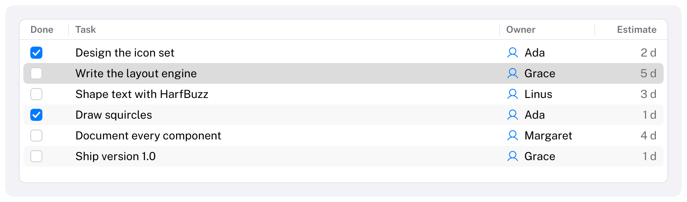

# Table

Rows of data in columns, with a header and a selection.
HIG: [Lists and tables](https://developer.apple.com/design/human-interface-guidelines/lists-and-tables)
Library: CarbonExtensions, `#include <Carbon/Extensions/Table.h>`



```cpp
const Carbon::TableColumn columns[] = {
    { .Title = "Done", .Width = 52.0f },
    { .Title = "Task" },                                                             // fills the rest
    { .Title = "Estimate", .Width = 80.0f, .Alignment = Carbon::TextAlignment::Trailing },
};

Carbon::BeginTable("tasks", columns, { .Height = 240.0f });
for (int i = 0; i < int(tasks.size()); i++)
{
    if (Carbon::TableRow(i, i == selected))
        selected = i;

    Carbon::BeginTableCell();                                                        // any content
    Carbon::Toggle("##done", &tasks[i].Done, { .Kind = Carbon::ToggleKind::Checkbox });
    Carbon::EndTableCell();
    Carbon::TableCell(tasks[i].Title);                                               // text
    Carbon::TableCell(tasks[i].Estimate, { .Secondary = true });
}
Carbon::EndTable();
```

| Function | Purpose |
| --- | --- |
| `BeginTable(id, columns, options)` / `EndTable()` | The table, with any number of columns. Returns what the user changed in the header this frame (`TableChanges`). |
| `TableRow(id, isSelected)` | Starts the next row; its cells follow. Returns `true` when the user picks the row. The ID is a number or a string, unique within the table. |
| `ClipTableRows(count, selectedRow)` | For long tables: declares the number of rows and returns the range to submit. See [Long tables](#long-tables) |
| `TableCell(text, options)` | The next cell, as text |
| `BeginTableCell()` / `EndTableCell()` | The next cell with content of your own, laid out like in an `HStack` |

A row ends where the next one starts. Its ID is pushed on the ID stack until then, so widgets in the cells of
different rows may share their labels (`"##done"` above). As with [List](List.md), the application owns the
selection.

## Columns

| Field | Type | Default | Meaning |
| --- | --- | --- | --- |
| `Title` | `std::string_view` | none | Shown in the header |
| `Width` | `Size` | `Fill` | A number of points, or `Size::Fill(weight)` to share what the fixed columns leave |
| `Alignment` | `TextAlignment` | `Leading` | Of the title and of text cells. Align numbers `Trailing`. |
| `MinWidth` | `float` | 40 | The narrowest the column gets, by dragging or when Fill columns share little space |
| `IsResizable` | `bool` | `true` | The user can drag the divider at the column's trailing edge, and double-click it to fit the column |
| `IsSortable` | `bool` | `true` | Clicking the header sorts by the column, in a table with a `Sort` |
| `InitialSortDirection` | `SortDirection` | `Ascending` | The direction of the first sort by the column. `Descending` suits dates and sizes |

## Table options

| Field | Type | Default | Meaning |
| --- | --- | --- | --- |
| `Width` | `Size` | `Fill` | |
| `Height` | `Size` | `Fill` | A table scrolls, so inside a stack that fits its content give it a fixed height |
| `RowHeight` | `float` | 24 | |
| `ShowsHeader` | `bool` | `true` | |
| `ShowsAlternatingRows` | `bool` | `true` | Tints every other row |
| `Sort` | `TableSort*` | null | The application's sort. Makes the headers sortable; see [Sorting](#sorting) |
| `ColumnWidths` | `std::span<float>` | empty | The application's storage for the widths the user gave the columns. See [Saving the arrangement](#saving-the-arrangement) |
| `ColumnOrder` | `std::span<int>` | empty | The application's storage for the order of the columns |

## Cell options

| Field | Type | Default | Meaning |
| --- | --- | --- | --- |
| `Secondary` | `bool` | `false` | Secondary label color |
| `Icon` | `std::string_view` | none | Before the text |

## Behaviour

- The header stays in place while the rows scroll.
- Text that does not fit its cell is cut off with an ellipsis.
- A click on a widget inside a cell goes to the widget, not to the row.
- A row with fewer cells than columns leaves the rest empty; more cells than columns is reported as an error.
- Cells are submitted in the order of the `columns` array, whatever order the user has put the columns in.

## Sorting

Carbon does not sort your data. Keep a `TableSort` (the column to sort by, as an index into `columns`, and the
direction), pass it as `TableOptions::Sort`, and submit your rows in that order. The table draws the sort indicator
in the header, a chevron that points up for ascending and down for descending, and updates your `TableSort` when the
user clicks a header: another column sorts by that column in its `InitialSortDirection`, the same column flips the
direction. `BeginTable` reports `SortChanged` in that frame, so sort right after it:

```cpp
Carbon::TableSort sort = { .Column = 0 };              // kept by the application, like the selection

const Carbon::TableChanges changes = Carbon::BeginTable("files", columns, { .Sort = &sort });
if (changes.SortChanged)
    std::ranges::sort(rows, [&](const File& a, const File& b) { return IsBefore(a, b, sort); });
for (const File& file : rows)
{
    ...
}
Carbon::EndTable();
```

A column with `IsSortable = false` ignores clicks. Without a `Sort` the header is not interactive, apart from the
dividers.

## Resizing and scrolling

Drag the divider at a column's trailing edge in the header to resize the column; it does not get narrower than
its `MinWidth`. Double-click the divider to fit the column to its title and to the text cells of the rows in view
(cells with content of your own are not measured). A column the user has resized keeps its width in points, like
a `Fixed` one; the `Fill` columns share whatever is left, so the table keeps filling its width while there are
any.

When the columns are wider than the table, it scrolls sideways: with a horizontal wheel or trackpad, with Shift
and the wheel, or by dragging the scroll indicator that appears at the bottom of the rows. The header scrolls
with the rows. A table with forty columns costs little more than one with four: cells scrolled out of view are
neither shaped nor drawn, and the table's column storage grows only when a table has more columns than any
before it.

## Saving the arrangement

Carbon remembers the widths the user gave the columns, per table, for as long as the context lives. To save
them, or to set them, give the table your own storage: one entry per column, indexed like `columns`. The table
reads it every frame and writes what the user changes.

```cpp
float widths[std::size(columns)] = {};   // 0: the column keeps its declared Width
int order[std::size(columns)] = {0, 1, 2};

const Carbon::TableChanges changes =
    Carbon::BeginTable("files", columns, { .ColumnWidths = widths, .ColumnOrder = order });
if (changes.WidthsChanged || changes.OrderChanged)
    SaveSettings(widths, order);
```

`ColumnOrder` lists the columns in the order they are shown. An order that is not a permutation of the column
indices (all zeros, for example) is reset to `0, 1, 2, ...`, also in your storage.

## Long tables

A row that is scrolled out of view costs little: it takes its space, but it is not hit-tested, its text cells are
not shaped and nothing is drawn. A plain loop over all rows is therefore fine for thousands of rows. The loop
itself, and the widgets you put into cells, still run for every row, so for tens of thousands of rows and more
submit only the rows that are needed:

```cpp
Carbon::BeginTable("files", columns, { .Height = 240.0f });
const Carbon::RowRange rows = Carbon::ClipTableRows(int(files.size()), selected);
for (int i = rows.First; i < rows.End; i++)
{
    if (Carbon::TableRow(i, i == selected))
        selected = i;
    Carbon::TableCell(files[i].Name);
    Carbon::TableCell(files[i].Size, { .Secondary = true });
}
Carbon::EndTable();
```

`ClipTableRows` returns the rows in view and, after the arrow keys, Home or End moved the selection, the row they
moved to. The table reserves the space of all the others, so it scrolls, draws and reacts to the keyboard as if
every row were submitted, and a frame costs the same for a thousand rows as for a million. Call it once, right
after `BeginTable`, and submit exactly the rows of the range, in order. Pass the index of the selected row (or -1)
so that the keyboard can move on from a selection that is not among the submitted rows. See
[Optimizations](../Optimizations.md#rows) for the numbers.

## Keyboard

| Key | Effect |
| --- | --- |
| Tab / Shift+Tab | Focus the header of a table that sorts, then the rows (one stop), then the widgets inside the cells |
| Left / Right arrow | In the header: move between the columns |
| Space / Enter | In the header: sort by the column, or flip the direction |
| Up / Down arrow | Select the previous / next row |
| Home / End | Select the first / last row |

## Guidance from the HIG

- Give every column a short noun as its title, and put the column that identifies the row first.
- Alternating row backgrounds help in wide tables; in a narrow one they are noise.
