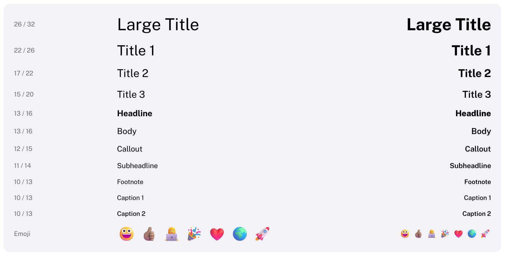

# Text

Displays text in one of the macOS text styles.
HIG: [Typography](https://developer.apple.com/design/human-interface-guidelines/typography)



```cpp
Carbon::Text("Settings", { .Style = Carbon::TextStyle::LargeTitle, .Emphasized = true });
Carbon::Text("Changes apply to all windows.", { .Secondary = true });

// Wrapped inside the width the layout gives it:
Carbon::Text(description, { .Secondary = true, .Width = Carbon::Size::Fill(), .Wraps = true });

// Icons are text:
Carbon::Text(std::string(Carbon::Icons::Folder) + "  Documents");

// Code, in the embedded monospaced font:
Carbon::Text("int main() { return 0; }", { .Font = Carbon::GetMonospacedFont() });
```

Lines are separated by `'\n'`.

## Emoji

Emoji are drawn in color when the host has added a color emoji font, such as the system's (Segoe UI Emoji on
Windows, Noto Color Emoji on Linux, Apple Color Emoji on macOS); Carbon embeds none. Any text can contain them,
and sequences such as skin tones, families and flags stay together:

```cpp
Carbon::AddFontFromFile("C:/Windows/Fonts/seguiemj.ttf");   // once, at startup
Carbon::Text("Launch \xF0\x9F\x9A\x80", { .Style = Carbon::TextStyle::Title1 });   // "Launch 🚀"
```

They keep their own colors whatever `Color` the text has, and fade with its opacity. Without an emoji font they
show as the fallback fonts' plain glyphs, or not at all. [Integration](../Integration.md#emoji) has the details.

## Options

| Field | Type | Default | Meaning |
| --- | --- | --- | --- |
| `Style` | `TextStyle` | `Body` | `LargeTitle`, `Title1`–`Title3`, `Headline`, `Body`, `Callout`, `Subheadline`, `Footnote`, `Caption1`, `Caption2` |
| `Emphasized` | `bool` | `false` | Uses the style's emphasized weight (bold titles, semibold body) |
| `Secondary` | `bool` | `false` | Uses the secondary label color |
| `Color` | `Color` | theme's `Label` | |
| `Weight` | `FontWeight` | from the style | Any weight on the 100–900 axis |
| `Italic` | `bool` | `false` | |
| `Font` | `Font*` | `nullptr` | The font for this text. `nullptr` uses the current font: the innermost `PushFont`, else `Theme::Font`, else Public Sans. `GetMonospacedFont()` returns the embedded JetBrains Mono |
| `Width` | `Size` | `Fit` | `Fit`: as wide as the text. Fixed or `Fill`: the text is laid out inside that width. |
| `Wraps` | `bool` | `false` | With a fixed or `Fill` width: `true` wraps between words; `false` keeps one line and ends it with "…" |
| `Alignment` | `TextAlignment` | `Leading` | Where lines sit inside a fixed or `Fill` width: `Leading`, `Center`, `Trailing` |
| `Icons` | `IconVariant` | `Auto` | Which Phosphor font draws icons in the text: `Auto` (bold for semibold and heavier text), `Regular`, `Bold`, `Fill` |

The sizes and weights of the styles are listed in [Styling](../Styling.md#text-styles).

## Keyboard

Text is not interactive and is not a Tab stop. `Tooltip` and `IsItemHovered()` work after it.

## Guidance from the HIG

- The default text size on macOS is 13 points (`Body`); avoid text smaller than 10 points.
- Use the built-in styles to express hierarchy instead of many custom sizes, and prefer Regular, Medium,
  Semibold and Bold over lighter weights.
