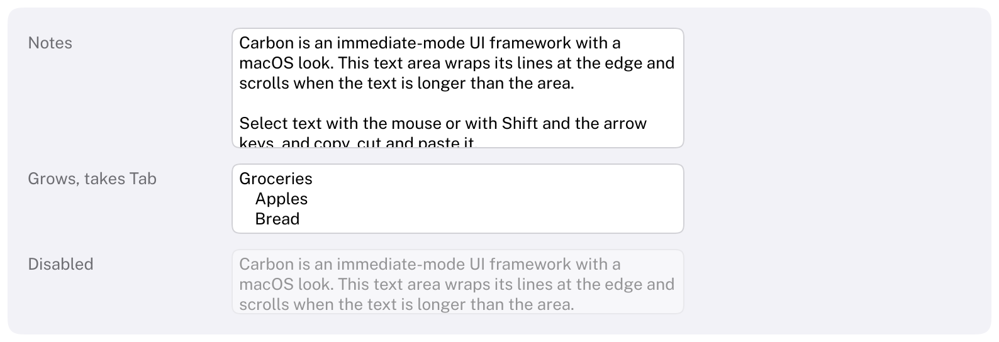

# TextArea

Edits several lines of plain text.
HIG: [Text views](https://developer.apple.com/design/human-interface-guidelines/text-views)



```cpp
std::string notes;
Carbon::TextArea("Notes", &notes);                                    // 240 × 96 points, scrolls

Carbon::TextArea("Comment", &comment, { .Width = 360.0f, .Height = Carbon::Size::Fit() });   // grows

char memo[512] = "";
Carbon::TextArea("Memo", memo);                                       // a fixed buffer
```

`TextArea` edits the text you pass (UTF-8) and returns `true` on frames the text changed. Lines wrap at the width
of the area; text that is longer than the area scrolls inside it. The label identifies the area and serves as its
placeholder; put a `Text` next to it for a visible title.

Like [TextField](TextField.md#where-the-text-lives), it takes the text in three forms that share one
implementation: a `std::string*`, a fixed buffer as `std::span<char>` (a zero-terminated string that never
overflows), or the current text as a `std::string_view` with a function that receives the new text.

A text area is plain text: one font and size, no styles, no line numbers and no syntax colors.

## Options

| Field | Type | Default | Meaning |
| --- | --- | --- | --- |
| `Placeholder` | `std::string_view` | the label | Shown in a faint color while the area is empty |
| `Width` | `Size` | 240 points | The text wraps inside it. `Fit` is the same as the default, since lines would never wrap otherwise |
| `Height` | `Size` | 96 points | The visible area; longer text scrolls. `Fit` grows the area with its text instead |
| `ControlSize` | `ControlSize` | `Regular` | The text style, as for other controls: Subheadline for `Small`, Body otherwise |
| `Disabled` | `bool` | `false` | |
| `MaxLength` | `size_t` | 0 | Longest text in characters, a line break counting as one; 0 is unlimited |
| `AcceptsTab` | `bool` | `false` | Tab types a tab character instead of moving the focus; Ctrl+Tab then moves it |

## Mouse

| Action | Effect |
| --- | --- |
| Click | Focus the area and place the caret |
| Shift+click | Extend the selection to the click |
| Drag | Select, across lines; dragging past the top or bottom edge scrolls |
| Double click | Select the word |
| Triple click | Select everything |
| Wheel | Scroll the area under the pointer |

The pointer becomes an I-beam over the area, and its border gets stronger.

## Keyboard

| Key | Effect |
| --- | --- |
| Tab / Shift+Tab | Focus the area (the caret goes to the end of the text) and leave it again. With `AcceptsTab`, Tab types a tab and Ctrl+Tab leaves; Shift+Tab still goes back |
| Left / Right | Move the caret; with Shift, extend the selection; with Ctrl or Alt, by word |
| Up / Down | Move to the line above or below, keeping to the column a run of moves started in; above the first line is the start of the text, below the last its end |
| Home / End | Start / end of the line |
| Ctrl+Home / Ctrl+End | Start / end of the text |
| Page Up / Page Down | Move by the number of lines that fit in the area |
| Return | A new line |
| Backspace / Delete | Delete the selection, or the character (with Ctrl, the word) before / after the caret; at the start of a line, join it to the line before |
| Ctrl+A, Ctrl+C, Ctrl+X, Ctrl+V | Select all, copy, cut, paste |
| Ctrl+Z, Ctrl+Shift+Z or Ctrl+Y | Undo, redo. A run of typing is one step |
| Escape | Give up focus |

Shift extends the selection with every key that moves the caret. Ctrl is the default shortcut modifier; see
[Keyboard navigation](../KeyboardNavigation.md).

## Notes

- **Wrapping.** Lines break after the last space that fits; a word longer than the line breaks between
  characters. Spaces at the end of a wrapped line hang past the edge, so the next line starts with a word.
- **Line breaks.** Pasted text keeps its line breaks; Windows (`\r\n`) and old Mac (`\r`) breaks become `\n`.
  Other control characters are dropped, except tabs.
- **Tabs** advance to the next stop, every four spaces, whether or not `AcceptsTab` is set; that option only
  decides what the Tab key does.
- **Scrolling** is that of a [ScrollView](ScrollView.md): the wheel, an overlay indicator that can be dragged,
  and a scroll offset kept per label. When the caret moves out of view, the area scrolls just far enough to show
  it.
- Only the lines in view are drawn, so long texts cost little to draw; the whole text is laid out every frame.
- While the area is focused, `io.WantsTextInput()` is true and the caret blinks without keeping `IsAnimating()`
  true, as in a text field.
- Input method composition (IME) and right-to-left text are not supported in this version.

## Guidance from the HIG

- Use a text view for text that is longer than a line or that needs line breaks, such as a comment or a note; use
  a [text field](TextField.md) for a single value.
- Make the area tall enough to show a few lines, so people see that it takes more than one.
