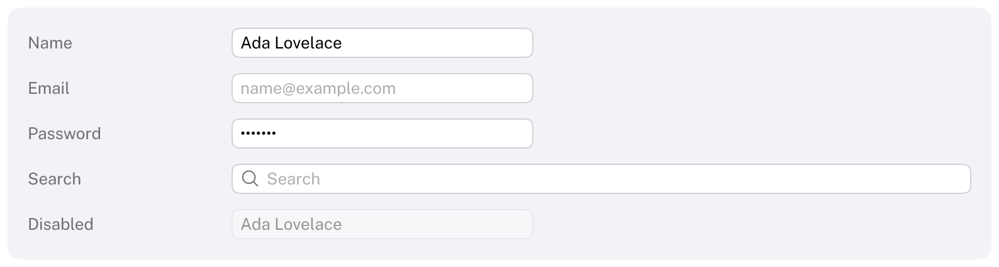

# TextField

Edits a single line of text.
HIG: [Text fields](https://developer.apple.com/design/human-interface-guidelines/text-fields)



```cpp
std::string name;
Carbon::TextField("Name", &name);                                   // "Name" is shown as the placeholder

Carbon::TextField("Email", &email, { .Placeholder = "name@example.com", .Width = 240.0f });
Carbon::TextField("Password", &password, { .IsSecure = true });

Carbon::TextField("Search", &query, { .Icon = Carbon::Icons::MagnifyingGlass, .ShowsClearButton = true });
if (Carbon::IsItemSubmitted())
    RunSearch(query);
```

`TextField` edits the `std::string` you pass (UTF-8) and returns `true` on frames the text changed. The label
identifies the field and serves as its placeholder; put a `Text` next to the field for a visible title.

## Where the text lives

Three forms take the text in different ways. They share one implementation, so they look and behave alike.

```cpp
// 1. A std::string, which grows as needed.
Carbon::TextField("Name", &name);

// 2. A fixed buffer you own: a char array, or any std::span<char>. Holds a zero-terminated UTF-8 string.
char title[64] = "Untitled";
Carbon::TextField("Title", title);

// 3. Text stored your own way: pass the current text and a function that takes the new one.
Carbon::TextField("Title", document.GetTitle(), [&](std::string_view text) { document.SetTitle(text); });
```

- **Buffer.** The text takes up at most all but the last byte, which holds the terminating zero. Typing or
  pasting more is cut off at the last whole character that fits, so a multi-byte character is never split, and
  nothing is written outside the span. When the buffer is full, more typing is ignored and the call returns
  `false`. The buffer may lack a zero; then its last byte becomes one. Carbon never allocates for the buffer
  (`MaxLength` still limits the characters).
- **Callback.** The function is called during the `TextField` call, once, on frames the text changed; the
  `std::string_view` it receives is valid during that call only. It is a `Carbon::FunctionRef`, a non-owning
  reference like C++26's `std::function_ref`, so passing a lambda never allocates whatever it captures. A plain
  function works too.

A `std::string` is always passed by pointer; `TextField("Name", name)` with a string does not compile, because it
would otherwise turn into a fixed buffer of the string's current size.

## Options

| Field | Type | Default | Meaning |
| --- | --- | --- | --- |
| `Placeholder` | `std::string_view` | the label | Shown in a faint color while the field is empty |
| `Icon` | `std::string_view` | none | An icon from `Carbon::Icons` at the leading edge |
| `ShowsClearButton` | `bool` | `false` | A button at the trailing edge that clears the text while the field is not empty |
| `Width` | `Size` | 180 points | A field cannot fit its content, so the default is a fixed width |
| `ControlSize` | `ControlSize` | `Regular` | |
| `Disabled` | `bool` | `false` | |
| `IsSecure` | `bool` | `false` | Shows bullets and keeps the text off the clipboard |
| `Keyboard` | `KeyboardType` | `Text` | The on-screen keyboard a phone or a tablet shows: `Text`, `Number`, `Email`, `URL`, `Search` |
| `MaxLength` | `size_t` | 0 | Longest text in characters; 0 is unlimited |
| `TrailingInset` | `float` | 0 | Points kept free at the trailing edge for an accessory you draw there, such as the button of a [ComboBox](ComboBox.md) |
| `VerticalArrowsMoveCaret` | `bool` | `true` | Up and down move the caret to the start and end. Turn it off when your component uses those keys. |
| `IsBezeled` | `bool` | `true` | Background, border and focus ring. Turn it off when your component draws the field around the text, as a [TokenField](TokenField.md) does |
| `AcceptsInput` | `bool` | `true` | While `false` the field keeps its focus but leaves keys, typing and clicks alone and hides its caret: for frames in which your component handles the keys itself |

When you replace the text of a field while it is being edited, call `ReloadTextField(label)` at the same ID
scope: the caret then moves to the end of the new text and undo starts over.

`GetTextFieldSelection(label, &selection)` tells where the caret and the selection of the field `label` are, as
byte offsets into its text (`Caret`, `Start`, `End`), and returns `false` while the field is not being edited.
Components built around a text field use it to act on keys at the ends of the text, such as Backspace with the
caret at the start.

`SetTextFieldSelection(label, selection)` sets them; offsets inside a character move back to its start. It takes
effect on the field's next call while the field is being edited, in this frame or the next, so it can be called
in the frame that gives the field focus: a [ScrubField](ScrubField.md) uses it to select its whole value when a
click turns it into a field.

## Mouse

| Action | Effect |
| --- | --- |
| Click | Focus the field and place the caret |
| Shift+click | Extend the selection to the click |
| Drag | Select |
| Double click | Select the word |
| Triple click | Select everything |

The pointer becomes an I-beam over the field (through the host's `SetCursor` callback), and the field's border
gets stronger.

## On phones and tablets

Tapping the field starts editing and asks the host for the on-screen keyboard (`Callbacks.SetKeyboardVisible`);
`Keyboard` chooses its kind (`KeyboardType::Text`, `Number`, `Email`, `URL`, `Search`). While a keyboard covers the
bottom of the display, the field is scrolled above it. Return, which the keyboard's Done, Search or Go key sends,
submits and ends editing in touch mode, so the keyboard goes away; with a mouse the field keeps the focus, as on
macOS. See [On-screen keyboard](../Mobile.md#on-screen-keyboard).

## Keyboard

| Key | Effect |
| --- | --- |
| Tab / Shift+Tab | Focus the field and select all of its text |
| Left / Right | Move the caret; with Shift, extend the selection |
| Ctrl+Left / Ctrl+Right (or Alt) | Move by word |
| Home / End, Up / Down | Start / end of the text; with Shift, extend the selection |
| Backspace / Delete | Delete the selection, or the character before / after the caret; with Ctrl, a word |
| Ctrl+A | Select all |
| Ctrl+C, Ctrl+X, Ctrl+V | Copy, cut, paste through the host's clipboard callbacks |
| Ctrl+Z, Ctrl+Shift+Z or Ctrl+Y | Undo, redo. A run of typing is one step. |
| Enter | Submit: `IsItemSubmitted()` is true for this frame. The text and the focus stay (in touch mode editing ends). |
| Escape | Give up focus |

Ctrl is the default shortcut modifier; see [Keyboard navigation](../KeyboardNavigation.md).

## Notes

- Text that is longer than the field scrolls to keep the caret visible.
- Pasted line breaks and tabs become spaces; other control characters are dropped.
- The focus ring shows whenever the field has focus, as on macOS.
- The application may change the text at any time, also while the field is focused.
- **Input methods.** Japanese, Chinese, Korean and other text typed through an input method appears at the
  caret while it is composed, underlined, with a thicker line under the clause being converted; the keys go to
  the input method meanwhile. What it commits is inserted like typed text (one undo step), and a click or a
  focus change commits what is being composed as it stands. A secure field shows only committed text. The
  host forwards the composition; see [Integration](../Integration.md#input-methods).
- Right-to-left text is not supported in this version.
- While a field is focused, `io.WantsTextInput()` is true and the caret blinks. The caret does not keep
  `IsAnimating()` true: it asks for a frame each time it changes, twice a second, which a host that renders on
  demand learns from `GetNextFrameDelay()` (see [Animation](../Animation.md#rendering-on-demand)).
