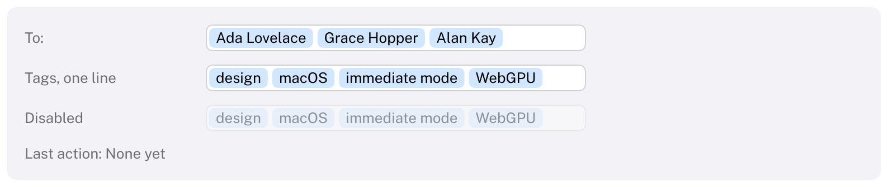

# TokenField

A text field that turns what people type into tokens: separate, selectable items such as the recipients of a
mail or the tags of a document.
HIG: [Token fields](https://developer.apple.com/design/human-interface-guidelines/token-fields)
Library: CarbonExtensions, `#include <Carbon/Extensions/TokenField.h>`



```cpp
std::vector<std::string> recipients = { "Ada Lovelace" };
if (Carbon::TokenField("To", &recipients, { .Placeholder = "Add recipients", .Width = 340.0f }))
    UpdateRecipients(recipients);

int token = 0;
if (Carbon::BeginTokenFieldMenu("To", &token))      // a right click on a token
{
    if (Carbon::MenuItem("Remove", { .IsDestructive = true }))
        recipients.erase(recipients.begin() + token);
    Carbon::EndTokenFieldMenu();
}
```

The application owns the tokens: `TokenField` edits the `std::vector<std::string>` you pass and returns `true`
on the frame it changed. Text that is still being typed is the field's own until it becomes a token. The label
identifies the field and serves as its placeholder.

## Options

| Field | Type | Default | Meaning |
| --- | --- | --- | --- |
| `Placeholder` | `std::string_view` | the label | Shown while there are neither tokens nor text |
| `Layout` | `TokenFieldLayout` | `Wrapping` | `Wrapping`: tokens wrap onto further lines and the field grows. `SingleLine`: one line that scrolls |
| `Width` | `Size` | 260 points | A token field cannot fit its content, so the default is a fixed width |
| `MaxLines` | `int` | 0 | With `Wrapping`, the most lines shown before the field scrolls; 0 for no limit |
| `Delimiters` | `std::string_view` | `","` | Characters that turn the text typed so far into a token |
| `TokenizesOnReturn` | `bool` | `true` | Return also makes a token. With nothing typed, Return submits (`IsItemSubmitted()`) |
| `ControlSize` | `ControlSize` | `Regular` | |
| `Disabled` | `bool` | `false` | Dimmed, ignores input |

## Behaviour

- **Making tokens.** Typing a delimiter turns the text before it into a token; pasting `a, b, c` makes three.
  Return does the same when `TokenizesOnReturn` is on, and so does leaving the field, as with `NSTokenField`.
  Spaces around a token are removed and empty parts are dropped.
- **Tokens** are rounded lozenges tinted with the accent color; selected tokens are filled with it. A token wider
  than the field is truncated.
- **Selecting.** Click a token to select it; Shift+click extends the selection. With the caret at the start of the
  text, Backspace or the left arrow key selects the token before it. While tokens are selected the caret is
  hidden: Backspace or Delete removes them, typing replaces them (as in Mail), Escape deselects.
- **Wrapping** fields grow by a line whenever the tokens and the text need one; the height animates. With
  `MaxLines`, the field stops growing and shows its last lines, where the typing happens.
- **Single line** fields keep their height and scroll sideways: to the text while typing, to a selected token
  while one is selected, back to the start when the field loses focus.
- **Context menu.** A right click on a token selects it and opens the menu that `BeginTokenFieldMenu` builds,
  with the index of that token. Call it right after `TokenField`, with the same label.
- The text being typed is kept per field in a fixed buffer (up to 120 characters); typing and selecting do not
  allocate. Adding a token adds a string to the application's vector.
- Suggestions while typing are not part of Carbon's token field; the HIG calls them optional. Dragging tokens is
  not supported either.

## Keyboard

Everything a [TextField](TextField.md#keyboard) does with the text, plus:

| Key | Effect |
| --- | --- |
| `,` (the delimiters) | Turn the text into a token |
| Return | Turn the text into a token; with no text, submit |
| Backspace at the start of the text | Select the last token; again to delete it |
| Left arrow at the start of the text | Select the last token |
| Left / Right with tokens selected | Select the previous / next token; with Shift, extend the selection. Right past the last token returns to the text |
| Backspace, Delete with tokens selected | Remove the selected tokens |
| Ctrl+A with no text | Select all tokens |
| Escape with tokens selected | Deselect |

## Guidance from the HIG

- A comma turns text into a token by default; consider additional ways, such as Return.
- Add value with a context menu on tokens, for example to edit a recipient or show their contact card.
- If you suggest tokens while people type (not provided by Carbon), do not show suggestions so quickly that they
  distract.
