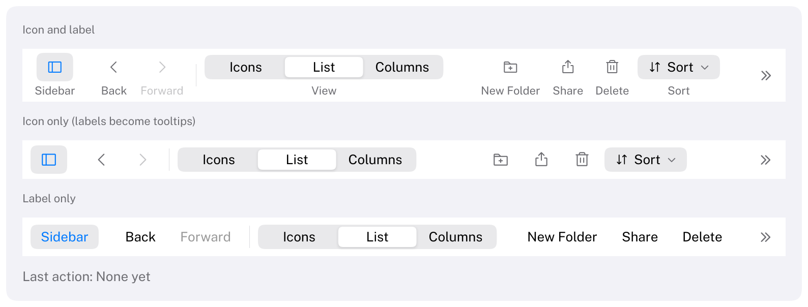

# Toolbar

A bar of frequently used commands and controls along the top of a window.
HIG: [Toolbars](https://developer.apple.com/design/human-interface-guidelines/toolbars)
Library: CarbonExtensions, `#include <Carbon/Extensions/Toolbar.h>`



```cpp
Carbon::BeginToolbar("Main", { .DisplayMode = Carbon::ToolbarDisplayMode::IconOnly });
    if (Carbon::ToolbarItem("Sidebar", { .Icon = Carbon::Icons::SidebarSimple, .IsSelected = showsSidebar }))
        showsSidebar = !showsSidebar;
    Carbon::ToolbarSpace();
    if (Carbon::ToolbarItem("Back", { .Icon = Carbon::Icons::CaretLeft }))
        GoBack();
    Carbon::ToolbarFlexibleSpace();
    if (Carbon::ToolbarItem("Share", { .Icon = Carbon::Icons::Export }))
        Share();
    Carbon::ToolbarSeparator();
    if (Carbon::BeginToolbarControl("Search", { .Icon = Carbon::Icons::MagnifyingGlass }))
    {
        Carbon::SearchField("Search", &query);
        Carbon::EndToolbarControl();
    }
Carbon::EndToolbar();
```

`ToolbarItem` returns `true` on the frame it was activated. Any control can sit in the toolbar through
`BeginToolbarControl` / `EndToolbarControl`: a [SearchField](SearchField.md), a
[SegmentedControl](SegmentedControl.md), a [PopUpButton](PopUpButton.md) or a
[PullDownButton](PullDownButton.md). Call `EndToolbarControl` only when `BeginToolbarControl` returned `true`.
Its label names the control's entry in the overflow menu and, with labels shown, appears below it.

## Options

`ToolbarOptions` mirror those of the [MenuBar](MenuBar.md):

| Field | Type | Default | Meaning |
| --- | --- | --- | --- |
| `Width` | `Size` | `Fill` | Usually the window's width |
| `Height` | `float` | 52 with labels, 38 without | Height of the bar |
| `Background` | `Color` | theme's `SecondaryBackground` | `Color::Transparent()` for a toolbar in a custom title bar |
| `HasSeparator` | `bool` | `true` | A hairline along the bottom edge |
| `DisplayMode` | `ToolbarDisplayMode` | `IconAndLabel` | `IconAndLabel`, `IconOnly` or `LabelOnly`, for the whole toolbar |

`ToolbarItemOptions`:

| Field | Type | Default | Meaning |
| --- | --- | --- | --- |
| `Icon` | `std::string_view` | none | An icon such as `Icons::Plus`. Without one, the item shows its label in every mode |
| `IsSelected` | `bool` | `false` | Shows the item as turned on, for items that toggle a panel |
| `Disabled` | `bool` | `false` | Dimmed, ignores input, skipped by Tab |

`ToolbarControlOptions` has one field, `Icon`, for the control's entry in the overflow menu.

`ToolbarSpace()` is a fixed gap of 8 points, `ToolbarFlexibleSpace()` takes the free space and pushes what follows
to the trailing edge, and `ToolbarSeparator()` is a thin vertical line.

## Behaviour

- **No bezel.** Items are drawn without a border, as in macOS 11 and later: a highlight appears under the pointer
  and while pressed. A selected item keeps a light fill and shows its icon in the accent color.
- **Display modes.** With `IconAndLabel` the label is below the icon and the highlight surrounds the icon;
  controls sit on the row of the icons with their label below. With `IconOnly` the label becomes the item's
  tooltip. With `LabelOnly` items are text buttons.
- **Overflow.** When the toolbar is narrower than its items, the items at its trailing end move into a menu
  behind a chevron button at the trailing edge, as on macOS. Flexible spaces shrink to nothing first; a separator
  or space is never the last thing before the chevron. Choosing an item in the menu activates it: its
  `ToolbarItem` returns `true` in the next frame. Choosing a control opens it in a popover below the chevron, with
  the keyboard in it.
- Which items fit is decided from the widths measured in the previous frame, so a toolbar that changes takes one
  frame to settle; `IsAnimating()` stays true for it.
- At most 64 entries per toolbar; one toolbar is built at a time (they cannot be nested).

## Keyboard

| Key | Effect |
| --- | --- |
| Tab / Shift+Tab | Move through the items and controls; every item is a stop |
| Space, Enter | Activate the focused item; open the overflow menu from the chevron |
| Down arrow | Open the overflow menu from the focused chevron |

## Guidance from the HIG

- Put navigation at the leading edge, the most important actions and a search field at the trailing edge.
- Group items by function and use few groups; three is a good maximum.
- Keep items that show text apart from items that show only an icon, so they do not read as one control.
- Prefer icons without a border; the toolbar draws hover and selection itself.
- Make every toolbar command available in the menu bar too: people can make a window narrow enough to hide items.
- Avoid layouts that overflow at the window's usual size; the overflow menu is a fallback.
- Not provided by Carbon: letting people customize the toolbar ("Customize Toolbar").
