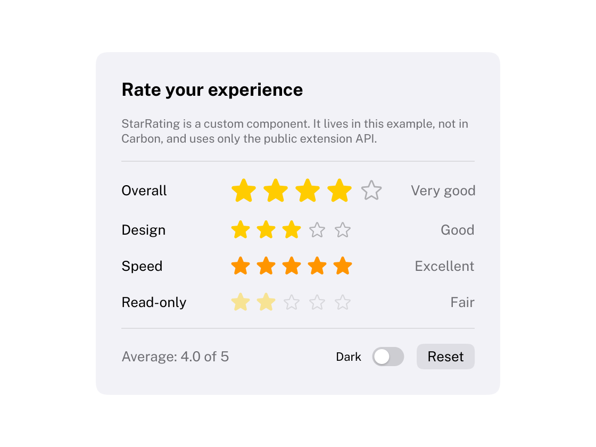

# Custom components

Carbon's components are ordinary functions built on a small public API. Yours can be too: there is no base
class to derive from and no registration. Everything `CarbonExtensions` uses is available to you, and nothing in
`CarbonExtensions` uses anything that is not.

```cpp
#include <Carbon/Extension.h>
```

This page walks through [Examples/CustomComponent](../Examples/CustomComponent): a star rating control in about
a hundred lines.



## The shape of a component

A component is a function that is called every frame. It takes a label, a pointer to the value it edits, and an
options struct; it returns whether the value changed.

```cpp
struct StarRatingOptions
{
    int Count = 5;
    float StarSize = 20.0f;
    std::optional<Carbon::Color> Tint = {};
    bool Disabled = false;
};

bool StarRating(std::string_view label, int* rating, const StarRatingOptions& options = {});
```

Give **every** field a default member initializer (`= {}` if nothing else). Callers then name only what they
change, `StarRating("Speed", &speed, { .Tint = orange })`, and GCC does not warn about the fields they omit.
Use `std::optional` for values that fall back to the style stack and the theme.

## 1. Identity

```cpp
const Carbon::ID id = Carbon::GetID(label);
```

The ID is a hash of the label and the ID stack (`PushID`). It is what focus, pointer capture, animations and
stored state hang on. Derive IDs for the parts of your component from it: `HashID("##thumb", id)`,
`HashID(index, id)`. `GetDisplayLabel(label)` gives the visible part of a label like `"Delete##row3"`.

## 2. Layout

```cpp
const Carbon::Rect rect = Carbon::AllocateItem(size);
```

`AllocateItem` reserves space in the current stack and returns the rectangle, already aligned and snapped to
pixels. Pass `ItemOptions` with a `Width` or `Height` to let the caller stretch your component
(`Size::Fill()`), and use `ResolveItemSize` when your height depends on the width you will get, as wrapping
text does.

Containers are composed of the public ones: `BeginVStack`, `BeginHStack`, `BeginScrollView`. `GetContentRect()`
is the content area of the container you are in, `GetLastItemRect()` the rectangle of the item (or container)
allocated last, and `SetCursorPos` places the next item by hand.

## 3. Interaction

```cpp
const Carbon::Interaction interaction = Carbon::ButtonBehavior(id, rect);
```

| Field | Meaning |
| --- | --- |
| `Hovered` | The pointer is over the item and nothing is above it, including overlays |
| `Pressed` | Held down by the mouse (pointer still over it) or by Space |
| `Clicked` | Activated: mouse released over it, or Space / Enter while focused |
| `DoubleClicked` | The press that started this frame was a double click |
| `Focused`, `FocusVisible` | Has keyboard focus; and the ring should show |

Options: `Focusable`, `Disabled`, `ActivateOnPress` (menus), `Repeat` (steppers), `IsDefault`.

For things that are dragged (slider knobs, dividers), `DragBehavior` captures the pointer from press to release
and reports `Started`, `Active`, `Ended`, `Delta` and `Total`. For plain hit tests there is
`IsRectHovered(rect)`, and the raw input lives in `Carbon/Input/Input.h` (`GetMousePos`, `IsMousePressed`,
`IsKeyPressed`, `GetInputCharacters`, ...).

Wrap the body in `PushDisabled(options.Disabled)` / `PopDisabled()`: inside a disabled scope the behaviours
ignore input, the item leaves the Tab order and everything is drawn dimmed.

## 4. Keyboard

Everything the mouse can do must work from the keyboard.

```cpp
if (interaction.Focused && Carbon::IsKeyPressed(Carbon::Key::RightArrow))
    current = std::min(current + 1, options.Count);
```

`ButtonBehavior` and `DragBehavior` already make the item a stop for Tab and activate it with Space and Enter.
A component made of several parts that should be **one** stop (a segmented control, a list) calls
`RegisterFocusable(id, rect)` for the whole and gives its parts `Focusable = false`; it moves focus to itself
with `SetFocus(id)` when a part is clicked. `FocusNext()` and `FocusPrevious()` step focus like Tab does, which
is how menus implement the arrow keys.

Draw the ring last:

```cpp
Carbon::DrawFocusRing(id, rect, cornerRadius);
```

It appears only while the user navigates by keyboard, follows the squircle of your control and animates in.

## 5. Drawing

```cpp
Carbon::DrawList& drawList = Carbon::GetDrawList();
drawList.AddSquircle(rect, fill, radius, Carbon::GetStyleVar(Carbon::StyleVar::CornerSmoothing));
Carbon::DrawLabel(drawList, rect, x, text, spec, color);        // one line, centered vertically
Carbon::DrawIcon(drawList, center, Carbon::Icons::Star, 20.0f, color, Carbon::IconVariant::Fill);
```

The draw list has filled and stroked squircles, circles, lines, shadows, images and text; every shape is
antialiased analytically at any content scale. `PushClipRect` restricts drawing, `PushOpacity` fades it,
`PushLayer` draws above the interface. A background whose size is known only after the content uses
`AddDeferredSquircle` and `ResolveDeferredSquircle`.

Measure text with `MeasureText(text, spec)`, where `spec` comes from `GetTextSpec(TextStyle::Body)`.
`GetControlMetrics(ControlSize)` gives the height, padding, corner radius and text style of the three control
sizes, so your controls line up with the built-in ones. `GetContentScale().Snap(...)` puts edges on whole
pixels and `GetPixelSize()` is the width of a hairline.

## 6. Styling

Never hard-code a color. Resolve each one through the three layers, per-call option over style stack over
theme:

```cpp
const Carbon::Color tint = Carbon::Resolve(options.Tint, Carbon::StyleColor::Yellow);
const Carbon::Color empty = Carbon::GetStyleColor(Carbon::StyleColor::TertiaryLabel);
```

`GetStyleColor` and `GetStyleVar` already include `PushStyleColor` / `PushStyleVar` and the animated theme
transition, so a component written this way follows a theme switch for free.

For hover and pressed feedback that matches the built-in controls:

```cpp
const Carbon::ControlFeedback feedback = Carbon::AnimateFeedback(id, interaction.Hovered, interaction.Pressed);
const Carbon::Color fill = Carbon::ApplyFeedback(base, labelColor, feedback);
```

## 7. Animation

```cpp
const float fill = Carbon::Animate(Carbon::HashID(i, id), isFilled ? 1.0f : 0.0f,
                                   Carbon::AnimationSpec::Spring(0.35f, 0.55f));
```

`Animate` takes a target and returns the value for this frame; the animation is identified by the ID, can be
retargeted at any time and keeps its velocity. It works for `float`, `Vec2`, `Rect` and `Color`. With Reduce
Motion on, movement jumps and changes of appearance become short fades, without any code in your component:
mark animations that are not movement with `.AsAppearance()`.

A component that animates from the clock instead (a spinner) reads `GetTime()` and calls
`RequestAnimationFrame()` so that hosts that render on demand keep rendering.

## 8. State

Most components need none: the application owns the value, and `Animate` remembers the rest. When you do need
to remember something per item:

```cpp
struct DragState { float StartValue; };
DragState* state = Carbon::GetState<DragState>(id);
```

The struct must be trivially copyable and starts zeroed. `StateLifetime::Transient` (the default) is dropped
when the item is not submitted for a frame; `StateLifetime::Persistent` survives, like the offset of a scroll
view.

## 9. Finish

```cpp
Carbon::SetLastItem(id, rect, interaction);
return changed;
```

`SetLastItem` makes `Tooltip()`, `IsItemHovered()`, `GetItemRect()` and context menus work after your component.
A component that takes text and reacts to Enter calls `SetItemSubmitted()` after it, so that `IsItemSubmitted()`
works too; the [ComboBox](../Extensions/src/Carbon/Extensions/ComboBox.cpp) does. A component built around a text
field can turn off its bezel (`IsBezeled`), take the keys for a while (`AcceptsInput`) and ask where its caret is
(`GetTextFieldSelection`), as the [TokenField](../Extensions/src/Carbon/Extensions/TokenField.cpp) does.

Check your arguments with `CB_VERIFY(condition, "message {}", value)`. It reports through the host's log and
assert callbacks in every build type and lets the frame continue, so return early afterwards.

## Overlays

Components that open something above the interface (a menu, a picker) use the overlay functions:
`OpenOverlay`, `BeginOverlay`, `EndOverlay`. See [Overlays](Overlays.md). `ColorWell` in CarbonExtensions is a
compact example: a swatch that opens a popover built from sliders and a text field.

## Rules for a component that feels native

- No per-frame heap allocations: take `std::string_view`, format into reused buffers, keep state in `GetState`.
- Everything in points; never multiply by the content scale yourself.
- Hit targets at least as large as what is drawn, and hover, pressed, focused and disabled states for anything
  interactive.
- Follow the [Human Interface Guidelines](https://developer.apple.com/design/human-interface-guidelines/) for
  the control you are building, and look at the nearest component in
  [Extensions/src/Carbon/Extensions](../Extensions/src/Carbon/Extensions) for how Carbon solved the same
  problem.

## Keeping to the public API

Only the headers listed as public in `Framework/CMakeLists.txt` are installed and supported; `Carbon/Extension.h`
includes the ones component authors need. Headers that end in `Internal.h` or live in an `Internal/` folder can
change without notice. Carbon checks its own extension library and the CustomComponent example for this with
the CTest cases `PublicApiBoundary.*`.
