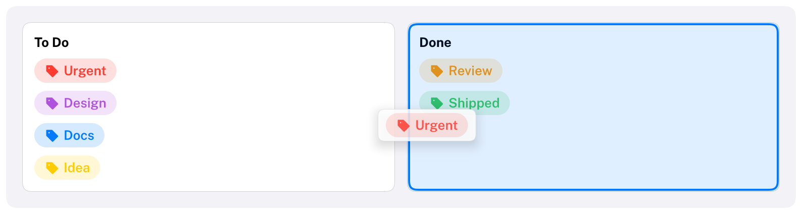
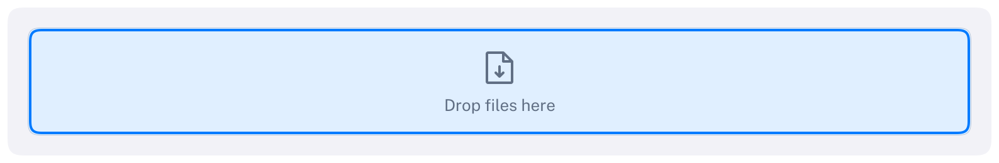

# Drag and drop

Carbon's drag and drop works like the rest of Carbon: every frame, an item says that it can be dragged and what
it would carry, and a target says which kinds of payload it takes. Carbon tracks the drag, draws a preview under
the pointer, highlights the target that would receive the drop, and tells that target when the user releases
the button. There are no callbacks and nothing to register.

```cpp
#include <Carbon/Carbon.h>               // or <Carbon/Extension.h> in a component
```



## A drag source

A drag source is an item that the user presses and moves. `BeginDragSource` returns `true` once the pointer has
moved four points with the button held, and keeps returning `true` while the drag lasts. In between it and
`EndDragSource`, attach the payload and lay out the preview, which follows the pointer like a small `VStack`.

```cpp
Carbon::BeginHStack({ .ID = "tag" });                       // anything: here, a tag made of an icon and text
Carbon::Icon(Carbon::Icons::Tag);
Carbon::Text(tag.Name);
Carbon::EndHStack();
if (Carbon::BeginDragSource(Carbon::GetID("tag"), Carbon::GetLastItemRect()))
{
    Carbon::SetDragPayload("Tag", tag.Id);                    // a type, and a value copied as bytes
    Carbon::Text(tag.Name);                                   // the preview
    Carbon::EndDragSource();
}
```

- `BeginDragSource(id, rect)` makes any rectangle a source. It takes a press inside the rectangle that no
  interactive item inside took, so the buttons and checkboxes in a card keep working. Call it after the content,
  when the rectangle is known.
- `BeginDragSource()` without arguments makes the last interactive item a source: a button, a list row, an item
  of your own component that called `ButtonBehavior` or `DragBehavior`.
- The drag outlives its source. When the row that was dragged scrolls out of view or its parent collapses, the
  drag goes on with its payload, which was copied when it was attached.
- `DragSourceOptions::Threshold` sets the distance that makes a press a drag, and `HasPreviewBackground = false`
  leaves out the preview's rounded surface for a preview that draws its own.

## Payloads

A payload has a type and data. The type is a string you choose, such as `"Tag"` or `"com.example.track"`; targets
accept drops by it, so a target for photos never lights up for a dragged task. The data is a copy of bytes:
`SetDragPayload(type, value)` copies any trivially copyable value, and `payload.As<T>()` reads it back. Pass
something that identifies the item, such as an index or an ID, rather than a pointer into data that may change
while the user drags. Files from outside the application have the type `Carbon::FilesPayloadType` and carry their
paths in `payload.Files`.

## A drop target

`AcceptDrop` makes a rectangle a target for one payload type. It returns a `Drop`: `IsHovered` while a drag of
that type is over the target, and `IsDelivered` in the frame the user drops it there.

```cpp
Carbon::BeginVStack({ .Width = Carbon::Size::Fill(), .Height = 160.0f, .ID = "done" });
...
Carbon::EndVStack();
const Carbon::Drop drop = Carbon::AcceptDrop(Carbon::GetID("done"), Carbon::GetLastItemRect(), "Tag");
if (drop.IsDelivered)
    tags[drop.Payload.As<int>()].Box = Box::Done;
```

While a drag it accepts is over it, the target shows the macOS drop highlight, an accent outline with a light
tint. A component that shows where a drop would land, such as an insertion line, turns it off with
`DropTargetOptions::ShowsHighlight = false` and draws its own indicator from `drop.Position`.

Where targets overlap, one gets the drag: the one on the highest layer (an overlay above the page), and among
those the smallest. A row inside a list that is itself a target therefore wins over the list. `AcceptDrop(type)`
without a rectangle makes the last interactive item a target.

## Lists and outline views

[List](Components/List.md#reordering) and [OutlineView](Components/OutlineView.md#moving-items) are built on
this API and reorder their rows with one option, `AllowsReordering`. A list makes room where the dragged item would
go, with an insertion line, and `EndList` returns a `ListMove` that `ApplyListMove` applies to your items. An
outline view tells "between" (an insertion line, indented like the items it goes between) from "into" (an outline
around a folder), expands a collapsed folder that the drag rests on, and `EndOutlineView` returns an
`OutlineMove` by the keys you gave the items.

```cpp
Carbon::BeginList("playlist", { .AllowsReordering = true });
...
Carbon::ApplyListMove(songs, Carbon::EndList());
```

Their rows use the payload type of their own, so they move only within their list. To drag rows elsewhere, make
the row a source yourself with `BeginDragSource()` right after `ListItem` (the row is the last item).

## Files from the system

Files dragged in from the file manager are a drag like any other, of the type `Carbon::FilesPayloadType`, with the
paths in `payload.Files`. Any item can accept them:

```cpp
Carbon::BeginVStack({ .Width = Carbon::Size::Fill(), .ID = "attachments" });
Carbon::Text("Drop files here");
Carbon::EndVStack();
const Carbon::Drop drop =
    Carbon::AcceptDrop(Carbon::GetID("attachments"), Carbon::GetLastItemRect(), Carbon::FilesPayloadType);
if (drop.IsDelivered)
    for (std::string_view path : drop.Payload.Files)
        Attach(path);
```



The host forwards the system's drop through the IO object, `io.AddFileDropEvent(x, y, paths)`; the target under
the position receives the files in the next frame. A host that also learns about the drag while it moves over the
window forwards it with `io.AddFileDragEvent` and `io.AddFileDragLeaveEvent`, and the targets highlight before
the drop. The examples forward GLFW's drop; [Integration](Integration.md#files-from-the-system) shows the code.
Dragging between windows or applications other than receiving files is not supported.

## While something is dragged

| Function | Purpose |
| --- | --- |
| `IsDragging()` | Something is dragged: from a source, or files from outside |
| `GetDragPayload()` | The payload of that drag; its `Type` is empty when nothing is dragged. A component can show that it would take a drop before the pointer reaches it |
| `GetDragSourceID()` | The source being dragged, for a component that dims it |
| `CancelDrag()` | Ends the drag without a drop |

- **Escape** cancels a drag, and so does the window losing focus. The Escape press does not also close an
  overlay.
- **Scrolling**: while the pointer is within 32 points of an edge of the scroll view under it, the view scrolls
  towards that edge, faster the closer the pointer gets. Lists, tables and outline views scroll this way too.
- The drag holds the pointer: nothing else is hovered or pressed until it ends.
- Dragging allocates no memory once the payload's storage has grown to the largest payload.

## API

| Declaration | Purpose |
| --- | --- |
| `bool BeginDragSource(const DragSourceOptions& = {})` | The last interactive item is a drag source; true while it is dragged |
| `bool BeginDragSource(ID id, const Rect& rect, const DragSourceOptions& = {})` | A rectangle is a drag source |
| `void SetDragPayload(std::string_view type, std::span<const std::byte> data = {})` | Attaches the payload; between Begin and End |
| `template <typename T> void SetDragPayload(std::string_view type, const T& value)` | Attaches a value |
| `void EndDragSource()` | Ends the preview |
| `Drop AcceptDrop(std::string_view type, const DropTargetOptions& = {})` | The last interactive item is a drop target |
| `Drop AcceptDrop(ID id, const Rect& rect, std::string_view type, const DropTargetOptions& = {})` | A rectangle is a drop target |
| `bool IsDragging()`, `DragPayload GetDragPayload()`, `ID GetDragSourceID()`, `void CancelDrag()` | The drag in progress |

| `DragSourceOptions` field | Default | Meaning |
| --- | --- | --- |
| `Threshold` | 4 | Points the pointer moves with the button held before the drag begins |
| `HasPreviewBackground` | `true` | Puts the preview on a rounded, translucent surface with a shadow |

| `DropTargetOptions` field | Default | Meaning |
| --- | --- | --- |
| `ShowsHighlight` | `true` | Outlines the target while a drag it accepts is over it |
| `CornerRadius` | 6 | Of that outline |

| `Drop` field | Meaning |
| --- | --- |
| `IsHovered` | A drag of the accepted type is over the target, and the target is the one that would receive it |
| `IsDelivered` | The payload was dropped onto the target this frame |
| `Position` | The pointer, in points |
| `Payload` | `Type`, `Data` (bytes), `Files` (paths of files from outside), `As<T>()` |
