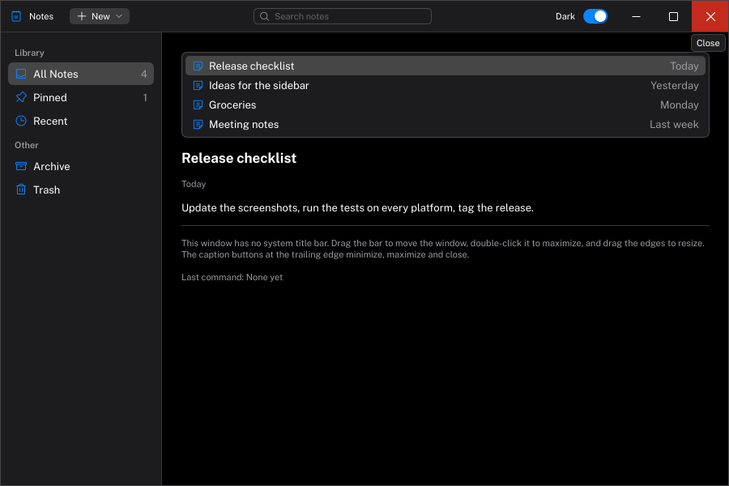

# Integrating Carbon into a host application

Carbon never creates windows, devices or OS hooks. Your application (the *host*) owns all of that, forwards input
to Carbon and gives it a place to draw. This guide covers the host's side: creating a context, connecting a
renderer backend, forwarding input, driving frames and handling DPI.

[Examples/WebGPUMinimal](../Examples/WebGPUMinimal/Main.cpp) is the complete, runnable version
of this guide. [Renderer backends](Backends.md) covers each graphics API in detail.

For what goes between `NewFrame` and `EndFrame`, see [Layout](Layout.md) and the
[component pages](Components/README.md).

## Creating a context

```cpp
#include <Carbon/Carbon.h>

Carbon::ContextDescription description;
description.Callbacks.Log = [](Carbon::LogLevel level, std::string_view source, std::string_view message) {
    std::println("[{}] {}: {}", Carbon::ToString(level), source, message);
};
description.Callbacks.GetClipboardText = [] { return ReadClipboard(); };          // returns std::string (UTF-8)
description.Callbacks.SetClipboardText = [](std::string_view text) { WriteClipboard(text); };
description.Callbacks.SetCursor = [](Carbon::Cursor cursor) { ShowCursor(cursor); };

Carbon::Context* context = Carbon::CreateContext(description);
// ...
Carbon::DestroyContext(context);
```

- Carbon has **one current context**. The first context you create becomes current; use
  `Carbon::SetCurrentContext` to switch between several.
- Every callback is optional. Without `Log`, messages are dropped; Carbon never prints on its own. Without the
  clipboard callbacks, copy and paste do nothing.
- A new context is *headless*: it builds draw data (`Carbon::GetDrawData()`) but cannot render. Connect it to your
  graphics API with a renderer backend, below.

## The frame loop

```cpp
Carbon::IO& io = Carbon::GetIO();
io.SetDisplaySize(widthInPoints, heightInPoints);
io.SetContentScale(contentScale);
io.SetDeltaTime(secondsSinceLastFrame);
// ... forward input events (see below) ...

Carbon::NewFrame();
// ... build the UI ...
Carbon::EndFrame();
```

Set the display size, content scale and delta time **before** `NewFrame`, every frame. `NewFrame` applies the
queued input; `EndFrame` produces the frame's draw data. Calling them out of order, or leaving a `PushID`,
`PushClipRect` or similar unbalanced, is reported through the log and the assert callback.

## Connecting a renderer backend

A renderer backend draws Carbon's frames with one graphics API into a target you own. Initialize one after
creating the context, with your API's objects:

```cpp
#include <Carbon/Backends/WebGPU/WebGPUBackend.h>

Carbon::WebGPUInitInfo info;
info.Device = device;                                    // wgpu::Device
info.ColorFormat = Carbon::TextureFormat::BGRA8Unorm;    // the format of the pass Carbon will render into
Carbon::WebGPUInit(info);
```

After `EndFrame`, the backend records the frame into your render pass, after your own content:

```cpp
wgpu::RenderPassEncoder pass = encoder.BeginRenderPass(&passDescriptor);   // your pass
DrawScene(pass);                                                           // your own content, if any
Carbon::WebGPURender(pass);                                                // Carbon's interface on top
pass.End();
```

Before destroying the context, call `Carbon::WebGPUShutdown()` (`DestroyContext` does it too). What the target
must look like (format, size, which state Carbon changes) and how each backend is set up is in
[Renderer backends](Backends.md). Calling a backend's render function before `EndFrame` is reported through the
assert callback.

### Drawing your own textures

A texture of yours — a rendered scene, a thumbnail — can be drawn inside the interface. The backend turns it into
a `TextureID`:

```cpp
Carbon::TextureID id = Carbon::WebGPUGetTextureID(sceneView);   // wgpu::TextureView
Carbon::GetDrawList().AddImage(id, Carbon::Rect(20, 20, 320, 180), Carbon::Rect(0, 0, 1, 1),
                               Carbon::Color::White(), 10.0f);   // tint and corner radius are optional
Carbon::WebGPUImage(sceneView, Carbon::Vec2(320, 180));          // the same as a widget
```

Or skip the registration and pass the raw handle, as with Dear ImGui's `ImTextureID`:
`Carbon::Image(Carbon::MakeTextureID(sceneView.Get()), size)` (an image view on Vulkan, a texture name on OpenGL).
The backend resolves it when it first draws it; [Renderer backends](Backends.md) lists what a raw handle cannot
carry.

Carbon keeps what it needs to draw the texture while it is in use and releases it once a whole frame passes
without the texture being registered or drawn. Call the backend's `GetTextureID` every frame, or keep drawing the
ID you got. Textures are sampled with linear filtering and treated as straight (non-premultiplied) alpha.

## Fonts

Public Sans (variable weight, upright and italic), the monospaced JetBrains Mono (upright and italic) and the
Phosphor icon fonts are compiled into the library, so text works without any files. `GetDefaultFont()` and
`GetMonospacedFont()` return the two text fonts. To add your own fonts:

```cpp
Carbon::Font* serif = Carbon::AddFontFromFile("Fonts/SourceSerif4.ttf");
Carbon::Font* brand = Carbon::AddFontFromMemory(bytes, { .Name = "Brand", .ItalicData = italicBytes });
```

A font is used in one of four ways, from strongest to weakest:

```cpp
Carbon::Text("Quote", { .Font = serif });           // for one piece of text
Carbon::PushFont(brand);                            // for everything drawn until the pop, every widget included
Carbon::PopFont();
theme.Font = brand; Carbon::SetTheme(theme);        // for the whole interface
// nothing set: Public Sans
```

`TextSpec::Font` selects the font where you draw or measure text yourself; `GetTextSpec` fills it in with the
pushed or the theme's font.

Fonts you add are also used as fallbacks, in the order they were added, for characters the requested font lacks.
The embedded monospaced font is not a fallback. The embedded fonts cover Latin text; add a font for other
scripts. See [Styling](Styling.md) for the type ramp and icons. The embedded fonts' licenses are in
[THIRD_PARTY_NOTICES.md](../THIRD_PARTY_NOTICES.md).

## Forwarding input

Call these from your window's event handlers; Carbon queues the events and applies them in the next `NewFrame`.

| Event | Call | Notes |
| --- | --- | --- |
| Mouse moved | `io.AddMousePosEvent(x, y)` | Points, relative to the top-left of Carbon's area |
| Mouse left the window | `io.AddMouseLeaveEvent()` | Ends hover |
| Mouse button | `io.AddMouseButtonEvent(button, down)` | `Left`, `Right`, `Middle`, `Back`, `Forward` |
| Scroll | `io.AddMouseWheelEvent(x, y)` | One unit per wheel notch; fractions for touchpads |
| Key | `io.AddKeyEvent(key, down)` | Map your key codes to `Carbon::Key`; include modifier keys |
| Text | `io.AddInputCharactersUTF8(text)` or `io.AddInputCharacter(codepoint)` | From the OS's character events, not from key codes |
| Window focus | `io.AddFocusEvent(focused)` | Losing focus releases all held keys and buttons |

Details worth knowing:

- **Modifiers are keys.** Send `LeftCtrl`, `RightShift` and so on as ordinary key events; Carbon derives the
  modifier state from them.
- **Key repeat is Carbon's job.** Repeated "down" events for a key that is already down are ignored; Carbon
  repeats held keys itself (0.4 s delay, then every 50 ms) so behaviour is identical on every platform.
- **Fast input is never lost.** If a press and a release of the same button arrive within one frame, Carbon
  applies them on two consecutive frames. The same holds for a key, and typed characters keep their order
  relative to editing keys such as Backspace.
- **Shortcuts** such as copy and paste use Ctrl. A host that prefers the Super/Command key calls
  `io.SetShortcutModifier(Carbon::KeyModifiers::Super)`.
- **Sharing input with your own content.** After `NewFrame`, `io.WantsMouse()`, `io.WantsKeyboard()` and
  `io.WantsTextInput()` tell you whether Carbon is using the mouse or keyboard, so your application can ignore
  those events for its own viewport.

## Points, pixels and DPI

All of Carbon's coordinates and sizes are **logical points**. The content scale is the number of physical pixels
per point: 1.0 on a standard display, 1.5 at 150 % scaling, 2.0 on a typical HiDPI display.

- Pass the display size in points: `framebufferSizeInPixels / contentScale`.
- Pass mouse positions in points too. Some window systems report them in pixels (divide by the content scale),
  others already in points.
- When the window moves to a display with a different scale, just pass the new value to `SetContentScale`; Carbon
  re-rasterizes text for it.

With GLFW, for example:

```cpp
float xScale, yScale;
glfwGetWindowContentScale(window, &xScale, &yScale);
int framebufferWidth, framebufferHeight;
glfwGetFramebufferSize(window, &framebufferWidth, &framebufferHeight);

io.SetContentScale(xScale);
io.SetDisplaySize(float(framebufferWidth) / xScale, float(framebufferHeight) / xScale);
```

`Carbon::ContentScale` offers the conversions (`ToPixels`, `ToPoints`) and `Snap`, which moves a coordinate to
the nearest pixel boundary so edges stay crisp.

## Drawing your own title bar

An application can open its window without the system's title bar and let Carbon draw the header instead, with
its toolbar in it. [Examples/CustomTitleBar](../Examples/CustomTitleBar) shows how; the split of the work is the
same as everywhere else:



- **Carbon draws and reports.** The title bar is ordinary Carbon content at the top of the window: an invisible
  button over the whole bar, submitted first so that the toolbar's controls win the pointer over it; caption
  buttons at the trailing edge; and invisible resize handles along the window's edges, submitted last so that
  they win there. Each frame it reports what the user did: start a move, double-click, minimize, maximize,
  close, start a resize at some edges. The handles ask for the matching cursor through `SetCursor`, including
  the diagonal `Cursor::ResizeTopLeftBottomRight` and `Cursor::ResizeTopRightBottomLeft`.
- **The host acts.** It opens the window without decoration (`GLFW_DECORATED` off with GLFW), and moves,
  resizes, minimizes, maximizes and closes it in response. The example follows the pointer itself while the
  button is held, which works the same on Windows and X11.

Things to know:

- **Wayland** does not let applications position their windows, so moving by dragging the bar does not work
  there; resizing, maximizing and the buttons do. A Wayland host would ask the compositor to start an
  interactive move (`xdg_toplevel.move`), which GLFW does not expose.
- **Windows** gives frameless windows no shadow and no snap layouts on the maximize button. Windows 11 rounds
  their corners when asked (`DWMWA_WINDOW_CORNER_PREFERENCE`), which the example does.
- The window manager's keyboard commands still work: Alt+F4 closes, Alt+Space opens the window menu.

## Logging and asserts

- `Callbacks.Log` receives every message with a level (`Trace` … `Fatal`) and a source such as `"Core"` or
  `"Assert"`.
- API misuse (unbalanced stacks, calls outside a frame, invalid values) is checked in every build type. Carbon
  logs the failure at `Fatal` level and then recovers. In debug builds it also breaks into the debugger, unless
  you set `Callbacks.AssertFailed`, in which case your callback decides what happens.
