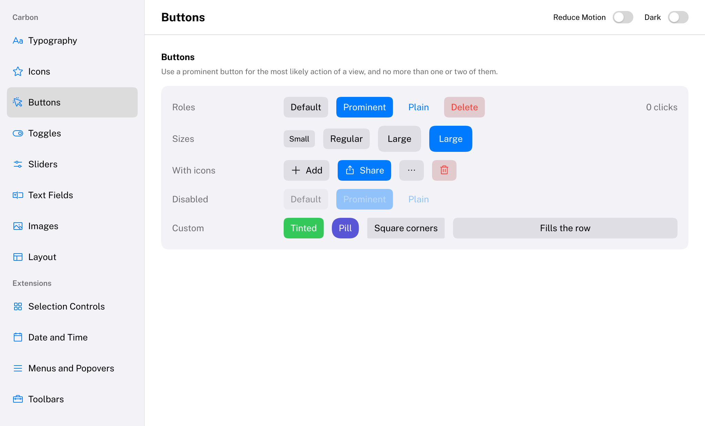
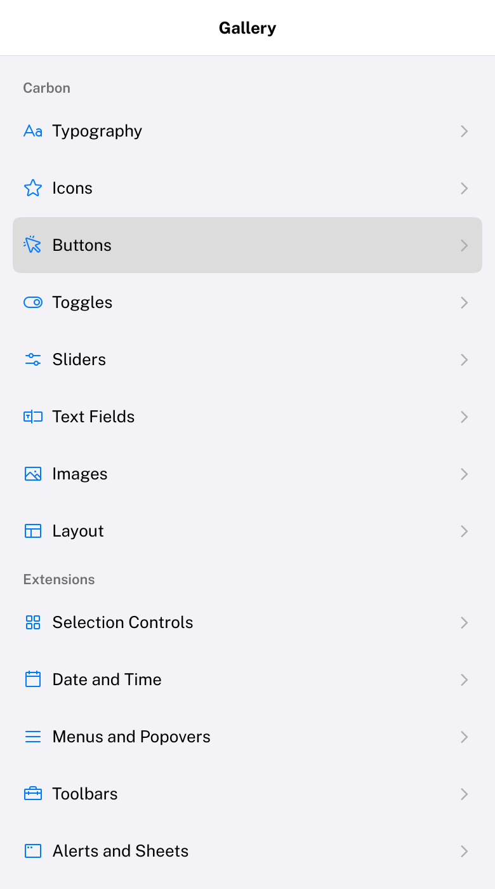
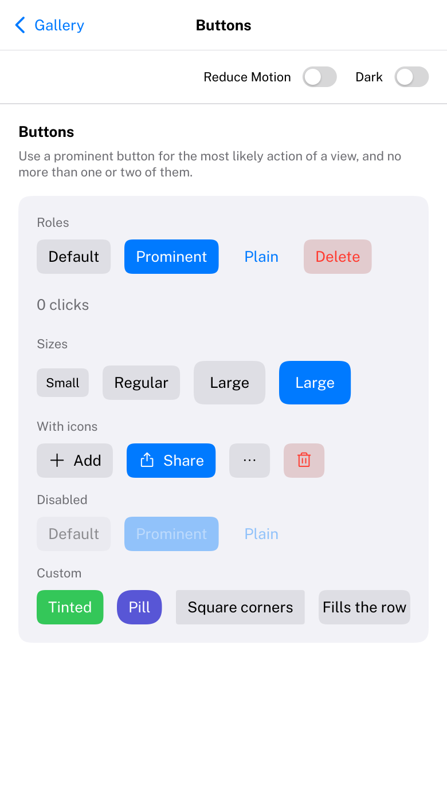
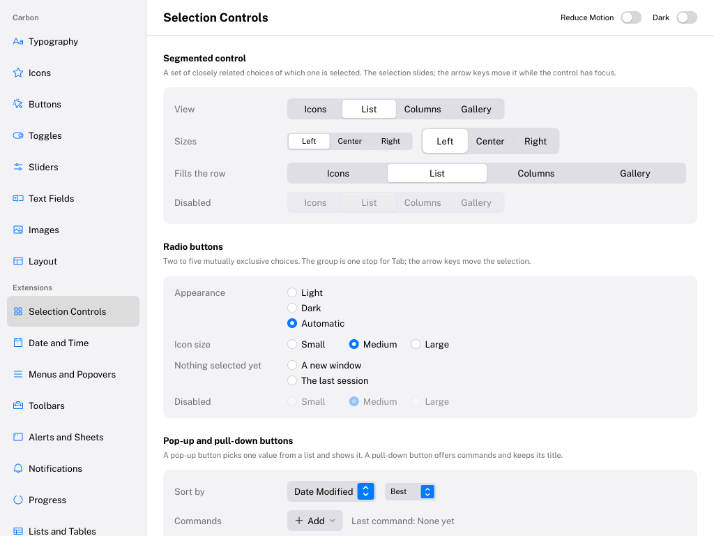

# Phones and tablets

Carbon keeps its macOS look on every device. On a touchscreen and on a narrow display it adapts the way Apple's
Human Interface Guidelines ask apps on iPhone and iPad to: controls are easy to hit with a finger, content follows
the finger, nothing depends on hovering, and where a macOS pattern does not fit a phone, the iOS pattern takes over.
It does not switch to an iOS look. This page explains what changes, the rules Carbon follows, and what a host does.

## Touch input

The host forwards every finger with `IO::AddTouchEvent` (see [Forwarding touches](#forwarding-touches) below):

```cpp
io.AddTouchEvent(Carbon::TouchPhase::Began, touchId, x, y);           // Moved, Ended, Cancelled
io.AddTouchEvent(Carbon::TouchPhase::Began, penId, x, y, Carbon::PointerType::Pen);
```

- **The first finger is the pointer.** While it is down it drives the pointer exactly like a mouse with its left
  button held, so every control works without changes: a tap activates a button like a click, a text field takes
  the caret where it is tapped. When the finger is lifted the pointer leaves: there is no hover on a touchscreen,
  and nothing stays highlighted. `GetPointerType()` tells which kind of device drives the pointer.
- **Further fingers** feed gestures: two fingers pinch. `GetTouchCount()` and `GetTouchPosition(i)` report them.
- **Nothing is lost.** Touch events go through the same queue as the mouse: a tap that begins and ends between two
  frames is still pressed in one frame and released in the next.
- **Cancelled touches activate nothing.** When the system takes a touch away (an incoming call, a system gesture),
  send `TouchPhase::Cancelled`: the control under it is released without being activated.
- **Mouse and touch mix.** A Windows laptop with a touchscreen can use both in one session; touch mode (below)
  follows whichever was used last.

### Gestures

The finger that drives the pointer can do more than tap. `Carbon/Interaction/Gesture.h` recognizes it, for
Carbon's components and for components of your own:

| Gesture | What it does | API |
| --- | --- | --- |
| Pan | Moving a finger more than 10 points (`TouchSlop`) scrolls the scroll view under it; the content follows the finger, keeps its momentum after the finger is lifted and bounces at the ends | `PanBehavior`, `TouchScroll` |
| Long press | Resting a finger for half a second (`LongPressDuration`) opens the context menu, shows the tooltip, or lifts a drag source | `IsItemLongPressed` |
| Pinch | Two fingers scale zoomable content around the point between them and pan it while it is zoomed; a double tap zooms in and out | `ZoomBehavior` |
| Swipe back | A pan that starts at the leading edge of a navigation stack goes back | `PanBehavior` with `PanDirections::Right` and priority 1 |

- **Scrolling takes over from controls.** A finger that lands on a button inside a scroll view presses it; once it
  moves past the slop, the scroll view takes the finger and the button is released without being activated, as on
  iOS. Controls that drag on their own (sliders, split dividers, column dividers, drag sources once they are
  lifted) keep their finger. A finger that lands on content that is still moving only stops it.
- **Momentum and bounce** follow `UIScrollView`: the content keeps 0.998 of its velocity per millisecond, resists
  beyond an end with UIKit's rubber-band constant (0.55), and returns on a critically damped Carbon spring.
- **Drag and drop** starts with a long press on a finger, not with movement (which scrolls). The item lifts at once
  and follows the finger; drop targets behave as with a mouse. See [Drag and drop](DragAndDrop.md).
- **Zoom is per component.** Carbon never zooms the whole interface. `ZoomBehavior(id, rect, { .MaxScale = 4 })`
  returns a scale and an offset; draw the content at `zoom.GetZoomedRect(rect)`, clipped to `rect`.
  `Image(texture, size, { .Zoomable = true })` does this for images.

```cpp
// A component that scrolls sideways on its own, the way Table does.
const Carbon::Pan pan = Carbon::PanBehavior(Carbon::HashID("##pan", id), viewport,
                                            { .Directions = Carbon::PanDirections::Horizontal });
if (Carbon::UpdateTouchScroll(state.Touch, pan, Carbon::Axis::Horizontal, shownOffset, maxOffset, viewport.Width))
{
    shownOffset = state.Touch.Offset;                           // may be a little beyond the ends while it bounces
    targetOffset = std::clamp(state.Touch.Offset, 0.0f, maxOffset);
    Carbon::RequestAnimationFrame();
}
```

None of this reacts to a mouse: with a mouse, every control behaves exactly as on the desktop.

## Touch mode and size classes

Each frame Carbon derives two states (`Carbon/Input/Adaptive.h`):

| State | Query | Detected from | Override |
| --- | --- | --- | --- |
| Touch mode | `IsTouchMode()` | The most recent pointer input came from a finger or a pen | `IO::SetTouchModeOverride(true / false)` |
| Size class | `GetSizeClass()`, `IsCompactWidth()` | Compact when the display is narrower than 600 points (`CompactWidthLimit`), regular otherwise | `IO::SetSizeClassOverride(SizeClass::Regular / Compact)` |

Before the first pointer input arrives, touch mode follows `IO::SetDefaultPointerType`: a host on a phone or a
tablet passes `PointerType::Touch`, so the interface starts out finger-sized.

**Why 600 points.** The HIG gives iPhones a compact width in portrait (320 to 440 points wide) and iPads a regular
width in full screen (744 points and more, in both orientations). Carbon sees only a display width, so any limit
between the two separates them; 600 also keeps a window in half of a 1280-point screen regular. Unlike iOS, an
iPhone in landscape (667 to 956 points) is regular, as the large iPhones are.

[Layout](Layout.md#adapting-to-the-device) shows how an application builds adaptive layouts of its own with these.

## Touch sizing

In touch mode (whatever the size class):

- **Hit areas are at least 44 × 44 points**, the HIG's minimum, centered on each control. The control is drawn at
  its usual size; only the area that reacts to the finger grows (`GetHitRect`). Where the enlarged areas of
  neighbors overlap, the control the finger is closest to wins.
- **Controls grow to macOS's large size and stand further apart:** the theme's `ControlHeight` is multiplied by 1.25
  (24 to 30 points) and its `Spacing` by 1.75 (8 to 14 points), so that one control's 44-point area ends about where
  the next one's starts. Values you pass explicitly (`.Spacing = 12.0f`) are kept.
- **Rows are 44 points tall:** sidebars, lists, tables, outlines, column views, menus and the lists of pop-up buttons
  and combo boxes (`GetAdaptiveRowHeight`).
- **Nothing depends on hover.** Tooltips appear on a long press, above the finger, and stay for a moment after it
  is lifted; the item is not activated. A notification shows its close button all the time; a chart keeps the
  values of the point last touched called out; a path control shows the full name of the component being pressed.
- Scroll indicators show where the content is but cannot be dragged with a finger, as on iOS.



## Compact width

Where a macOS pattern does not work on a phone, Carbon switches to the iOS pattern in compact width, and only there:
in regular width, an iPad in full screen or any desktop window wider than 600 points, everything looks and works as
before.

| Component | In compact width |
| --- | --- |
| [NavigationSplitView](Components/NavigationSplitView.md), horizontal [SplitView](Components/SplitView.md) | A navigation stack: the sidebar or first pane fills the display, choosing an item slides the content in, a back button or a swipe from the leading edge returns |
| [Popover](Components/Popover.md), [Menu](Components/Menu.md), [ContextMenu](Components/ContextMenu.md), [PopUpButton](Components/PopUpButton.md), [PullDownButton](Components/PullDownButton.md), [ComboBox](Components/ComboBox.md), [DatePicker](Components/DatePicker.md), [Sheet](Components/Sheet.md) | A sheet that slides up from the bottom across the display, with a grabber that drags it down to dismiss it ([Overlays](Overlays.md#sheets-in-compact-width)) |
| [MenuBar](Components/MenuBar.md) | Menus that do not fit move into a "more" button, whose menu is a sheet |
| [Toolbar](Components/Toolbar.md) | The overflow menu is a sheet |
| [Table](Components/Table.md) | Columns do not get narrower than 120 points; the table scrolls sideways instead |




Layouts of your own adapt with `IsCompactWidth()` ([Layout](Layout.md#adapting-to-the-device)). A wrapping
`HStack` (`HStackOptions::Wraps`) lets a row of controls continue on a new line instead of running out of a narrow
display. On an iPad, in regular width, sidebars stay beside their content and popovers stay anchored, as on iPadOS,
while touch mode still sizes everything for fingers:



## Forwarding touches

A host that receives touches forwards each one with the finger's identifier and its position in points, from the
top-left of Carbon's area, like mouse positions. Many platforms also report touches as mouse events; forward them
only once.

| Platform | Source | Notes |
| --- | --- | --- |
| Browser | Pointer events (`pointerdown`, `pointermove`, `pointerup`, `pointercancel`) with `pointerType` `touch` or `pen` | Call `preventDefault()` and set `touch-action: none` on the canvas, so the browser neither scrolls nor zooms the page, and does not send emulated mouse events |
| Android | `MotionEvent` actions `DOWN`, `POINTER_DOWN`, `MOVE`, `UP`, `POINTER_UP`, `CANCEL` with `getPointerId` | Positions are in pixels: divide by the content scale |
| Windows | `WM_POINTER` (`POINTER_INFO.pointerType` `PT_TOUCH` / `PT_PEN`) | Ignore the mouse messages Windows synthesizes from touches (`GetMessageExtraInfo` carries the `0xFF515700` signature) |
| iOS | `touchesBegan`, `touchesMoved`, `touchesEnded`, `touchesCancelled` | Use the `UITouch` pointer as the ID |

`Examples/WebApp` forwards pointer events in the browser and `Examples/Android` forwards `MotionEvent`s.
