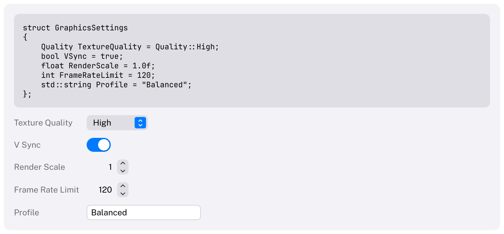
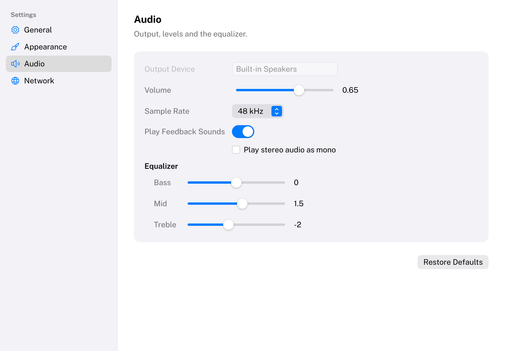
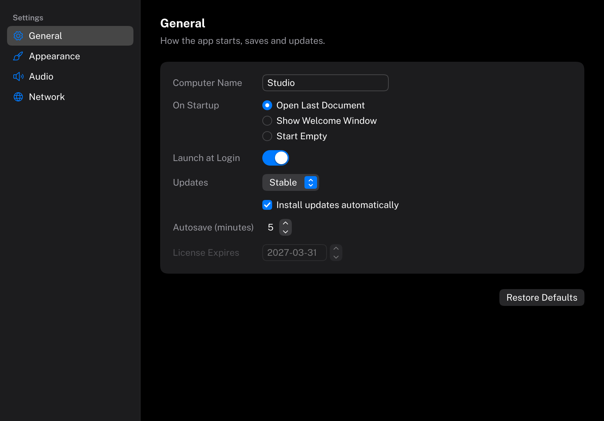
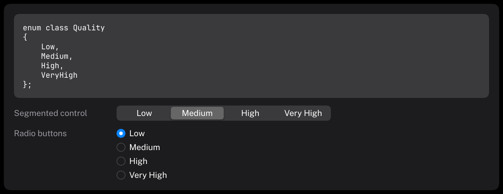

# Reflection

`CarbonReflection` lets an application build interface around its own enums and structs without writing a string
list for every pop-up button or a widget call for every field.

```cpp
#include <Carbon/Reflection/Reflection.h>

enum class Quality { Low, Medium, High, VeryHigh };

struct GraphicsSettings
{
    Quality TextureQuality = Quality::High;
    bool VSync = true;
    float Gamma = 2.2f;
};

Carbon::Reflect("quality", &quality);   // a PopUpButton: Low / Medium / High / Very High
Carbon::Reflect("graphics", &graphics); // one labeled control per field: "Texture Quality", "V Sync", "Gamma"
```



Both lines work without any extra code. An optional macro adds display names, tooltips, ranges, control
overrides and hidden or read-only flags, and describes types that automatic reflection cannot see.

[Examples/Reflection](../Examples/Reflection/Main.cpp) builds a whole settings window from one struct:

| Light | Dark |
| --- | --- |
|  |  |

The library is built when `CARBON_BUILD_REFLECTION` is on (the default) and needs `CarbonExtensions`. Link
`Carbon::Reflection`; with an installed Carbon, use `find_package(Carbon COMPONENTS Reflection)`.

## Automatic and described types

C++20 has no reflection, so Carbon combines two techniques:

- **Automatic.** Enum value names are read from the compiler's spelling of a template argument (the
  `__PRETTY_FUNCTION__` / `__FUNCSIG__` technique), for every value in a range. The fields of an aggregate struct
  are counted by brace initialization, reached through structured bindings, and named the same way, from a pointer
  to each field used as a template argument. Nothing is written per type.
- **Described.** `CB_REFLECT_ENUM` and `CB_REFLECT_STRUCT`, written after the type, add metadata and describe what
  the automatic part cannot see.

All compiler-specific code lives in `Carbon/Reflection/Detail/Signature.h`, so a backend built on standard
reflection (C++26 `std::meta`) can replace it without changing the API.

## Enums

| Function | Result |
| --- | --- |
| `GetEnumCount<E>()` | the number of reflected values |
| `GetEnumValue<E>(index)` | the value at an index; values are sorted ascending |
| `GetEnumValues<E>()` | all values, as a `std::span` |
| `GetEnumIndex(value)` | the index of a value, or -1 when it is not reflected |
| `GetEnumName(value)` | the enumerator's identifier (`"VeryHigh"`), or empty |
| `GetEnumDisplayName(value)` | the label (`"Very High"`), or empty |
| `GetEnumDisplayNames<E>()` | all labels, ready for `PopUpButton`, `SegmentedControl` or `RadioGroup` |

Everything except the labels is `constexpr`. Values may be negative and need not be contiguous. Two enumerators
with the same value are one value.

**Range.** The automatic search covers the values -128 to 127, clamped to what the underlying type can hold
(0 to 127 for `uint8_t`). **A value outside the searched range is not shown** unless the macro names it. The macro
can also move the range, up to `MaxReflectedEnumRange` (1024) values:

```cpp
enum class Bitrate { Low = 64, Standard = 128, High = 320 };
CB_REFLECT_ENUM(Bitrate, { .Min = 0, .Max = 512 });

enum class Port { Http = 80, Https = 443, Custom = 8080 };
CB_REFLECT_ENUM(Port, CB_VALUE(Https, {}), CB_VALUE(Custom, { .DisplayName = "Custom Port" }));
// Http (80) is found in the default range; 443 and 8080 are named.
```



**Metadata per value** (`ReflectValueOptions`): `DisplayName` replaces the automatic label, `Hidden` leaves the
value out entirely, which is useful for a trailing `Count`:

```cpp
enum class Quality { Low, Medium, High, VeryHigh, Count };
CB_REFLECT_ENUM(Quality,
    CB_VALUE(VeryHigh, { .DisplayName = "Ultra" }),
    CB_VALUE(Count, { .Hidden = true }));
```

## Structs

| Function | Result |
| --- | --- |
| `GetFieldCount<T>()` | the number of fields, hidden ones included |
| `GetFieldName<T>(index)` | the field's identifier (`"TextureQuality"`) |
| `GetFieldDisplayName<T>(index)` | the label (`"Texture Quality"`) |
| `GetFieldOptions<T>(index)` | the field's `ReflectFieldOptions` |
| `GetField<Index>(value)` | a reference to the field |
| `ForEachField(value, function)` | calls `function(index, field)` for every field |

The concept `ReflectedStruct<T>` tells whether a type can be reflected. Nested reflected structs are reflected
too: a field's type can be passed to the same functions.

**Automatic** reflection works for aggregates: structs with public fields, no user-declared constructors, no base
classes and no virtual functions, with at most `MaxReflectedFieldCount` (64) fields. Every other type needs the
macro, which then lists every field to show, in the order to show them:

```cpp
class Account
{
public:
    Account();
    int Id = 0;
    std::string Owner;
    bool IsActive = true;
};
CB_REFLECT_STRUCT(Account,
    CB_FIELD(Owner, {}),
    CB_FIELD(IsActive, { .DisplayName = "Active" }));
```

For an aggregate, the macro names only the fields that need metadata; every other field keeps its automatic
defaults:

```cpp
struct AudioSettings
{
    float Volume = 0.8f;
    int Bitrate = 256;
    int DeviceId = 0;
    std::string DeviceName;
    bool Muted = false;                 // not mentioned: automatic
};
CB_REFLECT_STRUCT(AudioSettings,
    CB_FIELD(Volume, { .Min = 0.0, .Max = 1.0, .Tooltip = "Output level" }),
    CB_FIELD(Bitrate, { .Min = 64, .Max = 320, .Step = 32, .Control = Carbon::ReflectControl::Stepper }),
    CB_FIELD(DeviceId, { .Hidden = true }),
    CB_FIELD(DeviceName, { .DisplayName = "Output Device", .ReadOnly = true }));
```

**Metadata per field** (`ReflectFieldOptions`, in declaration order, as designated initializers require):

| Field | Meaning |
| --- | --- |
| `DisplayName` | replaces the automatic label |
| `Min`, `Max` | the range of a number; with both, a number becomes a slider |
| `Step` | the increment of a stepper or slider (default 1 for integers, 0.1 for floating point) |
| `Control` | overrides the control chosen from the type: `Switch`, `Checkbox`, `Slider`, `Stepper`, `PopUpButton`, `SegmentedControl`, `RadioGroup` |
| `Tooltip` | help text for the field's row |
| `Hidden` | leaves the field out of the interface |
| `ReadOnly` | shows the field disabled |

## Reflect

`Carbon::Reflect(label, &value, options)` draws the controls for a reflected enum or struct and returns `true` on
frames the value changed (for a struct: any field). See [Reflect](Components/Reflect.md) for its options.

| Field type | Control |
| --- | --- |
| `bool` | Toggle (switch); `ReflectControl::Checkbox` for a checkbox that carries the label |
| integer / `float` / `double` with `Min` and `Max` | Slider, with the value after it |
| integer / `float` / `double` without a range | The value as text, then a stepper over the type's limits, step 1 for integers and 0.1 for floating point |
| `std::string` | TextField |
| reflected enum | PopUpButton, SegmentedControl or RadioGroup |
| `Carbon::Color` | ColorWell |
| `Carbon::DateTime` | DatePicker (date elements) |
| reflected nested struct | A sub-group: the field's label as an emphasized title, then its fields indented by 16 points, recursively |

- **Precedence** for a field's control: the field's `Control` from `CB_FIELD`, then the call's `EnumStyle`, then
  the default above. A control that does not suit the type is a compile error.
- **ReadOnly** fields are drawn disabled; **Hidden** fields are skipped; a **Tooltip** belongs to the field's row.
- **Layouts.** `LabelLeading` puts the labels in the secondary label color in a column as wide as the widest
  label of the struct (a [Grid](Components/Grid.md)), with 12 points between rows and between label and control,
  as in the Gallery's forms. `LabelAbove` puts each label 4 points above its control. A checkbox carries its own
  label in both.
- **IDs.** Every field pushes its name onto the ID stack, so state survives layout changes. Tab follows field
  order.
- **Numbers** are edited as `double` and converted back, rounded and clamped for integers. Values show at most two
  decimals, formatted into a fixed buffer. A field of another type fails to compile; hide it with
  `CB_FIELD(Name, { .Hidden = true })`.
- **No allocations** in a settled frame: labels come from static storage, numbers are formatted on the stack.

## Writing the macros

- Write `CB_REFLECT_ENUM` / `CB_REFLECT_STRUCT` at namespace scope after the type, **in the namespace that
  declares the type**, and end it with a semicolon. The type itself is never modified, so types from other
  libraries can be described too (open their namespace for the macro).
- Write it before anything uses the type's reflection: what a type reflects as is fixed where it is first used.
- The options of `CB_FIELD` and `CB_VALUE` are a braced initializer, even when empty: `CB_FIELD(Owner, {})`.
- A type name that contains commas (a template with several arguments) must be given through an alias.
- A field the macro names must exist; for an aggregate it must also be one that automatic reflection found,
  which is checked when compiling.

## Labels

Automatic labels split identifiers into words and capitalize each word:

| Identifier | Label | Rule |
| --- | --- | --- |
| `DarkMode`, `darkMode`, `dark_mode` | Dark Mode | a word starts at a capital after a lowercase letter, and after `_` |
| `VeryHigh` | Very High | |
| `HDREnabled`, `VSync`, `UserID` | HDR Enabled, V Sync, User ID | runs of capitals stay together; the last capital starts the next word when a lowercase letter follows |
| `Volume2`, `Channel10Gain` | Volume 2, Channel 10 Gain | digits start a word after a lowercase letter |
| `MP3Player`, `Vector3D` | MP3 Player, Vector 3D | digits stay with capitals before them; capitals after digits stay unless a lowercase letter follows |
| `MAX_SIZE`, `_private_` | MAX SIZE, Private | capitals are never lowered; leading, trailing and repeated `_` vanish |
| `LaunchAtLogin`, `SignIn` | Launch at Login, Sign In | title-style capitalization: articles, conjunctions and short prepositions stay lowercase unless they are the first or last word |

Labels are formatted once, on first use, into static storage; later frames never allocate for them.

## Limits

| Limit | Value | What happens beyond it |
| --- | --- | --- |
| Automatically searched enum range | -128 to 127 | values outside are not shown unless named with `CB_VALUE`, or the range is moved |
| Range a macro may set | 1024 values | compile error; name far values with `CB_VALUE` instead |
| Fields of an automatically reflected struct | 64 | the type needs `CB_REFLECT_STRUCT` |
| Struct kinds | aggregates only | constructors, private fields and base classes need the macro; private fields cannot be shown |
| Field kinds | no C arrays, references or bit-fields | in an aggregate they break automatic reflection; describe the type with the macro |
| Types local to a function | not supported | the field-name technique needs a declaration with linkage |
| Unscoped enums | need a fixed underlying type on Clang | `enum Color : int { ... }`; Clang rejects out-of-range values of other unscoped enums |

The tricks are tested on MSVC 2022, GCC 13 and Clang 17 (CI) and newer.
