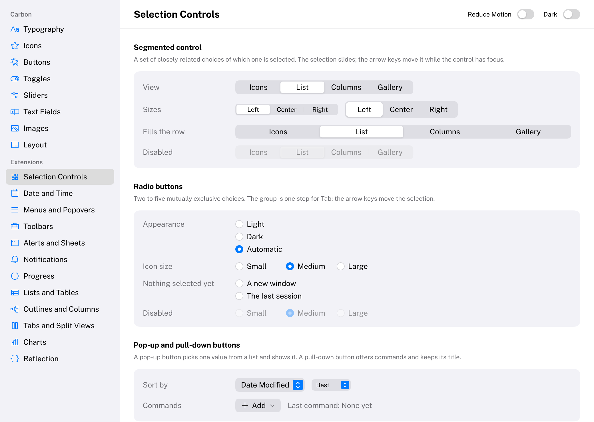
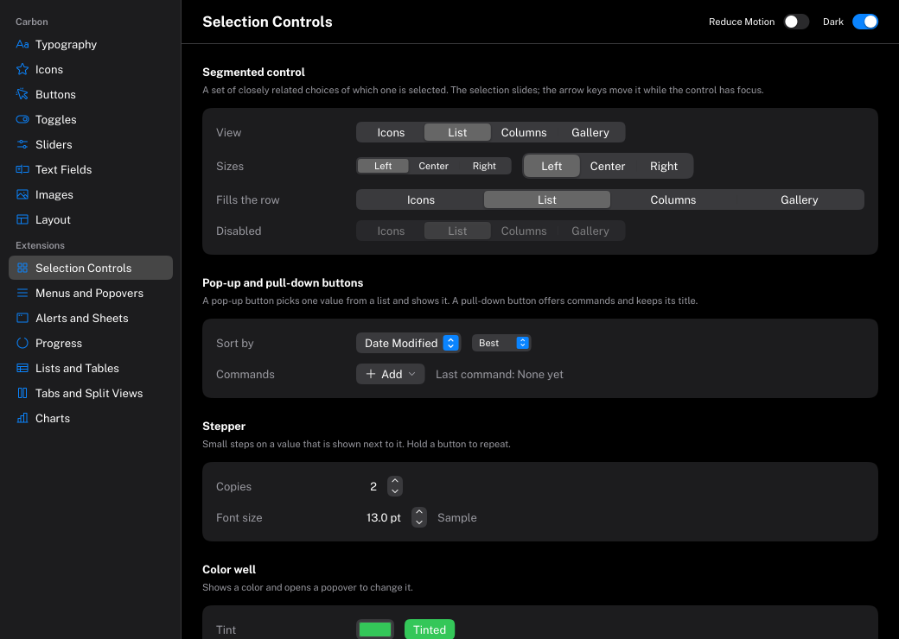
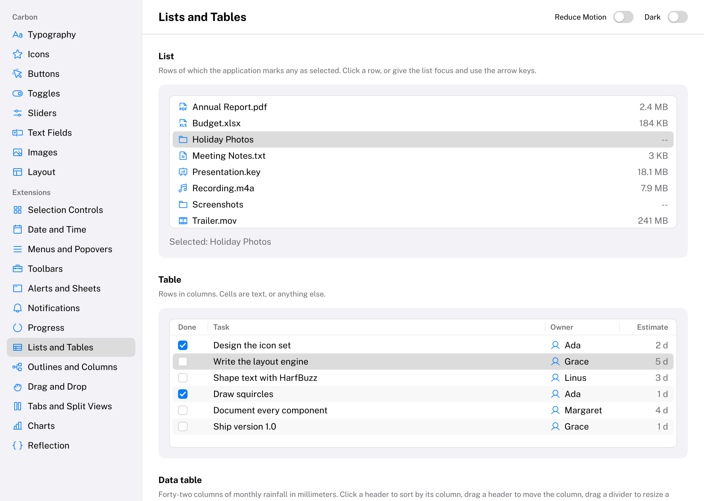
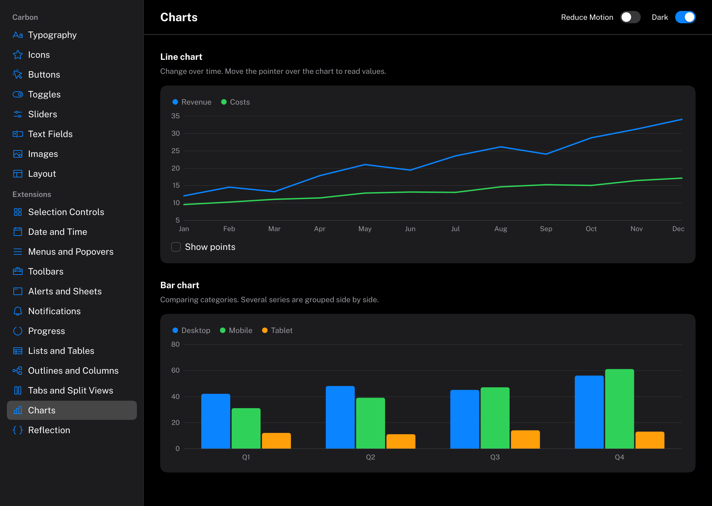

# Carbon

[](https://github.com/eliasertl/Carbon/actions/workflows/CI.yml)

*“Persistence refines the miserable piece of carbon in you into the purest form of diamond.”* ― Tobi Delly

Carbon is an immediate-mode C++20 UI framework for tools, editors and applications on Windows and Linux. It has
the productivity of an immediate-mode API and the look and feel of macOS: calm, minimal, precise, with smooth
spring-driven motion. Carbon renders through WebGPU ([Dawn](https://dawn.googlesource.com/dawn)) into a render
pass that your application owns; it never creates windows, devices or OS hooks.

| Light | Dark |
| --- | --- |
|  |  |
|  |  |

```cpp
Carbon::NewFrame();

Carbon::BeginVStack({ .Spacing = 12.0f, .Padding = 20.0f });
    Carbon::Text("Settings", { .Style = Carbon::TextStyle::LargeTitle });
    Carbon::Toggle("Dark Mode", &darkMode);
    Carbon::BeginHStack({ .Spacing = 8.0f, .Width = Carbon::Size::Fill() });
        Carbon::Spacer();
        if (Carbon::Button("Cancel"))
            Close();
        if (Carbon::Button("Save", { .Role = Carbon::ButtonRole::Prominent }))
            Save();
    Carbon::EndHStack();
Carbon::EndVStack();

Carbon::EndFrame();
Carbon::Render(pass); // your wgpu::RenderPassEncoder
```


> **Status: version 0.1.** Everything described below is implemented, documented and tested on Windows (MSVC)
> and Linux (GCC, Clang). The API may still change before 1.0. Not in scope: windows and docking, translucency
> and blur, IME composition, right-to-left text and screen-reader accessibility.

## Features

- **Components**: Text, Icon, Button, Toggle (switch and checkbox), Slider, TextField, Image, Separator,
  Tooltip, stacks, Grid, Spacer and ScrollView, each with hover, pressed, focused and disabled states that animate.
- **Extension components** (`CarbonExtensions`): Sidebar with a sliding selection, TabView, SegmentedControl, line
  and bar charts, Popover, Menu with submenus, ContextMenu, MenuBar, Toolbar, PopUpButton, PullDownButton, ComboBox,
  TokenField, RadioGroup, DatePicker, DatePickerCalendar, Stepper, ProgressIndicator (bar and spinner), SearchField,
  List, Table, OutlineView (trees, such as a file browser), ColumnView, PathControl, SplitView, Alert, Sheet,
  ColorWell and notifications at any edge or corner.
- **Overlays**: popovers, menus, alerts and sheets float in a layer above the interface and take the pointer and
  the keyboard while they are open.
- **Reflection** (`CarbonReflection`): enum value names and struct fields found by the compiler, with an
  optional macro for display names, ranges and other metadata, so an application's own types can drive its
  interface. [Docs/Reflection.md](Docs/Reflection.md) explains it.
- **Custom components**: the extension components are built only on Carbon's public extension API, and yours
  can be too. [Docs/CustomComponents.md](Docs/CustomComponents.md) walks through a star rating control.
- **Squircles**: every rounded shape has continuous-curvature corners, evaluated analytically in the fragment
  shader, so it is crisp and antialiased at any scale.
- **Text**: shaped with HarfBuzz and rasterized with FreeType at the display's content scale, with the embedded
  Public Sans variable font and the monospaced JetBrains Mono, the macOS type ramp, per-text and pushed fonts,
  wrapping and truncation.
- **Icons**: 1530 embedded Phosphor icons in three weights, usable inside any text.
- **Layout**: stacks, grids, spacers, fit/fixed/fill sizes and scroll views with overlay indicators.
- **Motion**: interruptible, frame-rate-independent springs, timing curves, reduce motion and animated theme
  switches.
- **Styling**: light and dark themes with Apple-like semantic colors (the dark theme is pure black), a style
  stack, and per-call options.
- **Keyboard**: Tab navigation, Space/Enter activation, arrow keys inside controls, menus and lists, Escape for
  overlays, and an animated focus ring.
- **Integration**: a GPU-free draw list and a Dawn renderer that draws into the host's pass; an input queue
  that never loses fast clicks or keystrokes; one static library with no asset files to ship; usable through
  `add_subdirectory` or `find_package`.
- **Lean**: no heap allocations in a settled frame, and nothing is logged or asserted except through the host's
  callbacks.

## Examples

| Example | Shows |
| --- | --- |
| [`MinimalIntegration`](Examples/MinimalIntegration/Main.cpp) | The host side, step by step: context, input forwarding, the frame loop, drawing your own content in the same pass |
| [`Gallery`](Examples/Gallery/Main.cpp) | Every component in both themes, a page per group, with a reduce-motion switch |
| [`CustomComponent`](Examples/CustomComponent/StarRating.cpp) | A star rating control that is not part of Carbon, built from the public extension API |
| [`CustomTitleBar`](Examples/CustomTitleBar/Main.cpp) | A window without the system's title bar: Carbon draws the header with a toolbar and caption buttons, the host moves, resizes, maximizes and closes the window |

Every example accepts `--theme light|dark`, `--scale <factor>`, `--size <width>x<height>` and
`--screenshot <file.png>`.

## Building

Requirements: CMake 3.25+, a C++20 compiler (MSVC 2022, GCC 13+ or Clang 17+) and an installed Dawn.

```sh
git clone --recurse-submodules https://github.com/eliasertl/Carbon.git
cd Carbon
cmake -S . -B Build -DCMAKE_PREFIX_PATH=<dawn-install>
cmake --build Build
ctest --test-dir Build
Build/Examples/Gallery/Gallery
```

With Visual Studio generators, add `--config Release` (or the configuration your Dawn install was built for) to
the build command and `-C Release` to `ctest`; the Gallery is then at `Build/Examples/Gallery/Release/Gallery.exe`.
[Docs/Building.md](Docs/Building.md) explains how to install Dawn, documents every CMake option and shows how to
use Carbon from your own project, as a subdirectory or as an installed package (`find_package(Carbon)`).

Developed and tested against Dawn commit `91158020c0b1cb0ddb4dc1c2c29e5a4669374f0b`.

## Documentation

- [Getting started](Docs/GettingStarted.md) — from a clone to your first interface
- [Architecture](Docs/Architecture.md) — modules, frame lifecycle, draw list, layout, animation, styling
- [Building](Docs/Building.md) — CMake options, dependency switches, installing Dawn
- [Integration](Docs/Integration.md) — creating a context, forwarding input, the render pass, DPI, fonts
- [Layout](Docs/Layout.md) — stacks, sizes, spacers, scroll views
- [Animation](Docs/Animation.md) — springs, timing curves, reduce motion, theme switches
- [Styling](Docs/Styling.md) — the three styling layers, themes, typography, icons, corner shapes
- [Keyboard navigation](Docs/KeyboardNavigation.md) — keys, focus order, the focus ring
- [Overlays](Docs/Overlays.md) — how popovers, menus, alerts and sheets float above the interface
- [Components](Docs/Components/README.md) — one page per component
- [Custom components](Docs/CustomComponents.md) — the extension API, by example
- [Reflection](Docs/Reflection.md) — interface from your own enums and structs: automatic reflection, the macros, limits

## License

Carbon is released under the [MIT License](LICENSE). Third-party components and the embedded fonts are listed in
[THIRD_PARTY_NOTICES.md](THIRD_PARTY_NOTICES.md).
