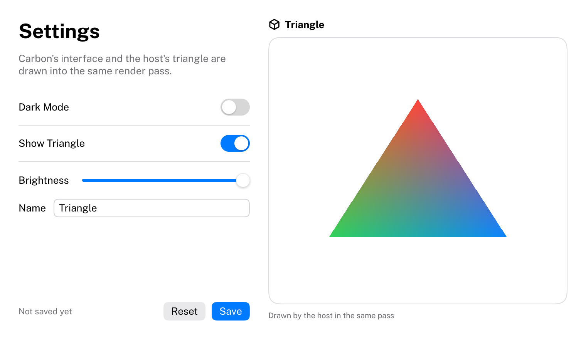

# Carbon

*“Persistence refines the miserable piece of carbon in you into the purest form of diamond.”* ― Tobi Delly

Carbon is an immediate-mode C++20 UI framework for tools, editors and applications on Windows and Linux, in
web browsers through Emscripten, and on Android. It has the productivity of an immediate-mode API and the look and feel of macOS:
calm, minimal, precise, with smooth spring-driven motion. Carbon renders into a target your application owns
through a renderer backend, chosen at run time: WebGPU ([Dawn](https://dawn.googlesource.com/dawn)), Vulkan,
OpenGL 3.3, OpenGL ES 3.0 (WebGL 2 in a browser), Direct3D 11 or Direct3D 9, or a backend of your own for any
other API. It never creates windows, devices or OS hooks.

**[Try it in your browser](https://eliasertl.github.io/Carbon/)**: the Gallery and this documentation, drawn by
Carbon itself, compiled to WebAssembly and rendered with WebGL 2 ([Examples/WebApp](Examples/WebApp/Main.cpp)).

| Light | Dark |
| --- | --- |
|  |  |
|  |  |

```cpp
Carbon::NewFrame();

Carbon::BeginVStack({ .Spacing = 12.0f, .Padding = 20.0f });
    Carbon::Text("Settings", { .Style = Carbon::TextStyle::LargeTitle });
    Carbon::Toggle("Dark Mode", &darkMode);
    Carbon::BeginHStack({ .Spacing = 8.0f, .Width = Carbon::Size::Fill() });
        Carbon::Spacer();
        if (Carbon::Button("Cancel"))
            Close();
        if (Carbon::Button("Save", { .Role = Carbon::ButtonRole::Prominent }))
            Save();
    Carbon::EndHStack();
Carbon::EndVStack();

Carbon::EndFrame();
Carbon::OpenGLRender(); // or WebGPURender(pass), VulkanRender(commandBuffer), DX11Render(), ...
```



> **Status: version 1.0.** Everything described below is implemented, documented and tested on Windows (MSVC),
> Linux (GCC, Clang), in browsers and on Android. The API is now stable: it changes incompatibly only with a new
> major version, and [CHANGELOG.md](CHANGELOG.md) lists what changed. Not in scope: windows and docking,
> translucency and blur, right-to-left and vertical text, rich text and code editing, screen-reader accessibility,
> and hosts on macOS and iOS.
>
> **Continuous integration is currently disabled** to keep GitHub Actions usage costs down: the workflow runs
> only when started by hand. Changes are built and tested locally on Windows before they are pushed; Linux was
> last checked by CI on 2026-10-06. See [Building](Docs/Building.md#continuous-integration).

## Features

- **Core components** (`Carbon`), each with hover, pressed, focused and disabled states that animate:
  - Content: Text, Icon, Image, Separator, Tooltip.
  - Controls: Button (with roles and a default button), Toggle (switch and checkbox), Slider (horizontal or
    vertical, linear or logarithmic, with tick marks), TextField (bound to a `std::string`, a fixed `char`
    buffer or a callback; secure entry and a clear button), TextArea (multi-line, wrapping, scrolling).
  - Layout: VStack, HStack and Spacer, Grid (rows of cells whose columns line up) and ScrollView.
- **Extension components** (`CarbonExtensions`):
  - Navigation: Sidebar with a sliding selection, TabView, SplitView, Toolbar (with an overflow menu), MenuBar,
    PathControl.
  - Selection: SegmentedControl, PopUpButton, PullDownButton, ComboBox, RadioGroup, TokenField (text that turns
    into tokens, such as mail recipients), ColorWell.
  - Numbers, dates and search: Stepper, NumberField (formatted, with a range and arrow-key steps), ScrubField
    (drag across a number to change it), DatePicker (date, time or both, with a calendar popover),
    DatePickerCalendar (a month of days), SearchField.
  - Data: List, Table, OutlineView (trees, such as a file browser), ColumnView (a hierarchy as columns), line and
    bar charts, ProgressIndicator (bar and spinner).
  - Overlays and feedback: Popover, Menu with submenus, ContextMenu, Alert, Sheet, and notifications at any edge
    or corner.
- **Reflection component** (`CarbonReflection`): `Reflect`, which draws the controls for an enum value or for
  every field of a struct.
- **Data tables**: any number of columns that the user sorts, resizes, fits to their content and rearranges by
  dragging their headers, with sideways scrolling; the application owns the sort, the widths and the order.
- **Drag and drop**: any item can be a drag source with a typed payload and any rectangle a drop target, with a
  preview, the macOS drop highlight, Escape to cancel and scroll views that scroll near their edges. Lists and
  outline views reorder their rows by dragging, and files dropped from the system arrive through the same API.
  [Docs/DragAndDrop.md](Docs/DragAndDrop.md) explains it.
- **Overlays**: popovers, menus, alerts and sheets float in a layer above the interface and take the pointer and
  the keyboard while they are open.
- **Reflection** (`CarbonReflection`): enum value names and struct fields found by the compiler, with an
  optional macro for display names, ranges and other metadata, so an application's own types can drive its
  interface. [Docs/Reflection.md](Docs/Reflection.md) explains it.
- **Custom components**: the extension components are built only on Carbon's public extension API, and yours
  can be too. [Docs/CustomComponents.md](Docs/CustomComponents.md) walks through a star rating control.
- **Squircles**: every rounded shape has continuous-curvature corners, evaluated analytically in the fragment
  shader, so it is crisp and antialiased at any scale.
- **Text**: shaped with HarfBuzz and rasterized with FreeType at the display's content scale, with the embedded
  Public Sans variable font and the monospaced JetBrains Mono, the macOS type ramp, per-text and pushed fonts,
  wrapping and truncation; color emoji from the system's emoji font (COLR, CBDT, sbix), with skin tones, families
  and flags; Japanese, Chinese and Korean input through the platform's input method, composed inline in text
  fields and text areas.
- **Icons**: 1530 embedded Phosphor icons in three weights, usable inside any text.
- **Layout**: stacks, grids, spacers, fit/fixed/fill sizes and scroll views with overlay indicators.
- **Motion**: interruptible, frame-rate-independent springs, timing curves, reduce motion and animated theme
  switches.
- **Styling**: light and dark themes with Apple-like semantic colors (the dark theme is pure black), a style
  stack, and per-call options.
- **Phones and tablets**: multi-touch with momentum scrolling and bounce, long press, swipe back, pinch to zoom
  and drag and drop; touch mode with 44-point targets; iOS patterns in compact width (navigation stacks, sheets
  from the bottom, overflow menus); safe areas, the system's text size and the on-screen keyboard.
  [Docs/Mobile.md](Docs/Mobile.md) explains what a host forwards.
- **Keyboard**: Tab navigation, Space/Enter activation, arrow keys inside controls, menus and lists, Escape for
  overlays, and an animated focus ring.
- **Integration**: a GPU-free draw list and renderer backends that draw into the host's own pass or command
  buffer, chosen at run time, with a public interface for writing your own; an input queue that never loses fast
  clicks or keystrokes; one static library with no asset files to ship; usable through
  `add_subdirectory` or `find_package`.
- **Lean**: no heap allocations in a settled frame, and nothing is logged or asserted except through the host's
  callbacks.

## Examples

Every example is built once per renderer backend that is compiled in, into a folder named after the backend:
`Build/Examples/OpenGL/Gallery`, `Build/Examples/Vulkan/Gallery`, ..., `Build/Examples/DX9/Gallery`. The `Minimal`
examples spell out one backend's integration each; the others are written once against `Examples/Common`, whose
graphics device for each backend is the only difference between the builds.

| Example | Shows |
| --- | --- |
| [`WebGPU/Minimal`](Examples/Minimal/WebGPUMinimal.cpp) | The host side with WebGPU, step by step: context, backend, input forwarding, the frame loop, drawing your own content in the same pass |
| [`Vulkan/Minimal`](Examples/Minimal/VulkanMinimal.cpp) | The same with Vulkan: a swapchain, frames in flight, Carbon and the host's triangle in one render pass |
| [`OpenGL/Minimal`](Examples/Minimal/OpenGLMinimal.cpp) | The same with OpenGL 3.3: Carbon resolves its functions through `glfwGetProcAddress` and restores the host's state |
| [`OpenGLES/Minimal`](Examples/Minimal/OpenGLESMinimal.cpp) | The same with OpenGL ES 3.0, natively or in a browser (WebGL 2) |
| [`DX11/Minimal`](Examples/Minimal/DX11Minimal.cpp) | The same with Direct3D 11: a flip-model swap chain, the host's triangle and Carbon in one render target |
| [`DX9/Minimal`](Examples/Minimal/DX9Minimal.cpp) | The same with Direct3D 9: a device reset on resize and a fixed-function triangle under Carbon's interface |
| [`<Backend>/Gallery`](Examples/Gallery/Main.cpp) | Every component in both themes, a page per group, with a reduce-motion switch |
| [`<Backend>/CustomComponent`](Examples/CustomComponent/StarRating.cpp) | A star rating control that is not part of Carbon, built from the public extension API |
| [`<Backend>/CustomTitleBar`](Examples/CustomTitleBar/Main.cpp) | A window without the system's title bar: Carbon draws the header with a toolbar and caption buttons, the host moves, resizes, maximizes and closes the window |
| [`<Backend>/Reflection`](Examples/Reflection/Main.cpp) | A settings window generated from one `AppSettings` struct: a sidebar of sections, each drawn by a single `Carbon::Reflect` call (built once, for the first backend of WebGPU, Vulkan, OpenGL, OpenGL ES, DX11, DX9 that is compiled in) |

In a browser (Emscripten), the examples are built for the OpenGL ES backend, and one more target exists:
[`Web/index.html`](Examples/WebApp/Main.cpp), the [live demo](https://eliasertl.github.io/Carbon/): a start screen
that leads to the Gallery and to a reader for every document in `Docs/`
([Building](Docs/Building.md#the-web-app)). On a phone it becomes navigation stacks with the browser's Back button.

[`Examples/Android`](Examples/Android/AndroidHost.cpp) is the Gallery as an Android app on the OpenGL ES backend,
built with Gradle and the NDK from the command line ([Building](Docs/Building.md#android)).

Every example accepts `--theme light|dark`, `--scale <factor>`, `--size <width>x<height>` and
`--screenshot <file.png>`.

## Building

Requirements: CMake 3.25+ and a C++20 compiler (MSVC 2022, GCC 13+ or Clang 17+). Nothing else needs to be
installed to try Carbon: the OpenGL 3.3 backend has no build dependency, and every other dependency is a git
submodule. On Linux, install the X11 and Wayland development packages GLFW needs (listed in
[Building](Docs/Building.md#requirements)).

```sh
git clone --recurse-submodules https://github.com/eliasertl/Carbon.git
cd Carbon
cmake -S . -B Build -DCMAKE_BUILD_TYPE=Release
cmake --build Build --config Release --parallel
ctest --test-dir Build -C Release --parallel 8
Build/Examples/OpenGL/Gallery
```

With a Visual Studio generator the executables are in a configuration folder:
`Build\Examples\OpenGL\Release\Gallery.exe`. CMake prints the renderer backends it found
(`Carbon: renderer backends: ...`) and builds every example once per backend, into
`Build/Examples/<Backend>/`.

More backends are picked up when their tools are installed at the first configuration (later, pass
`-DCARBON_BACKEND_<NAME>=ON`):

- **Vulkan**: install the [Vulkan SDK](https://vulkan.lunarg.com) (on Ubuntu: `libvulkan-dev glslc`); the
  Gallery is then also at `Build/Examples/Vulkan/Gallery`.
- **Direct3D 11 and 9** (Windows): found automatically with the Windows SDK, into `Build/Examples/DX11/` and
  `Build/Examples/DX9/`.
- **WebGPU** (optional): needs an installed [Dawn](https://dawn.googlesource.com/dawn), which Carbon never
  builds. Install it once as described in [Installing Dawn](Docs/Building.md#installing-dawn), then add
  `-DCMAKE_PREFIX_PATH=<dawn-install>` to the configure command. Carbon is developed and tested against Dawn
  commit `91158020c0b1cb0ddb4dc1c2c29e5a4669374f0b`.

[Docs/Building.md](Docs/Building.md) documents every CMake option, the web build with Emscripten, the Android
app, and how to use Carbon from your own project, as a subdirectory or as an installed package
(`find_package(Carbon)`).

Carbon 1.0.0 can also be installed with a package manager: [Packaging/](Packaging) has a vcpkg port
(`vcpkg install carbon --overlay-ports=Packaging/vcpkg`) and a Conan 2 recipe
(`conan create Packaging/conan -s:a compiler.cppstd=20`). Both take FreeType and HarfBuzz from the package manager
and need no Dawn; the backends are features and options
([Building](Docs/Building.md#package-managers-vcpkg-and-conan)).

## Documentation

- [Getting started](Docs/GettingStarted.md) — from a clone to your first interface
- [Architecture](Docs/Architecture.md) — modules, frame lifecycle, draw list, layout, animation, styling
- [Building](Docs/Building.md) — CMake options, dependency switches, installing Dawn, vcpkg and Conan, the web build and the web app
- [Integration](Docs/Integration.md) — creating a context, forwarding input, the render pass, DPI, fonts
- [Renderer backends](Docs/Backends.md) — the graphics APIs, choosing one, writing your own backend
- [Layout](Docs/Layout.md) — stacks, sizes, spacers, scroll views
- [Animation](Docs/Animation.md) — springs, timing curves, reduce motion, theme switches
- [Styling](Docs/Styling.md) — the three styling layers, themes, typography, icons, corner shapes
- [Keyboard navigation](Docs/KeyboardNavigation.md) — keys, focus order, the focus ring
- [Overlays](Docs/Overlays.md) — how popovers, menus, alerts and sheets float above the interface
- [Phones and tablets](Docs/Mobile.md) — touch, gestures, adaptive layouts, safe areas, the on-screen keyboard
- [Drag and drop](Docs/DragAndDrop.md) — drag sources, payloads, drop targets, reordering lists, files from the system
- [Components](Docs/Components/README.md) — one page per component
- [Custom components](Docs/CustomComponents.md) — the extension API, by example
- [Reflection](Docs/Reflection.md) — interface from your own enums and structs: automatic reflection, the macros, limits
- [Optimizations](Docs/Optimizations.md) — the benchmarks, what Carbon costs per frame and per build, and what was done about it

## License

Carbon is released under the [MIT License](LICENSE). Third-party components and the embedded fonts are listed in
[THIRD_PARTY_NOTICES.md](THIRD_PARTY_NOTICES.md).
