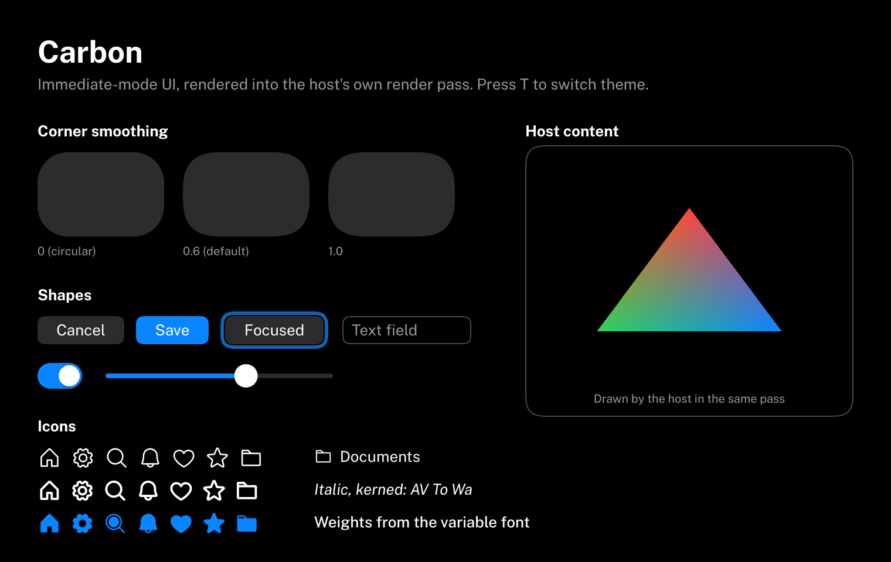

# Carbon
*“Persistence refines the miserable piece of carbon in you into the purest form of diamond.”* ― Tobi Delly

Carbon is an immediate-mode C++20 UI framework for tools, editors and applications on Windows and Linux. It has
the productivity of an immediate-mode API and the look and feel of macOS: calm, minimal, precise, with smooth
spring-driven motion. Carbon renders through WebGPU ([Dawn](https://dawn.googlesource.com/dawn)) into a render
pass that your application owns; it never creates windows, devices or OS hooks.

| Light | Dark |
| --- | --- |
|  |  |

> **Status: early development.** Rendering, text, icons, layout, animation and themes work today (the
> screenshots above are the `MinimalIntegration` example). The component library is being implemented
> milestone by milestone; see the roadmap in [Docs/Architecture.md](Docs/Architecture.md#15-milestones). In the
> snippet below the stacks are real; the widgets show the API they will have.

```cpp
Carbon::NewFrame();

Carbon::BeginVStack({ .Spacing = 12.0f, .Padding = 20.0f });
    Carbon::Text("Settings", { .Style = Carbon::TextStyle::LargeTitle });
    Carbon::Toggle("Dark Mode", &darkMode);
    if (Carbon::Button("Save", { .Role = Carbon::ButtonRole::Prominent }))
        Save();
Carbon::EndVStack();

Carbon::EndFrame();
Carbon::Render(pass); // your wgpu::RenderPassEncoder
```

## What works today

- Squircle shapes with continuous-curvature corners, evaluated analytically in the fragment shader: crisp and
  antialiased at any scale.
- Text shaped with HarfBuzz and rasterized with FreeType at the display's content scale, with the embedded
  Public Sans variable font and the macOS type ramp.
- 1530 embedded Phosphor icons in three weights, usable inside any text.
- Stacks, spacers, fit/fixed/fill sizes and scroll views with overlay indicators.
- Interruptible, frame-rate-independent springs, timing curves, reduce motion and animated theme switches.
- Light and dark themes with Apple-like semantic colors; the dark theme is pure black.
- A GPU-free draw list with clipping, layers and batching, and a Dawn renderer that draws into the host's pass.
- Input forwarding with an event queue that never loses fast clicks or keystrokes.
- One static library with no asset files to ship.

## Building

Requirements: CMake 3.25+, a C++20 compiler (MSVC 2022, GCC 13+ or Clang 17+) and an installed Dawn.

```sh
git clone --recurse-submodules https://github.com/eliasertl/Carbon.git
cd Carbon
cmake -S . -B Build -DCMAKE_PREFIX_PATH=<dawn-install>
cmake --build Build
ctest --test-dir Build
```

With Visual Studio generators, add `--config Release` (or the configuration your Dawn install was built for) to
the build command and `-C Release` to `ctest`. [Docs/Building.md](Docs/Building.md) explains how to install Dawn
and documents every CMake option.

Developed and tested against Dawn commit `91158020c0b1cb0ddb4dc1c2c29e5a4669374f0b`.

## Documentation

- [Architecture](Docs/Architecture.md) — modules, frame lifecycle, draw list, layout, animation, styling
- [Building](Docs/Building.md) — CMake options, dependency switches, installing Dawn
- [Integration](Docs/Integration.md) — creating a context, forwarding input, the render pass, DPI, fonts
- [Layout](Docs/Layout.md) — stacks, sizes, spacers, scroll views
- [Animation](Docs/Animation.md) — springs, timing curves, reduce motion, theme switches
- [Styling](Docs/Styling.md) — themes, typography, icons, corner shapes

## License

Carbon is released under the [MIT License](LICENSE). Third-party components and the embedded fonts are listed in
[THIRD_PARTY_NOTICES.md](THIRD_PARTY_NOTICES.md).
